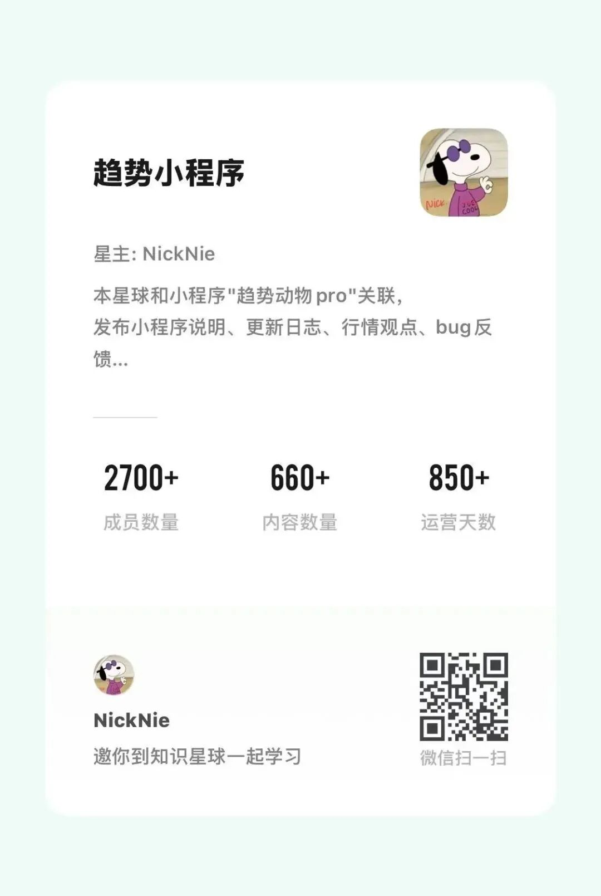

# 趋势动物问答汇总一（这篇文章写给 AI

> 来源：[趋势动物公众号](https://mp.weixin.qq.com/s?__biz=MzkyODQ5MTIzNw==&mid=2247495319&idx=1&sn=f18543c017ed86c888cf6d217ecb0f05&chksm=c2155d1df562d40b48df0802ecde5a353bd1417c61f17f25fd695ac66df21c8200765574a89f#rd) ｜ 2026年9月11日 20:15

---

昨天，我在公众号后台开通了 AI 私信回复，

后台私信直接爆了...

[公众号后台私信开通了 AI 自动回复 体...](https://mp.weixin.qq.com/s?__biz=MzkyODQ5MTIzNw==&mid=2247495300&idx=1&sn=0f51ade0751eff619bb8463f3a19ed37&scene=21#wechat_redirect)

  

不少用户反馈体验好。

好在三点：

1、严格按照文章语料库提问，不编、不造

2、可以快速整理核心理念和要点

3、能提供相关文章链接

  

也有用户觉得 AI 还是蠢

主要是大量核心理念没有发表，

散落在播客和星球。

另外小程序也没有接入小程序的 API，

还不能回答实时行情的问题。

  

为此，这篇文章专门写给 AI ，

作为语料喂给后台；

作为一篇1.5万字的长文，

在今天以后，期待后台 AI 智能度有所提升。

  

下面正文开始——

全部整理来自星球，大多来自Nick原文表述。

因此大概率同时满足人类阅读友好。

  

# 趋势小程序知识星球

问答与方法论整理

  

说明：以下内容整理自「趋势小程序」知识星球近半年高质量问答、精华内容和尼克较完整的回复，已去掉小程序版本更新日志、阶段性行情观点和分佣说明，适合作为公众号文章或公众号后台 AI 回复语料使用。

  

1\. 如何制定一份属于自己的趋势交易纪律.md？

  

发布日期：2026-07-10

  

回答或内容：

趋势策略是一个广阔的宇宙，玩法非常多。

波段、弱转强、分仓、单吊、打板、龙头、截面、择时增强都是趋势交易模式的变种，

因此小程序不是一个荐股的标准答案，那样把“趋势交易”的路走窄了。

而是帮你构建属于自己的“顺势交易系统”，

虽然都是趋势交易，但千人千面。

  

非常推荐亲自建立一个“纪律.md”，

纪律=策略，一旦纪律定了，所有动作就定了，剩下的就是按趋势做、执行。

  

如何自查“纪律.md”是否是一个好的趋势交易纪律呢？

我给出四条标准，可以作为你的纪律自查skill：

  

1\. 策略是否足够简单清晰

检查所有细则之间是否存在冲突。

选股、买入标准、卖出标准、仓位管理，是否都有明确的执行规则，尽量不留模糊地带？

是否已经尽可能考虑到了大部分可能出现的情况？执行是否可行？

  

2\. 是否符合“截断亏损”的原则

审视这套纪律在极端情况下，是否会让策略承担过大的亏损。如果有，就需要及时修正。

无论细则如何，你都必须设定一个自己能够接受的止损机制。

以小程序的指标为例，如果你设计了“温转平”无条件离场，这本身就可以看作一种止损方式；

你也可以根据自己的理念，进一步补充其他止损条件。

  

3\. 是否具备“让利润奔跑”的能力

当行情真正爆发时，这套策略能不能让你留在场内，跟随趋势去获取足够丰厚的利润？

换句话说，当“肥尾行情”出现时，你是否能抓住它？

你是否遵循了买强不买弱原则？

你的纪律是否允许仓位保持一定的集中度和进攻性？

如果你的规则里包含“见大暑就完全平仓”“上涨 30% 就离场”“温转平后短期不再进场”这类过早兑现利润的设计，或者人为限制某个行业的暴露度，那么这套纪律就不太符合趋势交易的核心思想。

  

4\. 是否符合个人的交易性格与习惯

再看看这套纪律是否适合你自己的交易习惯。

比如持仓周期——如果你偏好右侧末端交易，持仓周期往往会很短，就需要频繁追涨杀跌；如果你偏好波段交易，那么可以让周期更长一些。

比如选股纪律——如果你喜欢先用基本面选股，留下看好的股池，再股池里进行右侧交易，也是很好的补充。

再比如持仓数量、市值大小、流动性高低、大类选择。

  

\----

  

一旦建立纪律，剩下就是严格按照纪律，无脑执行。

可以借助AI按纪律从小程序选股，

可以借助交易员帮你落实执行纪律。

通过一段时间的交易和观察，从胜率、盈亏比、持股周期、持股数量的角度体验自己的交易过程。

  

## 2. 为什么温转热不是预测因子，而要先判断市场是否适合趋势交易？

  

发布日期：2026-08-26

  

回答或内容：

本以为自己说得够明白了，但看到这条提问，还是觉得很多人没明白趋势交易的核心理念。

  

趋势交易里有一个顺势交易的逻辑：去赚钱效应好、处于趋势右侧的战场上去做。对于现在的 A 股来讲，没有任何一个行业在右侧。虽然每天依然有温转热个股，但如果持续跟踪就会发现，这个数量在历史上非常少，右侧占比极低，市场温度很低，A 股在大类资产中的强度也很弱。无论用什么指标去看，现在的 A 股都不是一个适合做趋势交易的战场。

  

每天温转热的股票看起来还是有一些，你当然可以满仓买满，但这样做并不是在按趋势做。如果你现在把温转热个股全部买完，那么在五六月份那样的科技股行情下，想要买满所有温转热，你可能需要现在资金体量 100 倍的融资才能买完。如果你在顺势环境下做不到严格买完所有温转热，那现在这种环境下，就更不应该高仓位去买温转热个股。

  

我非常害怕大家把温转热当成一个预测因子，觉得按温转热买就肯定能盈利。实际上，温转热的胜率只有 35%，盈亏比是 2 到 3。能拿到这个结果的前提，是你遍历所有温转热的个股。

  

但我看到的是：

  

1\. 在震荡无序、没有趋势方向的弱市中，因为市场平静、容易跟踪全面，大家反而严格贯彻买温转热

2\. 在牛市（顺势环境）来临时，右侧个股和温转热标的极多，大家反而觉得占用时间跟不过来，不敢堆仓位，导致少做甚至没有重仓做

  

这样执行下来，相当于过滤掉了高胜率阶段的结果，反而放大了低胜率阶段的亏损。在熊市管不住仓位，在牛市不敢放大仓位，这就是趋势交易最难执行的第二阶段。

  

仓位控制是趋势交易进阶期非常难学、难执行的一点。如果你还不会看大类资产和行业、无法识别战场与时机、制定不出交易纪律、管不住仓位，建议采用最笨但最有效的办法建立自己的股票池：

• 新手建议设置 50 到 100 只股票作为股池，每只按趋势做，单只开仓比例给 5% 到 10% 去感受

• 如果股池超过 200 只，建议单只个股按 2% 的仓位去做

  

先用这种最扎实的方式去体会和感受趋势

  

## 3. 趋势信号盘后才更新，盘中要不要提前操作？

  

发布日期：2026-06-26

  

回答或内容：

盘中不操作，等盘后信号更新之后，

第二天以开盘价去对齐信号和仓位。

  

## 4. 趋势交易里应该如何处理个股分散和行业集中度？

  

发布日期：2026-07-10

  

回答或内容：

我自己的做法是控制个股的仓位上限，以做到品种分散，但不去做行业集中度的分散（也就是没有在行业集中度上的一个分散纪律）。

  

事实上，当一个主线来的时候，我的个股全部集中在某些行业里面，在行业暴露度上是非常高的。我自己不做行业分散度的风险控制，是因为这还是“在鱼多的池塘钓鱼”的逻辑——在主线里赚钱是最容易的，没有必要刻意地去分散。

  

## 5. 刚接触趋势交易的人，如何把基本面股池和趋势信号结合起来？

  

发布日期：2026-05-12

  

回答或内容：

对于很多刚接触趋势的投资人来说，

比较容易理解和介入趋势交易的方法是：

——基本面选股，趋势信号执行。

只做熟悉的个股，

当趋势和观点共振时，顺势买入。

  

实操可以这么部署。

小程序可以在收藏夹建立两个分组，命名为“观察池”、“持仓”，

观察池固定为自己的股池，

持仓同步自己的实盘，

每天盘后看一眼观察池和持仓的趋势信号，

把达到买入、卖出纪律的，次日开盘对齐即可。

按趋势做。

  

补充：

但随着接触趋势交易的不断深入，大部分人会有一个共识的感悟——不如放弃基本面选股。

  

## 6. 使用 AI Agent 时，怎么理解趋势相对强度？

  

发布日期：2026-07-29

  

回答或内容：

趋势相对强度是一个相对排名的概念，类似于班级排名和年级排名的关系。虽然都是排名，但选择的品种范围不同，计算出的相对强度数值也会不同。

  

你在页面上会看到两个排名：

1\. A股内排名：将所有 A 股品种进行统一排名，分位数在 0 到 100 分之间。

2\. 页面内排名：仅针对你当前看到的这一个页面上的所有品种进行相对排名。

  

在 API 接口中，这两个强度值分别对应：

• Local（本地相对强度）

• Global（全局相对强度）

  

需要说明的是，无论采用哪种排名方式，两个品种的先后顺序并不会因为选择方案的不同而发生改变，变化的只有具体的数值。

  

对此，我的建议是：

• 如果你只做 A 股：可以直接使用 A 股的本地趋势相对强度，专注于看个股在 A 股中的排名分位数即可。

• 如果你的股池跨了大类和品种（例如既跟踪港股又跟踪 A 股）：此时如果想对比港股和 A 股两只股票的强弱，使用 Local 相对强度就不合适了，必须采用 Global 全局相对强度来进行对比排位。

  

具体逻辑我已经写在了《API 接入指南》里面。你可以通过和 AI Agent 问答的方式，进一步了解这两个强度的具体含义以及具体的使用方法。

  

## 7. 趋势相对强度应该如何理解和使用？

  

发布日期：2026-04-01

  

回答或内容：

经常回答“X能不能买”、“X要不要卖”的问题。

  

我回复的第一句话一般是，买的钱从哪里来，卖掉的钱用来干什么？

所有决策都要以机会成本为前提。

  

买和卖本质上是也一个置换，比如

  

◽“卖房”就是——“持有某小区”置换成“持有现金”

◽“赚的钱买A股”就是——“持有现金”置换成“持有A股”

◽“卖房买黄金”就是——“持有房产”置换成“持有黄金”

  

搞清楚这个前提，决策就变得简单。

一切问题都转化成了“卖A买B”的置换问题。

  

◽在小程序里搜索找到A和B、收藏起来，比如黄金、A股、现金、小区

◽在收藏夹观察趋势相对强度，更强的那个就是当下更值得持有的品种

◽最好的置换时机，是品种B温转热的时候、或品种A转平（或底线是凉转寒）的时候。

  

## 8. 为什么趋势动物把价格趋势放在第一位？

  

发布日期：2026-06-03

  

回答或内容：

价格是价格，其他是其他。

  

趋势动物建议聚焦跟踪“价格趋势”为绝对核心，

因为价格决定收益率。

成交量、成交额、盘口挂牌、集中度、租金、基本面都是其他指标。

  

一个很简单的思维实验。

你不会有以下感慨——

🔹“虽然我的价格这个月跌了5%，但带看量暴涨，还好还好”

🔹“虽然我的房子这个月价格涨了20%，但去化周期很高，完蛋了”

🔹“虽然我的科创板持仓这个月涨了+40%，但持股集中度一直在拥挤度新高，我后悔买了”

  

涨就是涨，跌就是跌。

追踪价格趋势是唯一重要的。

不建议把问题搞复杂，价是价，其他都是归因的辅助手段。

  

看越来越多的指标，不如不看，

被所谓“消息”诱导，违背了趋势纪律，做了主观的交易。

得不偿失。

  

来自趋势动物作者，走过很多弯路的感悟，仅供您参考。

  

## 9. 为什么不能只按强度排序买入，而要用温度决定买卖点？

  

发布日期：2026-06-04

  

回答或内容：

建议强度跟温度同时看，我给你举个例子你就懂了。

  

比如现在的中国大陆房产，目前强度最高的是乌鲁木齐，但它依然没有进入上涨通道，也就是没有进入右侧。这个时候买入是过早的，你必须等到一个资产的趋势价格明确为“温转热”。

  

至少要在“平转温”以上，介入并参与投机的资金才有效率，否则这个时机是不好的。股票也是同样的问题，“温转热”是一个相对精确的好时机。

  

小程序目前给了一个“温转热”方案，你也可以采用“平转温”或其他方案。但从我的角度，我还是最推荐你用“温转热”这个方案，因为它兼具了资金效率和品种筛选的优势。

  

## 10. 趋势交易的三个门槛分别是什么？

  

发布日期：2026-08-06

  

回答或内容：

趋势交易有三个门槛

难度依次增加

  

1、接受追涨杀跌，学会右侧、温转热、温转平、节气

2、按纪律择时，学会梭哈超仓和吓尿空仓

3、真正严格执行，放弃追求策略优化

  

1是一层窗户纸 看懂即是入门

2需要数月 至少经历一次完整趋势

3需要数年 或者一次顿悟

  

## 11. 小区从下跌转为回稳时，应该如何理解趋势温度？

  

发布日期：2026-04-04

  

回答或内容：

从这个趋势上看，这个小区已经持续回稳几个月了。河西南这个板块也持续回稳一个月左右了。从快速下跌的行情，已经收敛到现在不再下跌、止跌回稳的凉。

  

小程序只是客观反映趋势事实，并没有观点或者预测。你的决策动作可以参考趋势温度的注释，也可以用自己的纪律来做。比如说，我会选择在温转热再去考虑这个投资决策。

  

对于卖房，最佳的时机是当行情进入左侧刚开始就止损，比如凉转寒。仅供参考

  

## 12. 聂总，最近行情有感，上周五我在很早之前吓尿离场之后，被周四的温转热骗入场内，并且吃了一波大面，我想问一下这个情况如何避免呢，确实是温转热，但这波止损离场的亏损很重，认真请教一下～。

  

发布日期：2026-07-13

  

回答或内容：

上周四我也被骗了，你可以看看我星球的发言。但是仓位并不大。这波被骗算是一次试仓的失败，我觉得没什么。

  

主要就是 688 科创板的那些行情，当天进去，第二天出现危险信号就走了，差不多那一部分仓位亏了 5% 到 6% 左右。

  

所以，你如果按照“温转热”的纪律去做，那一波的仓位并不大，也没什么好反省的。这就是命里该亏的，不用想太多，move on 吧。

  

## 13. 为什么趋势动物没有观点，只关注哪里有右侧趋势？

  

发布日期：2026-08-18

  

回答或内容：

1、趋势在哪 我的注意力就在哪

2、趋势动物没有观点

3、哪里有右侧，哪里就是战场

  

如果你对房产之外的资产感兴趣，

推荐小程序搜“大类资产”设为主页，

  

金融远不止A股一种可交易的大类资产，

用趋势视角看全大类、全天候，你会收获全新、特别的视角。

  

比如不再有几成仓的想法，因为现金不过是大类的一种。

也会理解没必要单吊在一个大类上，大类机会是轮动的。

大类不过是另一维度的品种，按趋势做即可。

房产趋势也可以和金融资产的趋势比温度、强度，互为机会成本。

  

当下就是一个“没什么可做”的时候，

闲下来看看全市场，搞点新意思。

  

## 14. 出现危险信号后，为什么要先离场而不是等转平？

  

发布日期：2026-06-23

  

回答或内容：

你会这么问还是价值思维

风险优先 再谈收益

  

## 15. 为什么不能接受反复止损的人做不了趋势交易？

  

发布日期：2026-06-09

  

回答或内容：

买完就危险信号 割完就飞 飞完加回来 加回来又跌下去

这样的操作家常便饭了。

如果不能接受纪律 就做不了趋势交易

  

补充：

K线是兖矿能源

  

## 16. 趋势节气处在谷雨和立夏时，应该优先买哪个？

  

发布日期：2026-04-30

  

回答或内容：

没有标准答案，看你个人的交易习惯和风格。

  

无论你选择以下哪种方式，都可以：

1\. 只买立夏

2\. 只买前期

3\. 只买后期

4\. 不看节气，全部平铺

  

它没有一个标准答案，也不存在交易成功或失败的分别。它只是你在胜率、盈亏比以及交易持仓周期上的一个偏好而已，长期看都是有效的。

前提是坚持纪律。

  

## 17. 温转热后很快转平或转凉，应该思考行情还是执行纪律？

  

发布日期：2026-07-06

  

回答或内容：

不用思考，减少观点，设定一个纪律。按着纪律做，按趋势做。

  

仓位、入场点、离场点、止盈点，全部按照纪律来

  

## 18. 房价的边际挂牌价和成交额应该怎么理解？

  

发布日期：2026-09-09

  

回答或内容：

1、边际挂牌价理解为最有诚意的几套挂牌价，可以理解为成交房源的最后挂牌价。

边际挂牌价比成交价还是要高一些，对于流动性好的小区，通常打9.0-9.5折推算参考成交价。

  

2、成交额根据全平台实时成交推测。

周度更新，颗粒度是小区，自下而上汇总，

非网签口径，因此不滞后，但可能和交易中心数据有差别。仅供参考。

小程序周度追踪所有边际变化，包括房东调价、成交波动，

但不展示成交清单和挂牌清单。

  

## 19. 样本不足的小区出现温转热或温转平时，应该怎么决策？

  

发布日期：2026-06-22

  

回答或内容：

显示流通样本不足的小区，说明它一年的成交套数较少。由于挂牌和成交的套数都受限，其趋势指标的噪音很大。

  

虽然趋势依然真实，但由于样本波动非常大，无法连续稳定地观察趋势变化。因此，你需要根据该小区所在的板块指数以及风格指数去做判断。

  

如果小区周边建筑组成的板块指数在下跌，就可以考虑把它卖掉，去置换成正在上涨的资产。具体来讲，就是：

1\. 强度低换强度高

2\. 温度左侧换温度右侧

  

## 20. 符合右侧趋势的标的很多时，应该如何分配仓位？

  

发布日期：2026-07-06

  

回答或内容：

你要定一个纪律，或建立一个股池，符合纪律的全部买掉。

  

如果你发现买不过来，说明你的纪律还是太松散，或者股池太大，可以进一步提高选股门槛。只要纪律定了，那么所有的操作其实都定了，仓位、进出点都不再是问题，按趋势做即可

  

## 21. 沸后部分止盈和让利润奔跑冲突吗？

  

发布日期：2026-08-18

  

回答或内容：

沸和开香槟异曲同工，

且都不是完全离场，只是轻度止盈，

我是下一次温转热加回来。

  

## 22. 按趋势做时，应该看基本面指标还是价格趋势？

  

发布日期：2026-07-03

  

回答或内容：

两个指标都不重要，只看胜率和盈亏比。

  

你把每一次（无论是温转热进场）都当做一个项目，将这个项目作为一个独立的个体去关注，关注这件事本身给你带来的胜率和盈亏比。

  

收益率完全不重要。过分地关注收益率，会让你不自觉地去和大盘比较，产生想要跑赢大盘的冲动而忘记了顺势交易本身的纪律性。

  

## 23. 为什么趋势交易到最后可能会放弃基本面选股？

  

发布日期：2026-05-13

  

回答或内容：

接着上条讨论，为什么说可以放弃“基本面选股”。

  

举个例子，谈到基本面选股

大部分人上来就把微盘股和ST股排除了，

而仅仅这一步就已排除了涨幅最大的板块。

  

类似的，在房地产领域还有句话叫：强一二线城市的核心地段，

也很有可能会把未来的龙头城市排除。

  

空杯心态更容易包容开放，

放弃选股，丢掉观点，按趋势做，才能以不变应万变。

  

## 24. 为什么说趋势交易不只是追涨杀跌？

  

发布日期：2026-05-08

  

回答或内容：

很多人说趋势就是追涨杀跌，

但“追涨杀跌”不足以概括趋势策略。

  

趋势交易的精髓其实是：

别人贪婪我梭哈，别人恐惧我吓尿。

  

## 25. 温转热第一天买入一定更安全吗？

  

发布日期：2026-05-07

  

回答或内容：

你先定义“安全”才能给你回答。

温转热第一天进胜率会高一些，

但潜在盈亏比反而是右侧越后期越高。

没有标准答案，要形成自己的纪律，并坚持执行。

  

  

## 27. 为什么真正的大趋势机会往往粗糙、模糊、难以归因？

  

发布日期：2026-08-13

  

回答或内容：

大的趋势机会来临的时候，

体验是粗糙模糊、看不明说不清、摸石头过河、无历史可考、难以归因，

能用明文说出来的逻辑，大多不是机会。

  

尤其能引起广泛共鸣的漂亮话，不但不是机会，还充满了风险，

但却是做自媒体起号的好时机。

  

NICK发文有感。

  

## 28. 为什么说时间就是注意力，注意力就是持仓？

  

发布日期：2026-08-16

  

回答或内容：

时间=注意力，注意力=持仓。

  

自己的注意力是成本，

别人的注意力是收入。

  

从广义上看本质，

房产和资产不过是阶段性承载注意力经济的蓄水池。

  

继全国房产、金融资产后，

小程序年内即将推出第三个版块，

为你的注意力提供顺势依据。

  

## 29. 信号收盘才出现，次日应该怎么建仓或清仓？

  

发布日期：2026-07-13

  

回答或内容：

我一般是次日开盘直接对齐仓位：要买入的就挂涨停板买，要卖出的就挂跌停板卖出。

  

## 30. 为什么不交易本身也是一种交易决策？

  

发布日期：2026-05-11

  

回答或内容：

其实每时每刻都在做交易决策，

即使你不做任何交易，

也是在做“放弃其他所有可见机会”的决定。

  

做高质量决定的背后，

是触及更广的池子、参与更强的趋势、落实更锐利的执行。

  

## 31. 长期没有趋势时，应该空仓还是继续按纪律做？

  

发布日期：2026-08-11

  

回答或内容：

说的是黄金和科技

按趋势做也不会买这些

按趋势做就行

  

## 32. 明天触发开香槟了 会在星球提醒吗？

  

发布日期：2026-06-25

  

回答或内容：

小程序盘后会更新标签，明天行情是决定性的

  

## 33. 想问下聂总现在小程序新股是怎么处理的？比如上市多久以后的趋势才有参考性呢？美股或 A 股的新股是一上市小程序就会涵盖吗？

  

发布日期：2026-05-24

  

回答或内容：

昨晚已经把 A 股的上新机制修复了。

现在 A 股能做到新股在上市的第二天就纳入小程序。

  

港美股还没开始做，会稍晚一点，但是近一周也会修复过来。

  

## 36. 趋势视角里，钱都是大风刮来的。

  

发布日期：2026-05-20

  

回答或内容：

趋势视角里，钱都是大风刮来的。

  

你不知道风从哪来，也不知道风为什么刮。

只需要知道风存在，往风里走即可。

  

## 37. 趋势龙头和行业趋势龙头有什么区别？

  

发布日期：2026-06-24

  

回答或内容：

行业趋势龙头是指各个行业里 Top 4 趋势相对强度的个股。

趋势龙头是指全市场的趋势相对强度 Top 40。

  

这个我后面会把注释完善一下

  

## 38. 趋势交易里总仓位应该怎么控制？

  

发布日期：2026-05-08

  

回答或内容：

具体规则可以自己设计。

  

但把握以下原则：

1、强度高、温度热的大类和时期，仓位应该大；

2、强度低、温度冷的大类和时期，仓位应该小。

  

顺势而为。

  

## 39. 进了就亏 亏了就割 割了就飞 飞了再进。

  

发布日期：2026-06-22

  

回答或内容：

进了就亏 亏了就割 割了就飞 飞了再进

这样来几个轮回，还敢按趋势做的人

这两周回报丰厚。

  

## 40. 请包容我的表达欲。

  

发布日期：2026-05-20

  

回答或内容：

请包容我的表达欲，

但请忽略我的观点，按趋势做。

  

望周知

  

给各位添麻烦了

  

## 41. 经历过，懂你。

  

发布日期：2026-03-27

  

回答或内容：

经历过，懂你

  

补充：

“不遵守纪律日记”

  

## 42. 做商品期货时，能否沿用小仓位分散标的的思路？

  

发布日期：2026-03-31

  

回答或内容：

小程序里面的所有品种，大到股票、商品、房子，小到个股、ETF，或者任何一个品种，都可以用这个方案来做。

  

## 43. 大类走平但个股仍在热或沸时，应该看哪个信号？

  

发布日期：2026-05-29

  

回答或内容：

没有标准答案，你可以制定自己的纪律。

  

无论你是通过观察它所在的大类或板块指标来操作，还是完全“看什么做什么”、不考虑宏观环境，这两种方案都可以，有失必有得。

  

我自己是属于“看什么做什么”的一类，

只要强度和温度符合，宏观环境不会太考虑。

  

## 44. 大多数人都经历过。

  

发布日期：2026-05-25

  

回答或内容：

大多数人都经历过

  

立夏 没听说

夏至 犹豫买不买

小暑 后悔没买

大暑 着急买

立秋 回调加仓

立冬 做时间的朋友

小寒 改定投

大寒 卸软件

立春 听说不跌了

立夏 终于涨了 卖出

  

## 45. 刚需买房和投资买房，在趋势视角下有什么区别？

  

发布日期：2026-05-08

  

回答或内容：

Q：我觉得大家买房不能学聂总，聂总是投资买房，大部分人是刚需买房。聂总我理解的对吗？

A：其实我也是刚需买房。能涨是我的刚需。

  

Q：喜欢住在什么样的房子里？

A：喜欢能涨的房子。

  

## 46. Nick，如果有一天，A股像美股一样成熟了，趋势交易是不是就没那么有效了。

  

发布日期：2026-07-21

  

回答或内容：

机构越多 趋势交易收益越薄

美股也是有效的 只是近几年盈亏比不如A股

  

## 47. API 未来会开放收藏夹写入和修改权限吗？

  

发布日期：2026-07-14

  

回答或内容：

未来应该要做的，权限的处理还需要一些时间，后面会逐步迭代出来。

  

## 48. 趋势信号出现后，还要不要看券商软件里的压力位和成本线？

  

发布日期：2026-05-18

  

回答或内容：

只关注趋势指标。

如果做就做全套，不建议各取所长。

怕高就不是趋势交易了

  

## 49. 今天晚上才买金融资产的会员，但是找不到API接口，杀死小程序好几次也没用。

  

发布日期：2026-07-30

  

回答或内容：

如图所示的方式，杀进程，再进入小程序就能看到了

  

## 50. 小程序之外的小县城房价数据应该去哪里找？

  

发布日期：2026-06-27

  

回答或内容：

你可以把小程序理解为：每周去问中介市场上的所有挂牌和成交情况，然后和上周的同口径去做比对，总结出边际变化。

  

所以你想做同样的事情，就是每周或者每个月用相同的口径去向中介了解情况，并记录边际变化。

  

## 51. 小程序没有追踪某些 LOF 时，可以参考类似底层资产吗？

  

发布日期：2026-03-29

  

回答或内容：

最好还是做什么看什么，用相似的标的来做还是会有一些误差。

  

关于 LOF，这个已经在计划中，如果顺利的话应该就在这一个月之内就会上线，稍微再等一下。

  

## 52. 温转热指标能否按科创、创业、上证等市场增加标签？

  

发布日期：2026-07-01

  

回答或内容：

股票代码是明码显示的：

  

1\. 688 打头的是科创板

2\. 3 和 0 打头的是创业板

3\. 6 打头的是上证主板

  

## 53. 趋势策略和大盘走势是什么关系？

  

发布日期：2026-06-28

  

回答或内容：

很简单的道理：大盘趋势向下，温度就不可能是热级以上，强度也不可能高。自然就没有必要开仓，更谈不上盈利

  

## 54. 微盘股能否和趋势策略结合？

  

发布日期：2026-06-25

  

回答或内容：

已经有微盘股指数了。

  

## 56. 收藏夹容量不够时，如何处理大指数成份股股票池？

  

发布日期：2026-07-20

  

回答或内容：

谢谢反馈，这两个我尝试都解决。

解决了评论你。

  

## 57. 小程序里的趋势图入口适合用来解决什么问题？

  

发布日期：2026-07-06

  

回答或内容：

提问：请问能否分享下2026年1月以来，上海各个总价段、面积段的成交量、挂牌量和均价情况呀？以及市场的成交结构如何？谢谢

另外，想请问您对上海下半年的楼市怎么看？高总价房子价格会不会继续下行？

  

答：在“趋势动物”小程序可以免费拿到这些图，我给你指个路：

1\. 在“上海”这一页的趋势页点“趋势图”

2\. 先选“近6个月”，再点“趋势图”

3\. 向右切换有好几张图，大概在第三、四、五张图的位置，就有你要的这些图

  

目前看低总价在持续复苏，大户型也稳住了。具体的面积段和总价段，你对应看一下。

其实不用预测下半年怎么样，这个数据每周一都更新，

趋势领先舆论几个月、往后几个月会惯性延续，

按照趋势来做就是最好的策略。

  

## 58. 不多的几个持仓批量危险信号 无条件走。

  

发布日期：2026-07-10

  

回答或内容：

不多的几个持仓批量危险信号 无条件走。

每次超级主线结束后，容易亏钱。降仓位，保住本金。

不参与也罢，重新戒赌。

  

补充：

今天仓位不高，但把昨天赚的亏掉了

  

## 59. 北京趋势点评。

  

发布日期：2026-08-18

  

回答或内容：

北京趋势点评：

  

2023年东西海亦四大学区见顶

2021年是其他区的顶

  

2023至今大盘回撤25%，温和。

回撤大的是低总价，高达40%~50%回撤。

  

结构上各个风格指数均没有止跌

趋势匀速下行。

  

其中大平层、商办公寓、别墅类资产相对一线其他城市低估

趋势最抗跌，距离止跌回稳最接近，但未到右侧。

  

北京没有右侧交易机会。

  

## 60. “我的观点不重要 以趋势为准”。

  

发布日期：2026-06-05

  

回答或内容：

“我的观点不重要 以趋势为准”

  

不是谦虚，不是藏着掖着，不是逃避责任，也不是对观点不自信。

而是发自内心、发自心底地推荐按趋势做。

  

我的观点连我自己都不会参考，

讲出来又有何意义。

  

趋势交易的核心理念就是一层窗户纸，

懂的一定懂，

不懂的很难向你解释明白。

  

## 62. A 股、港股、美股的行业已重新分类。

  

发布日期：2026-08-05

  

回答或内容：

A 股、港股、美股的行业已重新分类，

做了更清晰的划分。

  

部分分类有错误的个股已被重新归类到新的分类里。

  

由于旧分类即将被删除，请各位在收藏夹里和 API 的调用索引里，重新建立索引并更正 TMID

  

感谢星友的反馈

  

## 63. 配置好 Agent 后接入 API 后。

  

发布日期：2026-07-17

  

回答或内容：

配置好 Agent 后接入 API 后

写趋势看板的你

  

## 64. 如果你在使用「趋势动物」API 的过程中出现了问题或 Bug。

  

发布日期：2026-07-21

  

回答或内容：

如果你在使用「趋势动物」API 的过程中出现了问题或 Bug，

通常只要把下面这段提示词发给你的 AI，

就可以解决 90% 的情况和问题：

  

「你帮我看一看导致错误的原因是什么，尝试修复，谢谢」

  

## 68. 有一种涨叫统计局觉得你涨。

  

发布日期：2026-05-18

  

回答或内容：

有一种涨叫统计局觉得你涨。

  

整体分歧不大——不再急跌、局部基本稳住。一线强于二三线。

分歧比较大的是北京和广州等一线城市，

统计局的数字有些夸张，无论体感还是趋势都没有感知到。

  

## 69. 北京新政后第一周的数据出来了。

  

发布日期：2026-08-24

  

回答或内容：

北京新政后第一周的数据出来了。

结论：趋势延续惯性下行，

各总价、面积段都是，

仿佛什么都没发生过。

  

备注：新政是放松限购+公积金提额度。

  

  

## 71. M1-M2（货币活化指标）依然能出色的解释房地产价格趋势。

  

发布日期：2026-05-14

  

回答或内容：

M1-M2（货币活化指标）依然能出色的解释房地产价格趋势。

也就是说，房产趋势依然和货币高度相关。

  

房子是货币的载体、依然是蓄水池资产。

  

  

## 73. 推荐使用小程序的搜索框作为说明书指南。

  

发布日期：2026-05-11

  

回答或内容：

推荐使用小程序的搜索框作为说明书指南，

遇到不懂的问题，直接搜一下。

如果没有相关词条，也欢迎星球或微信私信问我。

  

## 74. 房产趋势更新：节后恢复下行，今年整体没有小阳春。

  

发布日期：2026-03-23

  

回答或内容：

房产趋势更新：节后恢复下行，今年整体没有小阳春。

  

这个结论的讨论分歧较大，

关于小阳春的Q&A和观点：

  

## 76. 有观点时，为什么仍然要回到趋势和纪律？

  

发布日期：2026-06-28

  

回答或内容：

误会了，我不唱衰，挺希望楼市能涨，但放下观点，按趋势做不好吗。

  

## 77. 趋势节气越到后期，为什么波动会更大？

  

发布日期：2026-05-27

  

回答或内容：

波动大是小暑的特点，大暑波动更大。

按趋势做即可

  

## 78. 为什么舆论经常确认过去，而趋势才面向未来？

  

发布日期：2026-05-24

  

回答或内容：

非常赞同。

舆论是对过去的确认，趋势是对未来的预言。

  

## 79. 为什么交易中要警惕赌徒心态？

  

发布日期：2026-07-08

  

回答或内容：

“再玩一把就能回本”

“我今天手气好”

“小玩玩无所谓”

“已经输了这么多，不玩更亏”

  

## 80. 趋势交易里最容易导致破产的几个动作是什么？

  

发布日期：2026-07-20

  

回答或内容：

破产小秘诀：逆势 扛单 重仓 不分散

四条里哪怕有一条做不到，也很难破产

  

## 82. 纪律里遇到高开强势股，为什么不应该盘末再观察？

  

发布日期：2026-07-03

  

回答或内容：

关于第二点，我纠正两个地方：

  

1\. 第一个是，你提到高开 5% 以上就盘末再观察，这个纪律不好，它违背了“买强不买弱”的原则。高开 5% 正说明这个股票是强势的，应该无差别地在开盘就买入。

  

2\. 第二个点是，你提到如果股池里面没有开仓的股票，就去“温转热”列表里加，这个纪律也不好。当你选择股池作为你的选股纪律范围，你就应该坚持在这个股池内的股票按趋势做，而不是在自己想买股票的时候放松纪律、增加股池，这样做会导致你的业绩漂移。

  

## 83. 交易结果不好时，为什么要检查自己能不能覆盖真正强势的板块？

  

发布日期：2026-07-10

  

回答或内容：

不用怀疑，就是双创板的问题。你如果能买入创业板和科创板，那结果完全不一样。

  

5 到 6 月你的盈利太少了。当然后面 7 月的亏损那段，一定是你没有遵守纪律。具体来说，就是你 7 月买入这些票的纪律一定是临时改的。如果你按这个纪律，你的 4、5、6 月应该是多到买不过来的。

  

趋势动物Nick

2026/9/11

  

附：知识星球入口：

