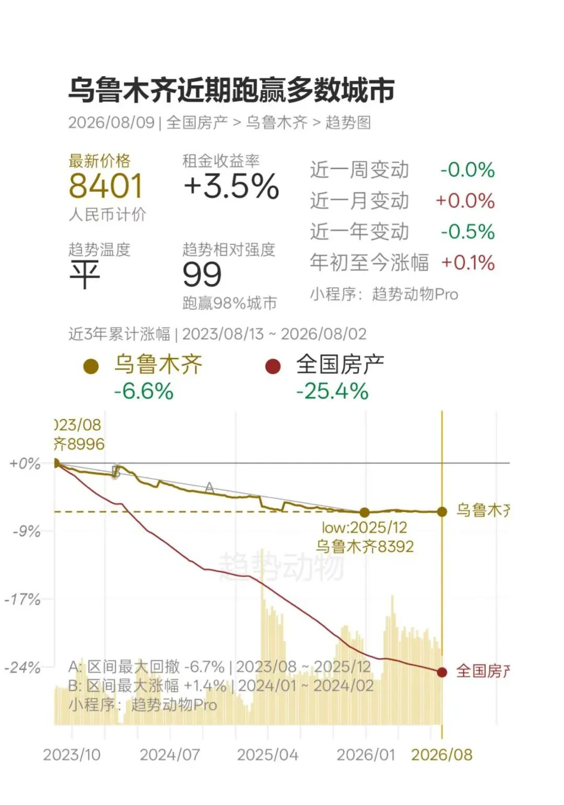
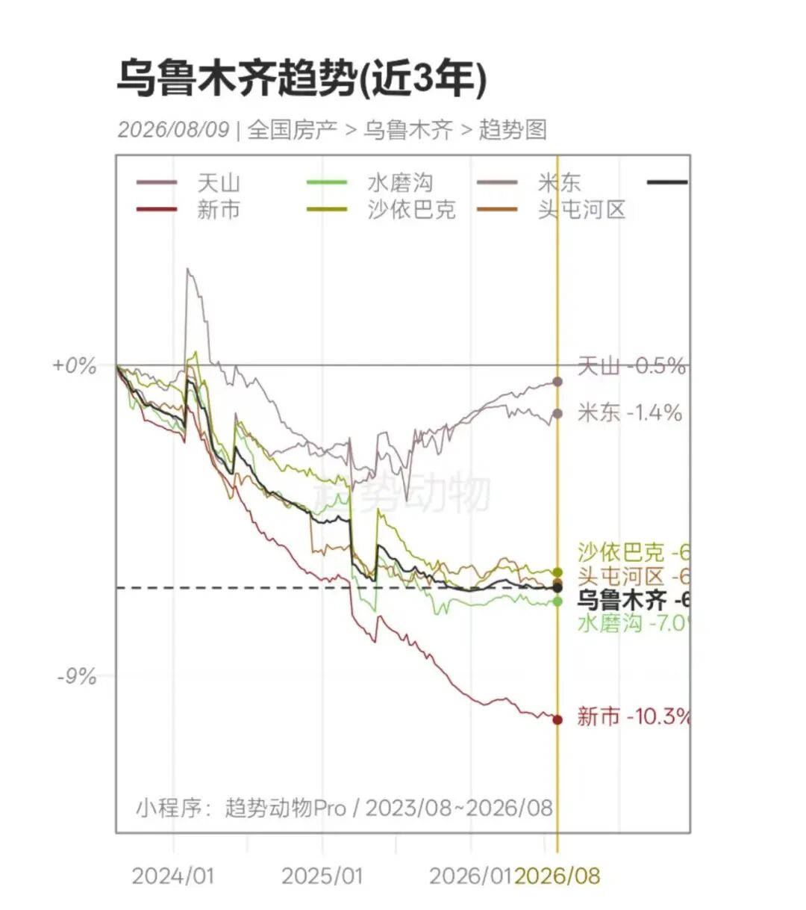
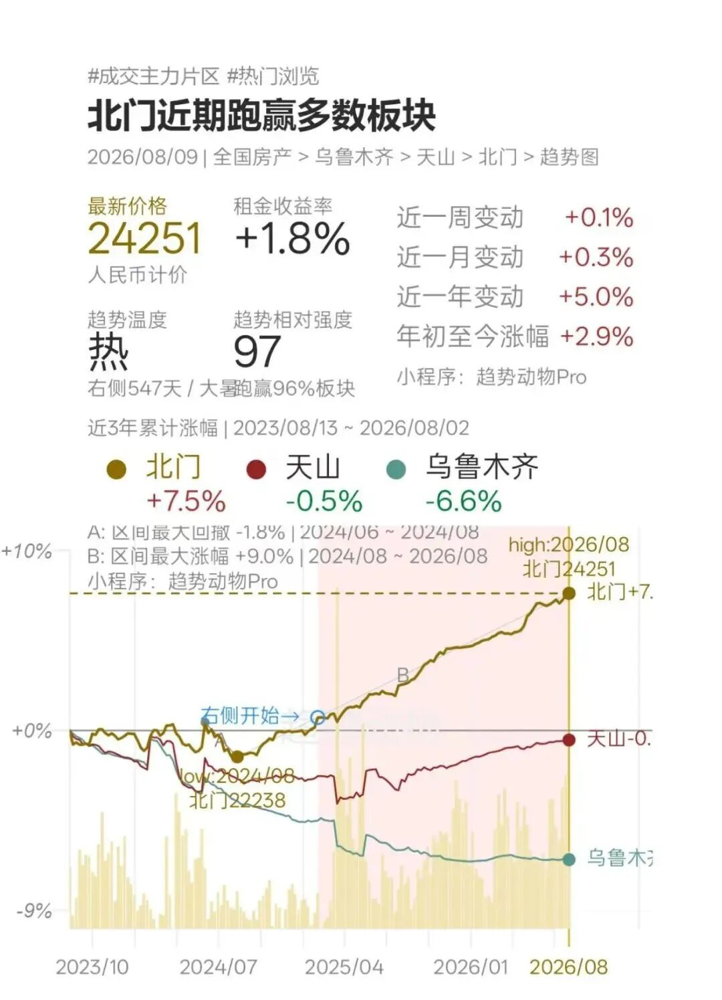
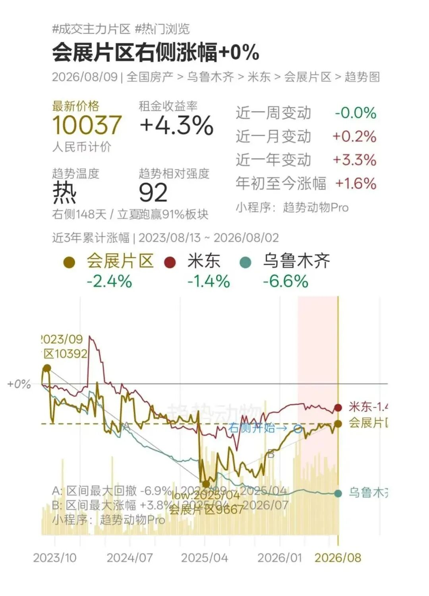
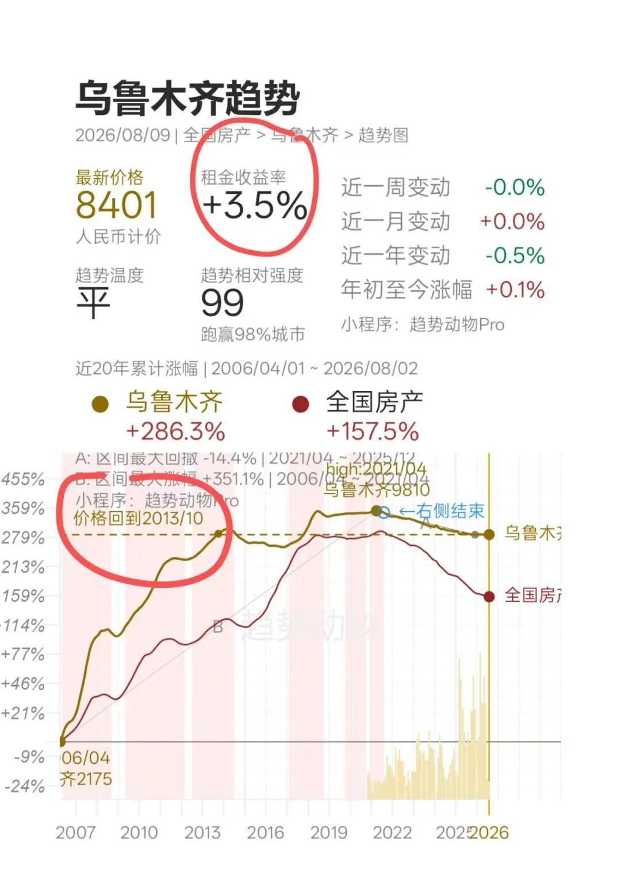
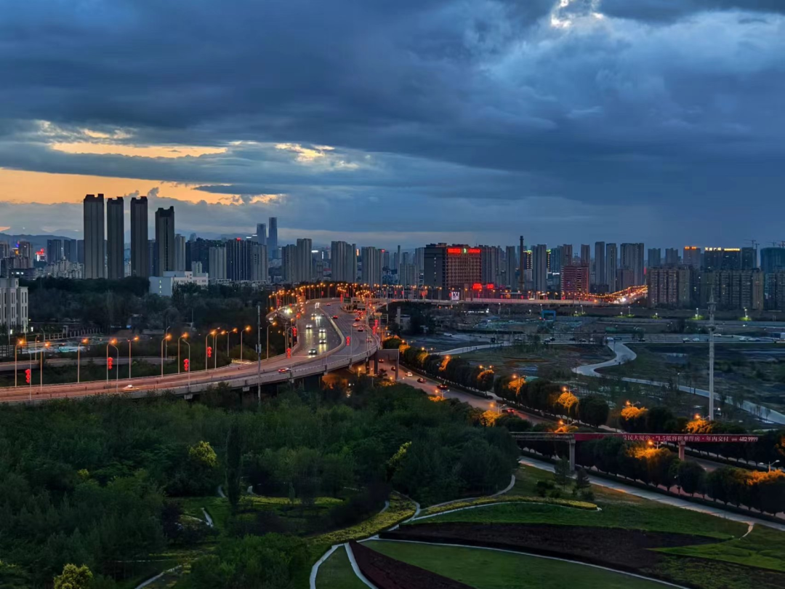
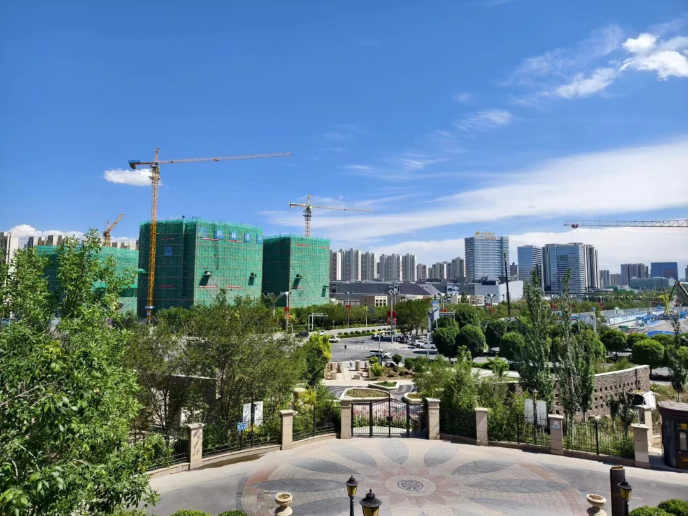
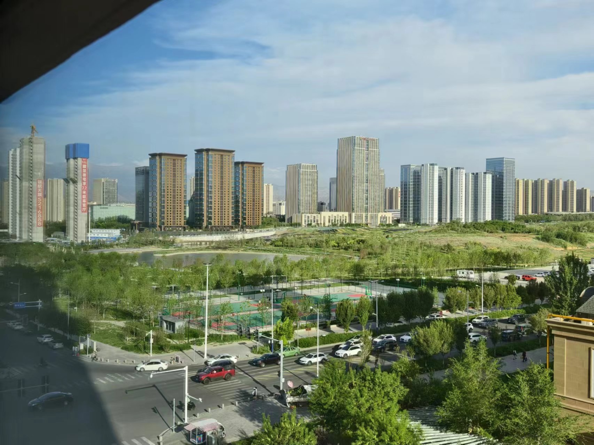
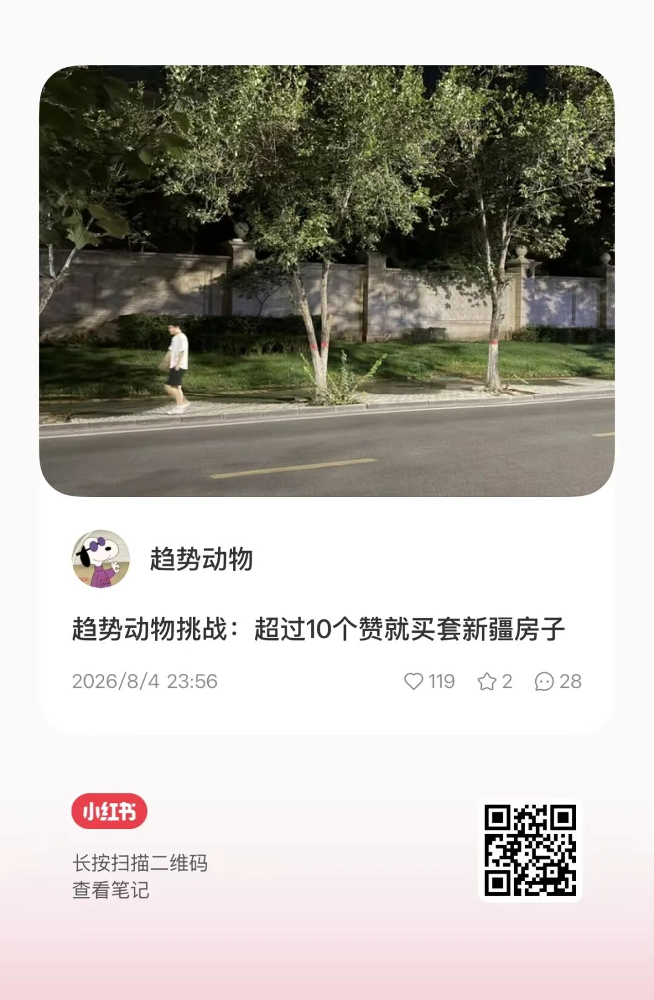
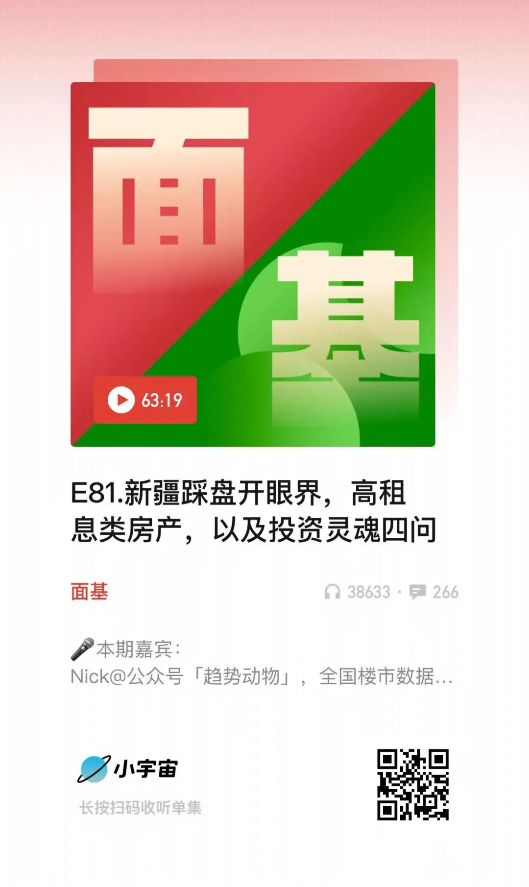

# 20260809 我为什么买了乌鲁木齐

> 来源：[趋势动物公众号](https://mp.weixin.qq.com/s?__biz=MzkyODQ5MTIzNw==&mid=2247494777&idx=1&sn=07b95a79df8d96c342d63431ff93b856&chksm=c2155ff3f562d6e500814c329f31b5a09f390039c5402951bdc503d7e677219c53206ace9d0e#rd) ｜ 2026年8月9日 23:22

---

[趋势动物：成为新疆业主](https://mp.weixin.qq.com/s?__biz=MzkyODQ5MTIzNw==&mid=2247494756&idx=1&sn=1d2bcf5b2f29fade60c46edcd7ea2773&scene=21#wechat_redirect)

终于成了新疆业主，

也是近三年买的第一套房子。

这篇完整说说我的考虑。

  

一、为什么是现在？  

  

趋势动物关注新疆好多年了。

两年前踩盘新疆，对我的震撼依然历历在目。

震惊于城市之开放、产业之强劲、租金之活跃、价格之低廉、民风之淳朴。

[20240730 西部：新疆随写](https://mp.weixin.qq.com/s?__biz=MzIyMTYyMzg1OQ==&mid=2247494883&idx=1&sn=a9db5baf66f967a0fd516eb55d5cd0f1&scene=21#wechat_redirect)

  

之所以选择这个时间在乌鲁木齐买房子，

直接原因其实是：

今年最大的主线——科技股告一段落

资金无处可去，适合开始配置楼市。

  

这两年有两大主线——黄金、科技

两条主线均大幅回撤、趋势熄火，

以我做趋势交易的经验看，未来几个月甚至几年都难以重回趋势。

主线已死，新主线可能酝酿。

对我来说，平仓黄金和科技后，

资金无处可去，开始配置楼市。

  

[20260130 黄金：一夜入秋](https://mp.weixin.qq.com/s?__biz=MzkyODQ5MTIzNw==&mid=2247491301&idx=1&sn=f158d1d462850fc4c4a9fcdb7a4f5c05&scene=21#wechat_redirect)

[20260702 科技：吓尿离场](https://mp.weixin.qq.com/s?__biz=MzkyODQ5MTIzNw==&mid=2247494188&idx=1&sn=2ab7e79599278f8306d94acff9b743f9&scene=21#wechat_redirect)

  

相较科技股，后市主观更看好老登资产，

而乌鲁木齐也恰好是楼市老登资产的龙头。

  

推荐所有人抽空去新疆看看市场，

乌鲁木齐、喀什、伊犁、霍尔果斯。

楼市老登的朝圣之旅，

这些城市我独爱伊犁，但房产我偏爱乌市。

  

二、为什么是乌鲁木齐？

  

乌鲁木齐是除了香港之外，趋势最强的城市。

体现在：

▪️趋势相对强度最高；

▪️近期价格跌幅最小；

▪️成交量/成交金额大幅提升；

▪️进入右侧的板块数量最多。

  

全国楼市整体并没有止跌，

但不妨碍一些城市率先走好。

买入乌鲁木齐，依然是按趋势做。

  

乌鲁木齐趋势最好的两个类型：

进入趋势右侧的板块。

  

1、本地学区，下图1

趋势龙头——天山区北门——兵一、兵二。

趋势龙二——经开的126中学——经开万达、乌北站。

  

2、商务片区，下图2

唯一龙头是会展板块，

房价单总价、租金租息、产品力的高地。

同时乌鲁木齐是楼市老登的极致，

去新疆是“老登朝圣之旅”，

买新疆是“做多老登”。

  

体现在四个方面：

  

1、价格深度价值，下图

——房价回到2012年，价格最低的省会城市之一。

  

2、租金回报率第一梯队，下图

——全城平均租金回报率3.5%，租息普遍超过贷款利率。

  

3、产业定位老登但富足。

——老登行业：农业、电力、矿业、资源、旅游、贸易、房地产。

  

4、行业共识极低。

——无人问津：低共识、强趋势。

投资人对城市安全、租金流动性、城市价值的偏见误差极大。

三、买的是什么风格  

关于楼市，这几年来我一直有个观点：

房产指数正在失效，整体阴跌或横盘。

机会藏在两个赛道里——天地资产。

用现在流行的话说——老登和小登资产。

  

▪️老登房产/地资产：

租金回报率极高，最好超过3.0%的资产；

▪️小登房产/天资产：

产品力极好，低密、会所、新一代住宅；

  

推荐从这个维度重新审视你持有的房产类别，  

2024年开始，楼市最好的策略是：

卖出中腰部资产，向天地两端置换。

具体来说——

卖出租金回报率和产品力都不够好的房产，

置换买入高租息老登房产、或小登好房子。

  

选筹依然是按照趋势动物的理念来选筹。

具体来说——

小程序进入乌鲁木齐

选择乌鲁木齐温转热后的右侧板块，

观察趋势相对强度高的风格和小区，

选择成交主力、租息较高、趋势强的高品质小区。

  

乌鲁木齐是一个极其特殊的城市，

你可以在乌鲁木齐选到同时满足“老登”（高租息）、“小登”（好产品）的房产。

  

列举三个我考虑过的房产参数，

供你感受。

  

▪️产品一

二手住宅，低密改善，面积188平；

总价285万，单价1.51万，

租金1.2万/月，租息4.6%。

  

▪️产品二

二手住宅，超高层改善，面积201平；

总价295万，单价1.46万，

租金1.4万/月，租息5.2%。

  

▪️产品三

新房四代宅，低密改善，面积139平；

总价173万，单价1.25万，

预估租金6000-8000/月，租息4.4%。

  

  

FAQ:

  

乌鲁木齐未来看涨？

  

虽然我买了，但对后市没有预期。

高租息是保底收入，

但作为趋势交易者，当然期待涨幅的发展和加速。

  

目前趋势已出现萌芽，局部进入温转热。

趋势延续的概率很大，但并不是上涨的保证。

  

推荐各位通过小程序收藏乌鲁木齐指数，并监控后续。

当趋势按预期发散，我将持续发文；

当趋势和预期相背离，我将随时离场。

  

小红书100个赞了，为什么只买一套？

  

作为试仓，如果盈利，不妨继续加仓。

按趋势做。

  

乌鲁木齐已经涨了一些，有没有后悔买晚了？

  

依然是趋势交易的思路。

如果不涨，无法验证右侧，

确认趋势上涨再买，胜率、盈亏比都更高。

共识依然极低，已经吹乌鲁木齐三年了，

身边几乎没有被我说动的。

  

我在乌鲁木齐举办了一场线下沙龙。

宣传了公众号、星球、会员群，

覆盖五万粉丝，到场仅三人。

  

为什么看好新疆？

  

买入乌鲁木齐是“按趋势做”的理念延伸。

虽然我看好新疆，但“看好新疆”是观点，

观点不是买入的依据，趋势才是。

[什么是“按趋势做”？](https://mp.weixin.qq.com/s?__biz=MzkyODQ5MTIzNw==&mid=2247487956&idx=1&sn=1ccdc168f1550959c933cc058cf7bd2e&scene=21#wechat_redirect)

  

关于看好新疆的归因，我已经说足够多了，

不在本文赘述。

且我相信：当下趋势是未来消息的预言，

也许关于新疆更多的消息和归因，

未来一段时间大家会慢慢看到。

  

如果感兴趣趋势动物的新疆观点和踩盘见闻，

欢迎收听这期播客，

录这期时刚从新疆踩盘回来。

  

  

详见趋势动物Pro

Nick, 2026/8/9
