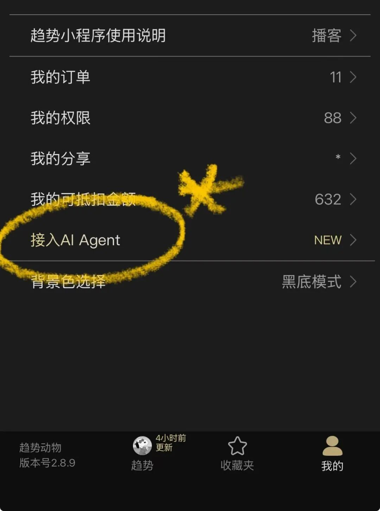
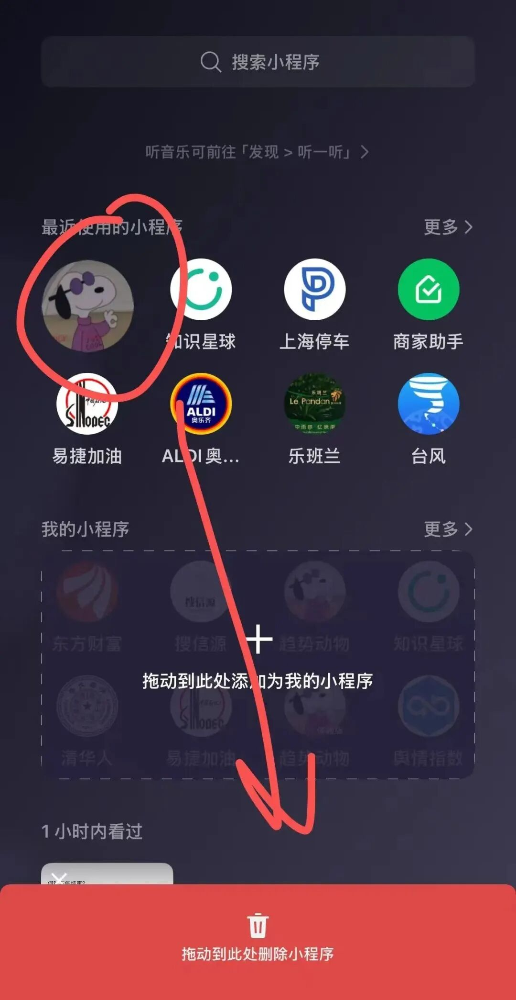
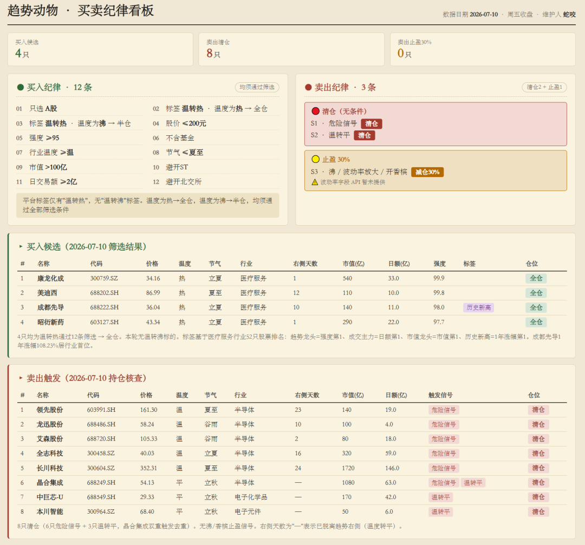

# 20260717 我第二次把自己干掉了

> 来源：[趋势动物公众号](https://mp.weixin.qq.com/s?__biz=MzkyODQ5MTIzNw==&mid=2247494367&idx=1&sn=5c8ab82110680c6cdbee0a1205b8bc10&chksm=c2155955f562d0432b67465e67dab4e25870b8ec1bd6f14774cfada8c8556861d76a2925de42#rd) ｜ 2026年7月17日 12:15

---

**2023年11月，我第一次把自己干掉了。**

**[20231120 我把自己干掉了](https://mp.weixin.qq.com/s?__biz=MzkyODQ5MTIzNw==&mid=2247483993&idx=1&sn=5133230500c0a30fced06e97279fc93d&scene=21#wechat_redirect)**

  

那次，我开发了这个小程序趋势动物Pro

我把**趋势** 工具开发出来，干掉了我自己。

您不必再咨询我楼市观点，按**趋势做** 即可。

即使咨询我，我也会向您推荐和**趋势** 一致的交易方向。

**  
**

2026年7月，我第二次把自己干掉了。[趋势动物金融 API 已上线， 面向金融...](https://mp.weixin.qq.com/s?__biz=MzkyODQ5MTIzNw==&mid=2247494332&idx=1&sn=31fd09a50641b81e0fd15c72b13a2581&scene=21#wechat_redirect)

###   

这次，我上线了趋势动物金融 API。

我把 API 开发出来，干掉了我自己。

现在你可以把趋势动物接入你的 AI Agent。

我把趋势理念都写在.md文件里，

这次你不用咨询我，甚至不必打开小程序，

可以依据自己的纪律，通过自动工作流，

定制自己独特的交易信号，

通过邮件、看板、数据接口来指导自己顺势交易。

  

常见问题FAQ：

  

🔸API入口在哪？

目前 API 刚上线的初期阶段，

仅面向金融会员开放内测。

入口：我的页 → 接入 AI Agent

测试完成后，API 将开放给所有小程序用户。

  
🔸已经买了金融会员，没看到入口？

如果是金融会员但没找到api入口，

建议杀死趋势动物。

具体来说：把小程序拖拽到下方，杀死。

再次进入后 就能看到。如下

  

🔸已经用上，求推荐一些玩法？玩法很多。我个人认为当下的最佳实践——是建立一套自己的股池+纪律.md，然后让 AI 自动运行定时任务、进行趋势信号的扫描向你推荐符合你纪律的入场和离场信号，并自动发邮件给你。

  

我把这个最佳实践写在了接入指南里面，

你可以跟你的 agent 进行讨论。

我也看到了来自网友各种有意思实践，未来会分享更多玩法。

  

🔸建议用哪家的 AI Agent？

市面上的AI Agent都可以满足接入API我基本上都尝试过了：

1\. Work Buddy：安装最便捷，可以微信互动  

2\. Openclaw(龙虾)：自由度和灵活度最高

3\. ClaudeCode / CodeX：最智能，但接入有门槛

  

未来还会有更多新的Agent工具，

选一个用吧，越用越上瘾。

  

🔸求说明文档？

我写了详细的面向 AI 的说明文档，

只需要一键接入，

剩下的所有问题，和你的agent互动即可。

  

🔸有了API是不是不用再打开小程序了？

老实说，是的。

"软件已死"已成趋势，或将死未死。

API上线不过一周，我已经看到好几个网友vibe出来的优秀看板和系统。

  

我做两个展示，来自网友：

1、[趋势之后，落袋为安](https://mp.weixin.qq.com/s?__biz=MzAwMjQyMTkxMQ==&mid=2648826824&idx=1&sn=eb83a12e7ff95ce90b6b7cc37514e500&scene=21#wechat_redirect)

2、趋势买卖纪律看板

但趋势动物小程序毕竟是迭代了三年的产品，

细节打磨了百轮，体验至少能到80分水平，

我非常有信心，未来两个月内不会被 AI Agent 能力超越。

  

我还是有这个习惯——

每天收盘后打开小程序看看趋势，

但交易信号已经全自动化。

  

🔸是不是可以躺着赚钱了？

  

可以躺平，也能赚钱，

但过程可能没你想象轻松。

  

首先，

趋势交易并不是圣杯，也有难做的时候，

理念虽然极简，但能坚持执行并不容易。

AI 可以做决策代理，

但盈亏浮动是自己的账户。

每次连续亏损、长期不挣钱，自然会引导你走向对趋势的质疑。

  

AI 并不能抑制你想不断切换策略、破坏纪律、改变仓位、切换股池、主观买卖的人性冲动。

因此认知还得靠自己，

推荐收听视频播客和音频播客，

欢迎加入趋势宇宙。: )

  

视频播客：[第一次露脸视频播客](https://mp.weixin.qq.com/s?__biz=MzkyODQ5MTIzNw==&mid=2247494328&idx=1&sn=fce7d03fa930629d480b067532c0580a&scene=21#wechat_redirect)

音频播客：[播客更新：成为趋势动物](https://mp.weixin.qq.com/s?__biz=MzkyODQ5MTIzNw==&mid=2247486781&idx=1&sn=11cde2723387466529d70d4cc2175cca&scene=21#wechat_redirect)

  

详见趋势动物Pro

Nick, 2026/7/17
