# 很惭愧，用户对小程序的开发不足十分之一（房产版）

> 来源：[趋势动物公众号](https://mp.weixin.qq.com/s?__biz=MzkyODQ5MTIzNw==&mid=2247494095&idx=1&sn=e83eb48c4fcb28db12e0f1f506490a1c&chksm=c2155a45f562d353b9e806eb4fae1a18b87603155f6f1e0bf8a82bd03c44c4df4b2d2c899395#rd) ｜ 2026年6月27日 09:49

---

聊天过程，太多用户反映：

🔹小程序80%的功能都不知道...

🔹感觉小程序的开发不足十分之一...

作为开发者，我很惭愧。

这篇文章，带你解锁不为人知的“小众功能”。

我们开始——

  

如果你知道小程序可以切换为白底模式

### 恭喜你，超过了10%的用户

  

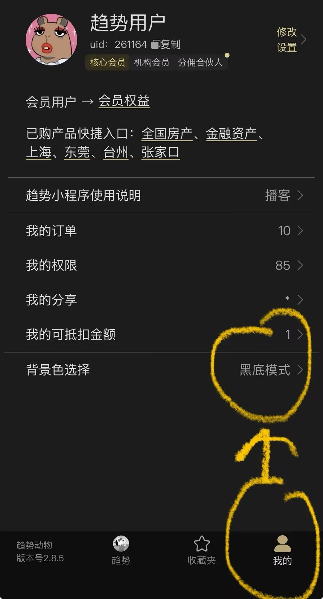

  

如果你知道小程序更新时间和数据口径

### 恭喜你，超过了15%的用户

  

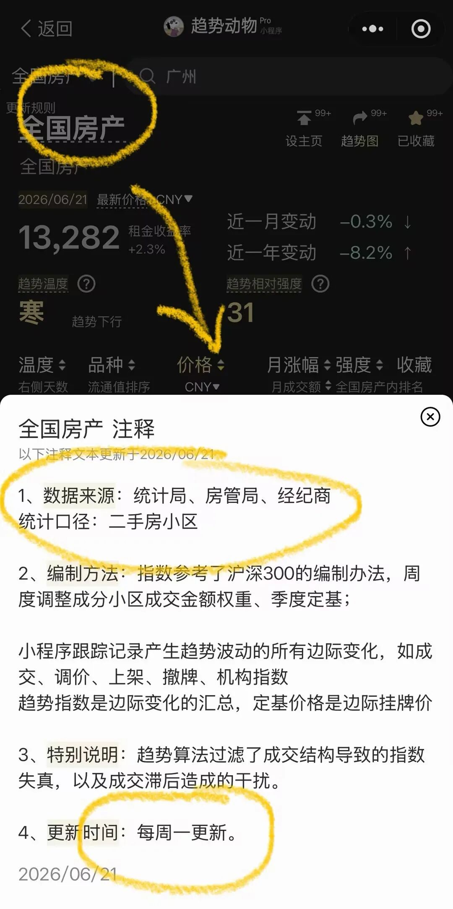

如果你知道小程序不止能看全国、城市、大类，还能看所有小区、个股趋势

### 恭喜你，超过了20%的用户

###   

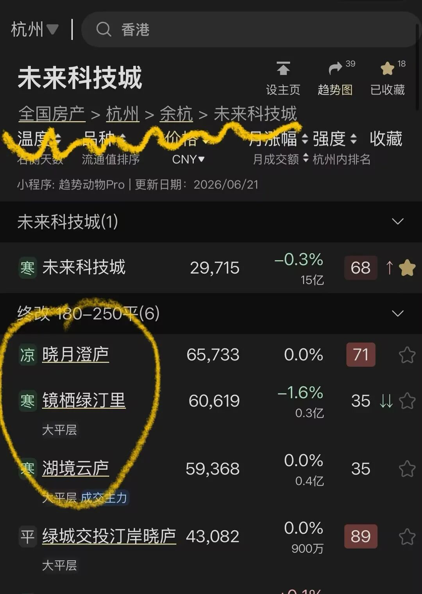

###   

如果你看过房产的“组合”功能

### 恭喜你，超过了25%的用户

###   

搜索“组合”能看到。详情如下：

### [一系列楼市“风格指数”上线。](https://mp.weixin.qq.com/s?__biz=MzkyODQ5MTIzNw==&mid=2247484952&idx=1&sn=6ea115a5cc4e30191c093ab628e8c7d2&scene=21#wechat_redirect)

###   

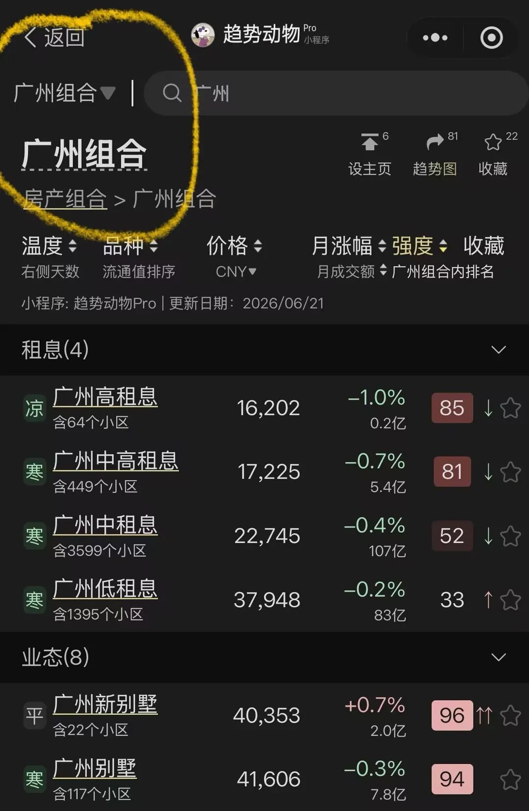

###   

如果你知道趋势图表的线是“价格趋势”，柱子是“成交金额”

### 恭喜你，超过了30%的用户

###   

### 价格趋势：边际挂价定基，调价成交贡献波动；

### 成交金额：成交套数×每套成交总价。

### 每周一更新趋势。

### [20260601 小程序支持查看成交金额...](https://mp.weixin.qq.com/s?__biz=MzkyODQ5MTIzNw==&mid=2247493756&idx=1&sn=5029e3ff7577286325f9fb3db44488a5&scene=21#wechat_redirect)

###   

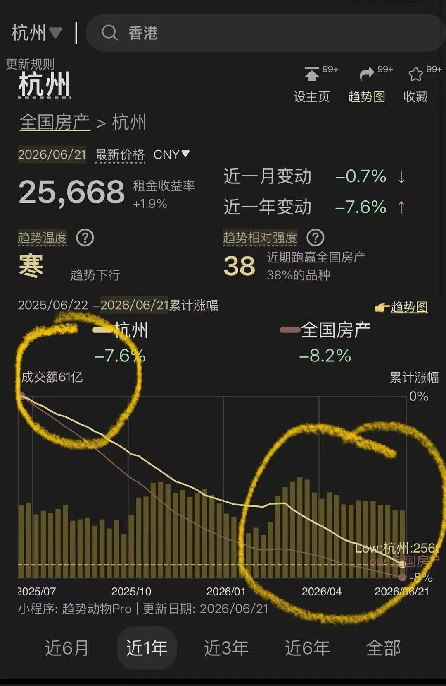

  

如果你知道小程序可以看所有品种的“租金收益率”

### 恭喜你，超过了40%的用户

  

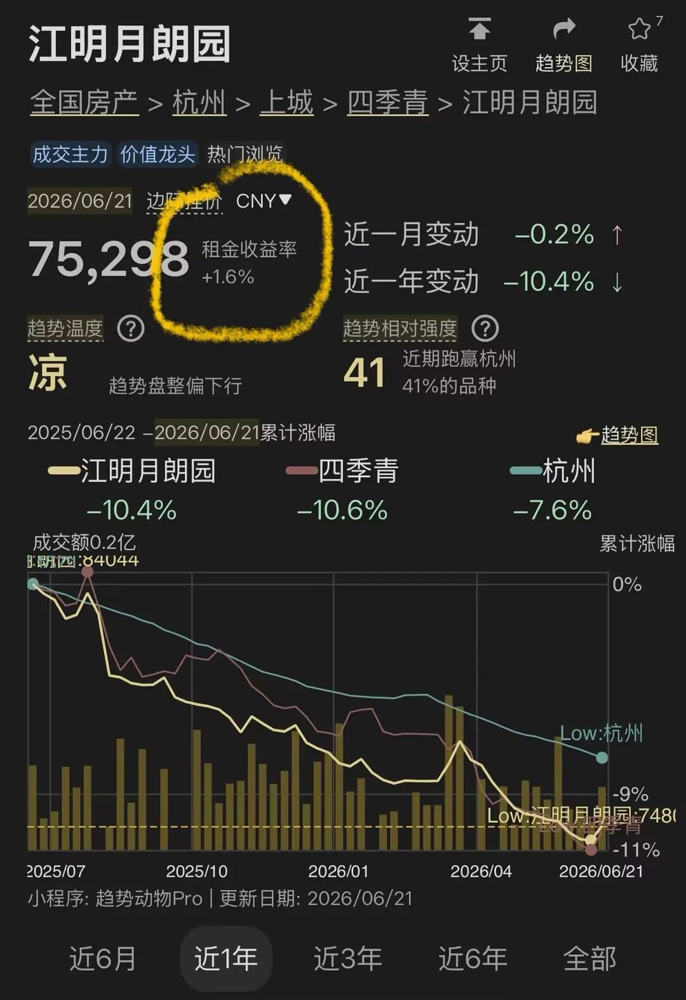

  

如果你会把自己偏好的城市“设为主页”

### 恭喜你，超过了50%的用户

###   

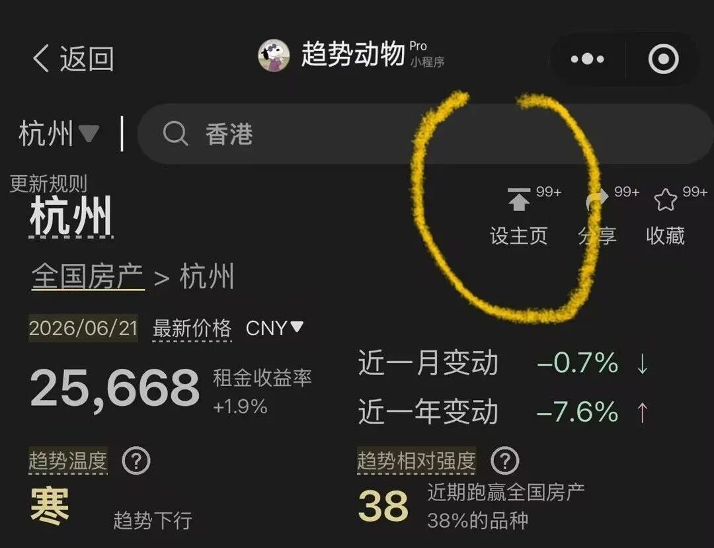

###   

如果你知道趋势表的涨幅区间可以切换

### 恭喜你，超过了55%的用户

###   

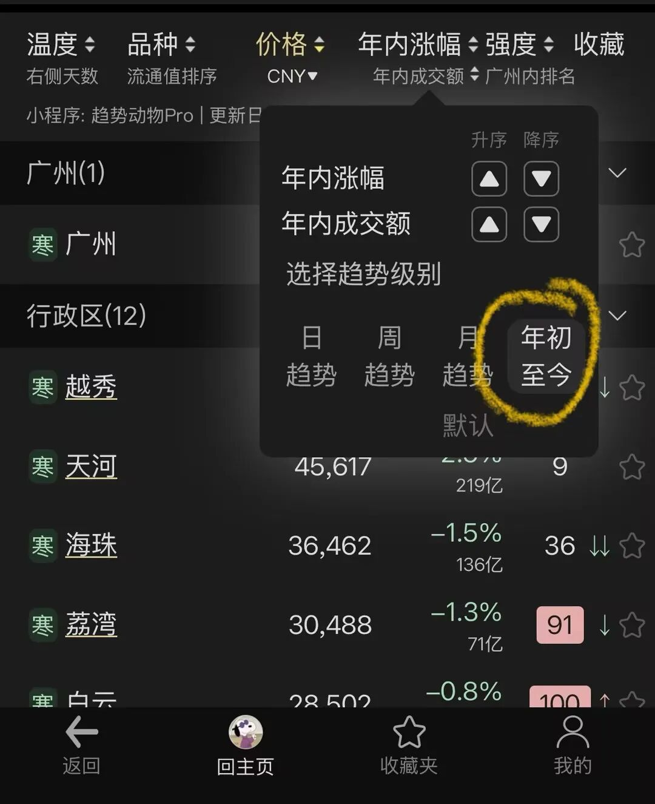

###   

如果你知道趋势线的计价货币可以切换

### 恭喜你，超过了60%的用户

###   

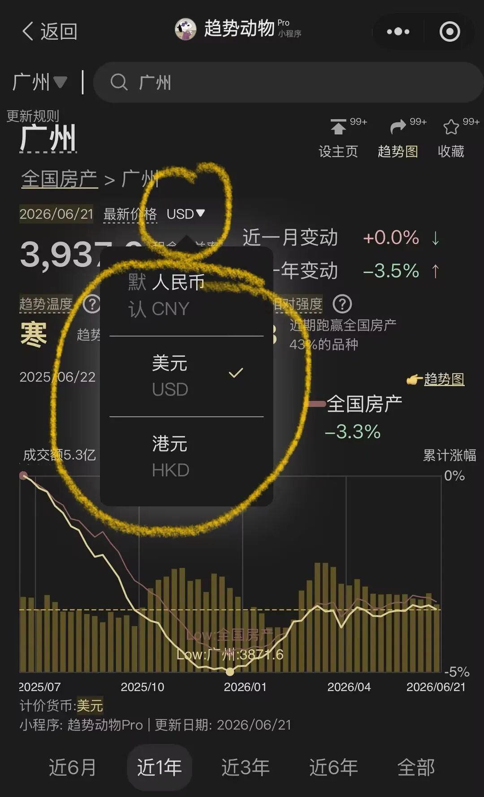

###   

如果你点开过“趋势图”页面

### 恭喜你，超过了70%的用户

  

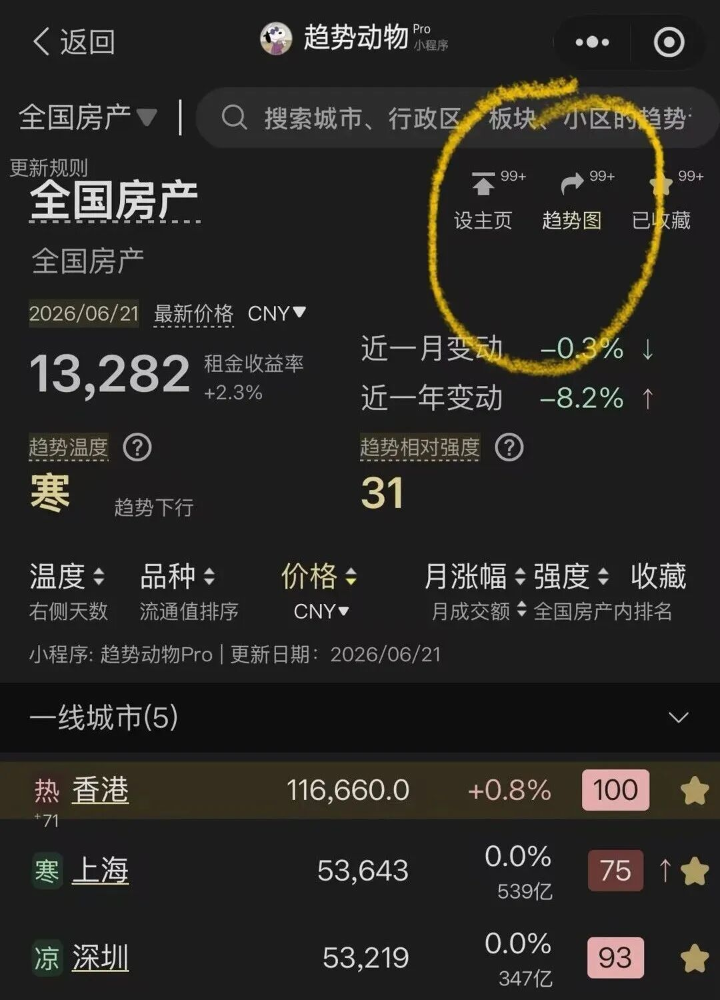

  

如果你知道“趋势图”远不止一张，可以左右切换，可调整水印和去除二维码。

### 恭喜你，超过了80%的用户

###   

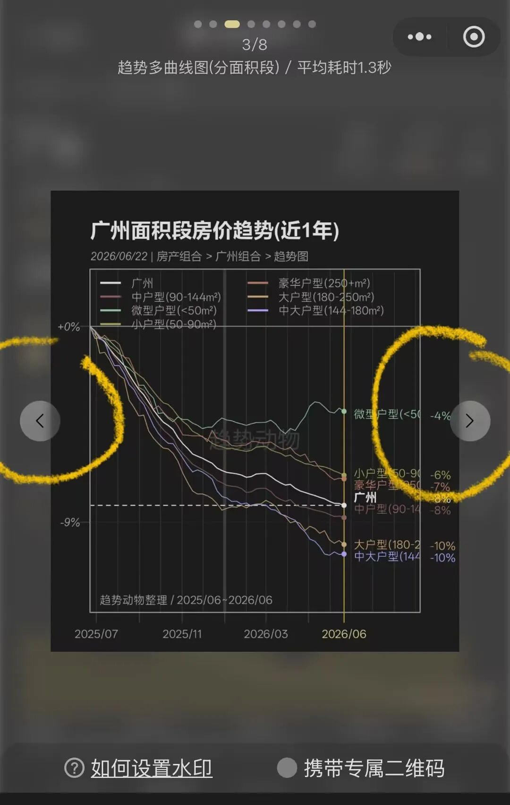

### 图表类型丰富，且将持续增加： 

1 - 趋势曲线：品种价格走势与行业指数、大盘指数的对比图。 

2 - 趋势仪表盘：组合内各成分的核心趋势指标一览，包括温度、强度、收益率。 

3 - 趋势同环比曲线：年同比涨跌幅曲线与月环比涨跌幅柱状图的组合。 

4 - 趋势多曲线图：组合内各成分的价格走势对比，识别领涨龙头。 

5 - 趋势节气图：组合内各成分的趋势节气分布可视化。 

6 - 趋势多曲线图 (分面积段)：房产按面积段拆分的多曲线对比。 

7 - 趋势多曲线图 (分总价段)：房产按总价段拆分的多曲线对比。 

8 - 趋势多曲线图 (分租息段)：房产按租金回报率拆分的多曲线对比。

9 - 趋势多曲线图 (分业态)：房产按物业类型拆分的多曲线对比。 

10 - 租金一览：房产租金、房价、租金回报率的数据表格。 

###   

如果你点开阅读过“趋势温度”和“趋势相对强度”的注释（推荐）

### 恭喜你，超过了85%的用户

  

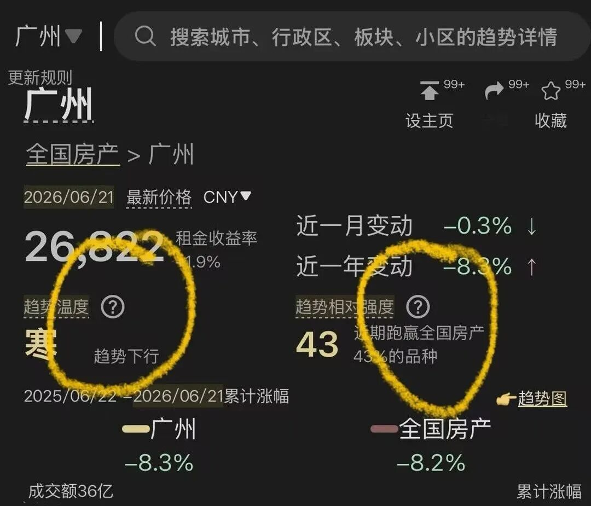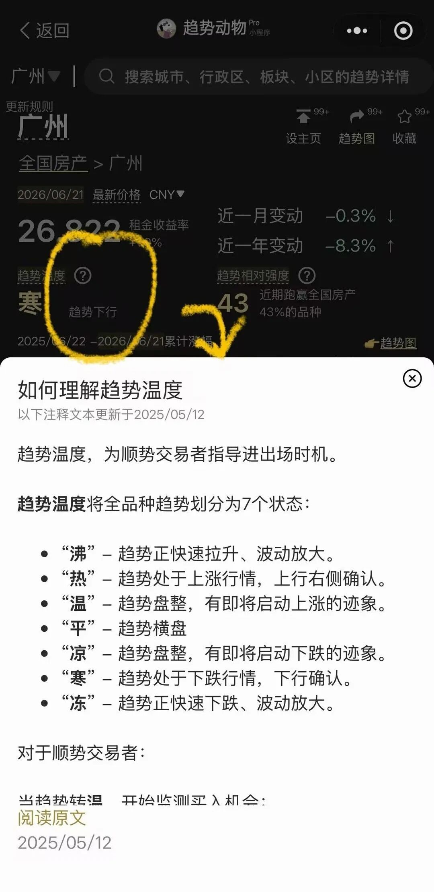

如果你通过“播客”了解过趋势动物的交易理念

### 恭喜你，超过了90%的用户

  

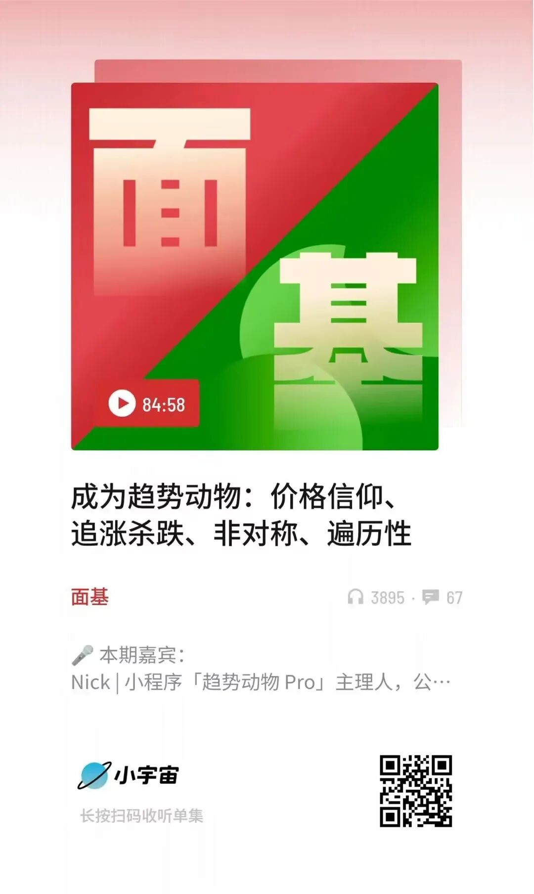

如果你开通解锁了小程序的会员

### 恭喜你，超过了95%的用户

  

欢迎公众号后台联系我，

出示会员截图邀请你加入“趋势小程序”星球。

  

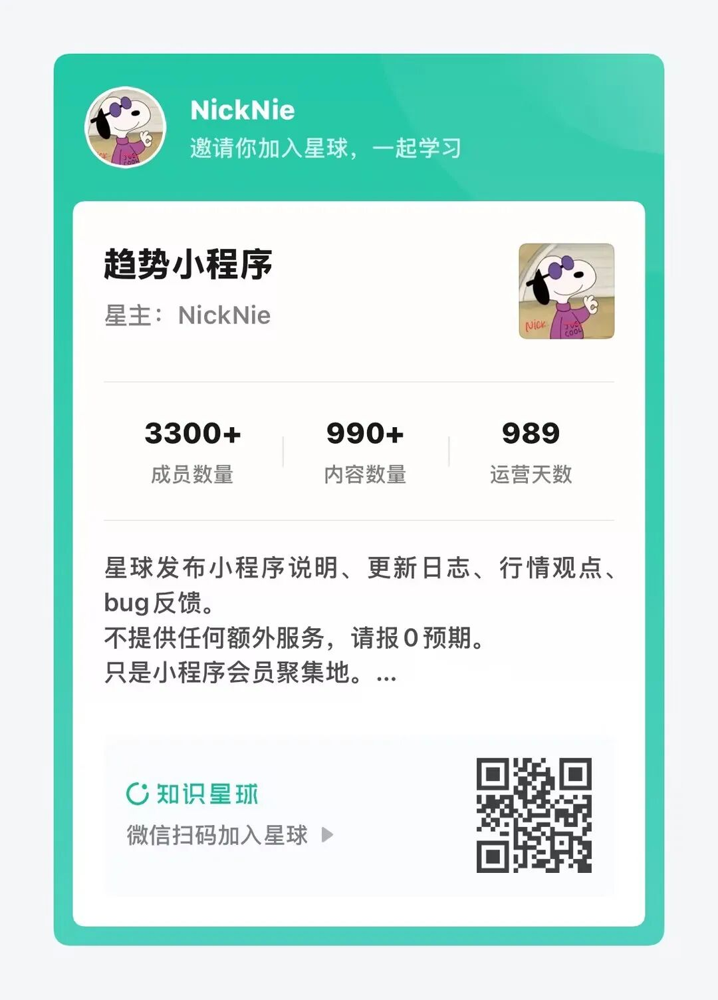

  

详见趋势动物Pro  
趋势动物Nick2026年6月26日
