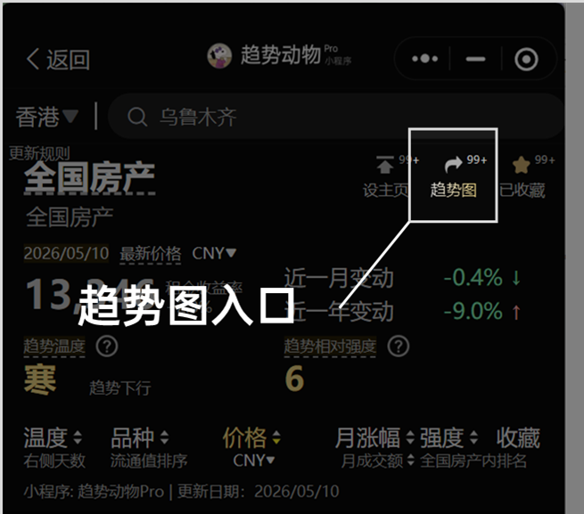
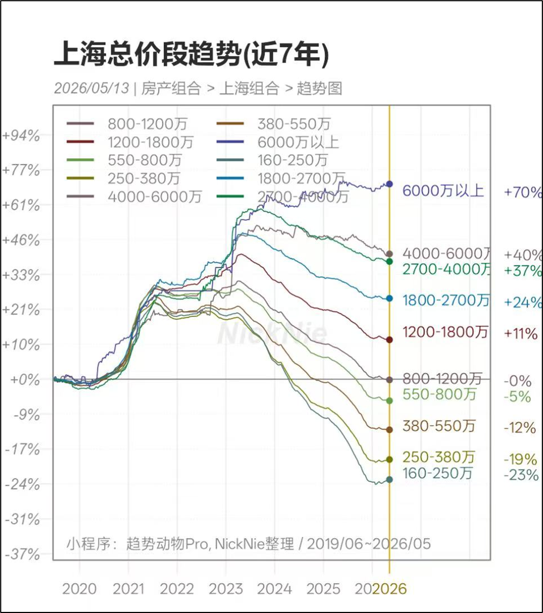
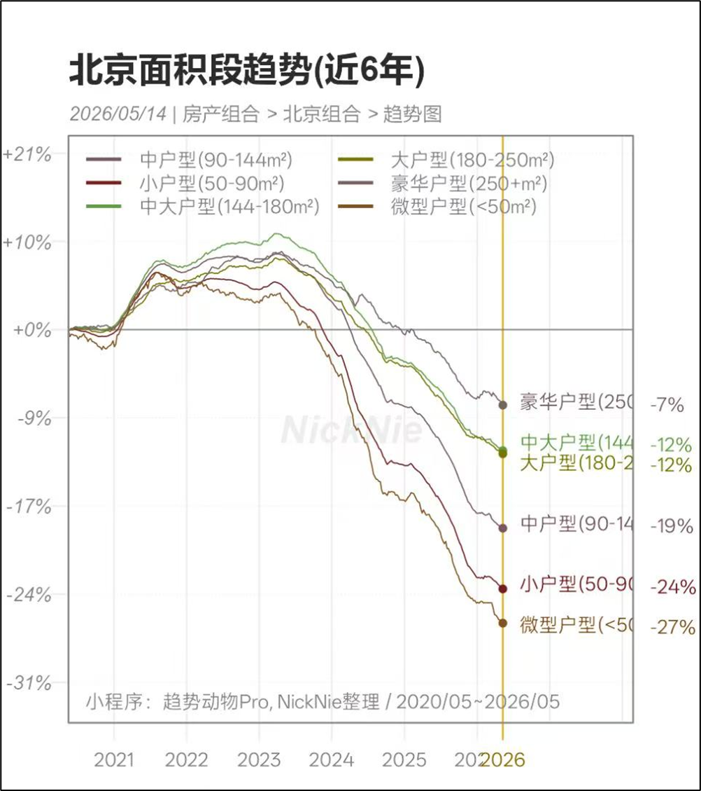
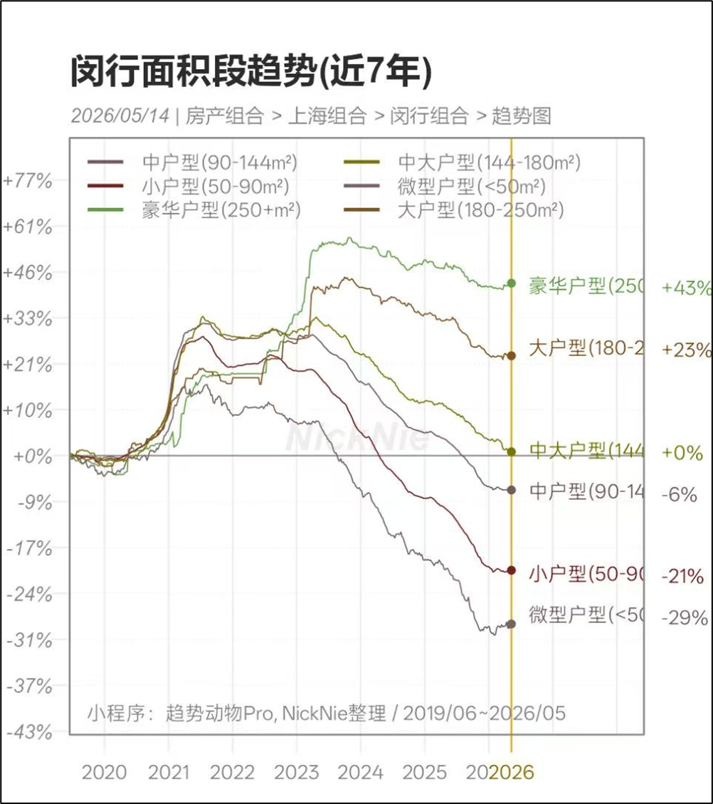
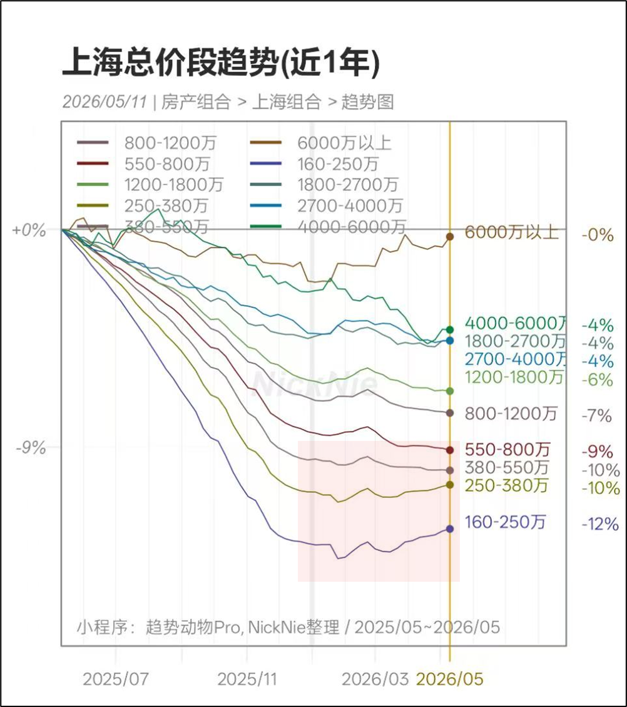
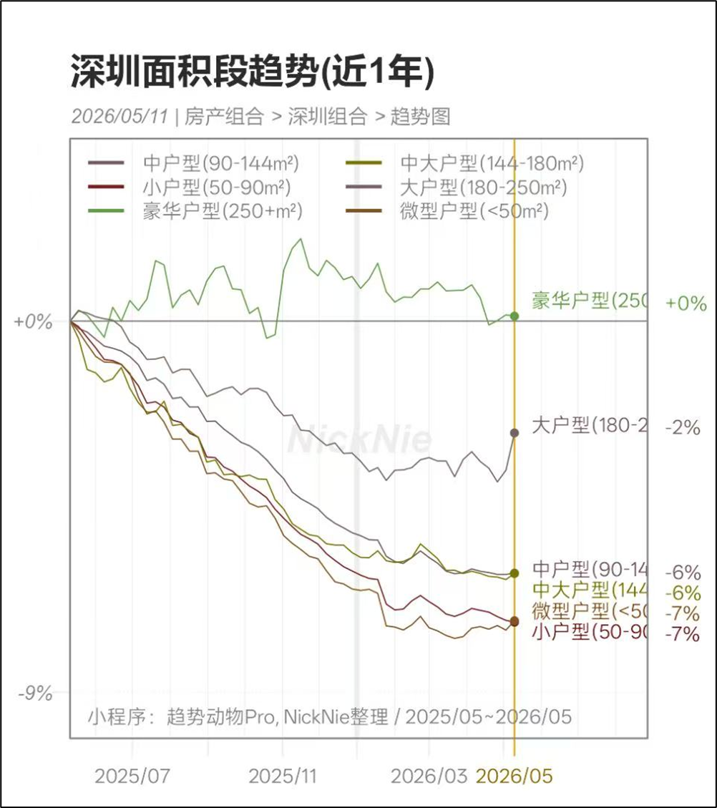

# 可以看各城市分总价段、面积段趋势了

> 来源：[趋势动物公众号](https://mp.weixin.qq.com/s?__biz=MzkyODQ5MTIzNw==&mid=2247493574&idx=1&sn=6ab178e5420b1422e6818f98a9ddd665&chksm=c215544cf562dd5a22c356028c2761b40c64c939a6dadfbde1707a2dcf97b2f5941788a2a501#rd) ｜ 2026年5月14日 18:37

---

继[一系列楼市“风格指数”上线](https://mp.weixin.qq.com/s?__biz=MzkyODQ5MTIzNw==&mid=2247484952&idx=1&sn=6ea115a5cc4e30191c093ab628e8c7d2&scene=21#wechat_redirect)后，

现已上线分总价段、面积段的趋势图了。

  

入口：城市页 > 趋势图。

  

发几个例子：

  

上海、近七年、分总价：

  

## 

##   

## 

北京、近六年、分面积：

  

### **  
**

### **为什么要做分总价段、面积段的趋势？**

  

因为我发现一个现象——

城市内部风格的分化，早已超过城市间的分化和地段分化。

  

之前讨论楼市，总是聊城市轮动和地段论。

然而最新的趋势是：

“风格轮动”反超了“城市轮动”，

“产品论”反超了“地段论”。

**  
**

举个例子，上海同一地段的房产。

🔹别墅的价格比2019年贵+40%以上；

🔹次新房的价格回到了2019年；

🔹老破小的价格比2019年还低-20%。

  

  

而在2021年之前，这三类房产的趋势几乎没有太大分别，

风格的剧烈分化发生在2022年以后，

仅仅4年，风格的差距已经达到30-50%之多，远超城市分化和地段分化。

[20260407 房产天地行情剧烈分化](https://mp.weixin.qq.com/s?__biz=MzkyODQ5MTIzNw==&mid=2247492827&idx=1&sn=da0beb5d34b32a46d0490a5ae5f605f4&scene=21#wechat_redirect)

  

楼市行情从结构性分化开始

**  
**

楼市巨轮普涨很难，但结构性行情已经开始。

打开面积段、总价段、业态等维度，

可以更好的看清趋势强弱，资金的去向。

  

举个例子，[20260421 深圳成长、上海红利](https://mp.weixin.qq.com/s?__biz=MzkyODQ5MTIzNw==&mid=2247493182&idx=1&sn=19b5285c87565402b8a2963f4f56b329&scene=21#wechat_redirect)文章里分享了一个洞察——

当前全国沪深趋势最好，其中，

上海低总价刚需企稳，深圳大户型改善型企稳。

  

得到这个结论的依据就是来自趋势图。

上海低总价、深圳大户型已连续4个月企稳。

  

  

  

趋势图入口

  

推荐探索小程序的“趋势图”入口。 

大部分星球和公众号的图都已开放上线，用户可以自助获取。 

  

🔹趋势多曲线图 

🔹趋势仪表盘 

🔹房产租金回报率一览 

🔹趋势节气图 

🔹价格指数同环比图

  

可以自由选择近X年、图片水印、排序方式。 

欢迎探索。

  

  
详见趋势动物Pro

声明：趋势指标仅供参考，请独立决策，自负盈亏。

  
趋势动物Nick2026年5月14日
