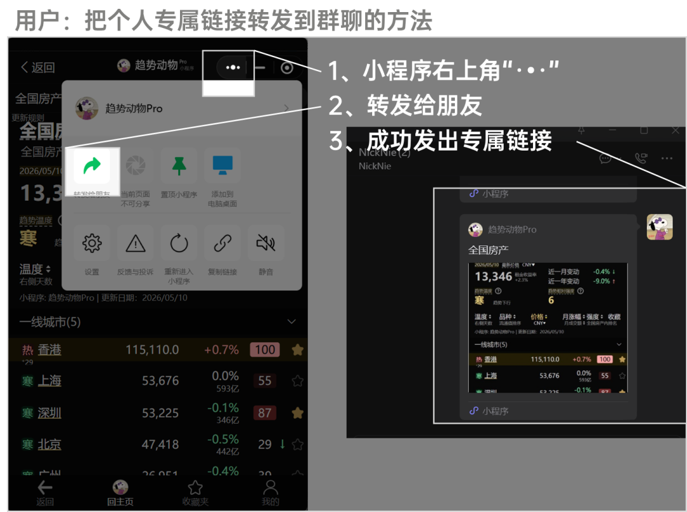
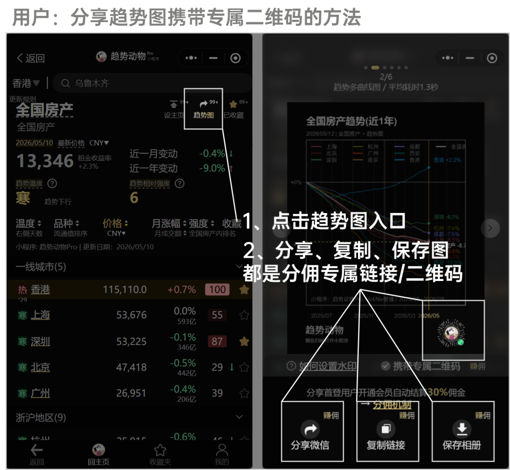
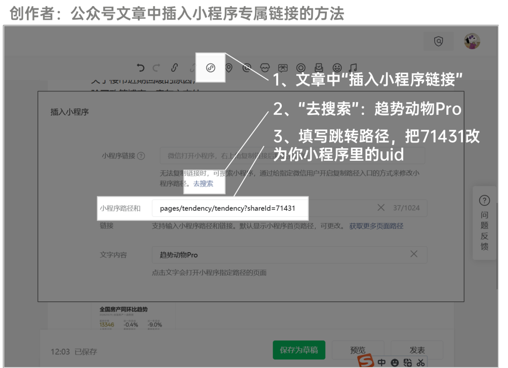
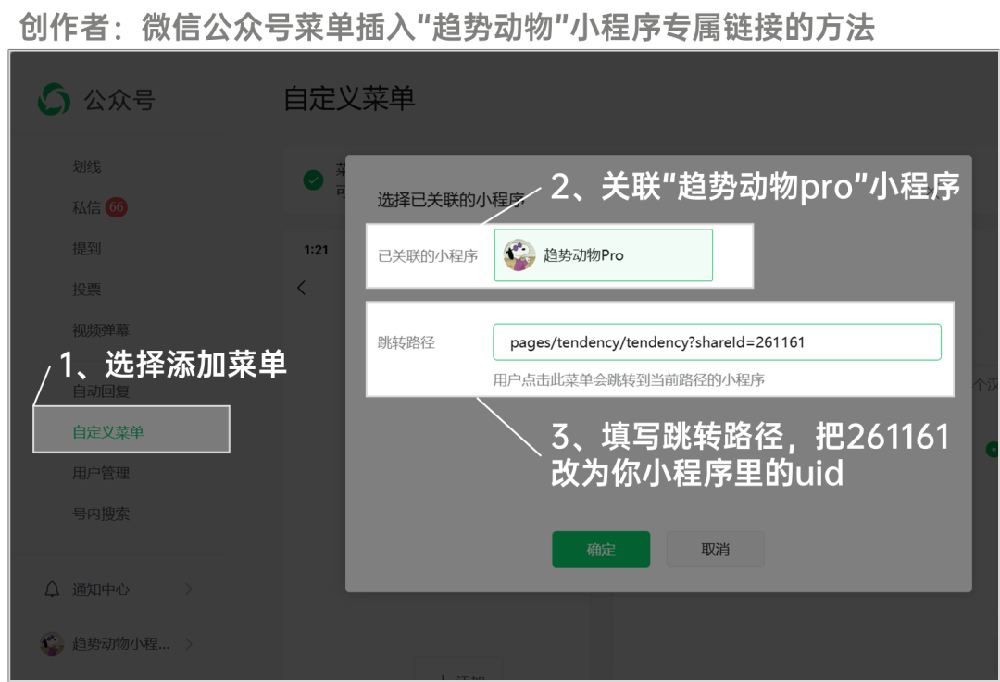
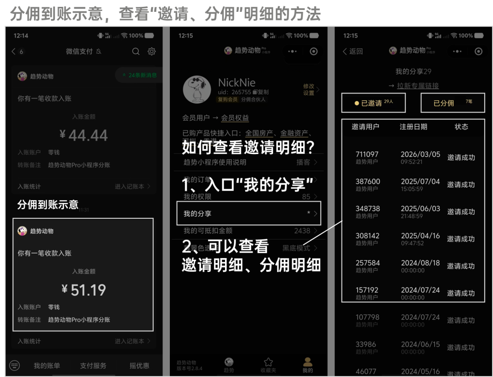

# 说明 | 分享小程序并获得分佣的方法介绍

> 来源：[趋势动物公众号](https://mp.weixin.qq.com/s?__biz=MzkyODQ5MTIzNw==&mid=2247493563&idx=1&sn=5c76ca078e5a424978f6cdf63868b4d2&chksm=c2155431f562dd2794c11cf663089007ce3bedf4224eb8fbba319c0e099e3a3ca05129e120a6#rd) ｜ 2026年5月13日 17:54

---

分佣一直是小程序的默认功能，

面向全体用户、创作者开放。

无需申请、无需注册、无需提现。

自动到账，明细公开。

  

### **分佣规则如下：**

**  
**

1、用户通过你的专属链接/二维码首次打开小程序，即视为“邀请成功”。

终身尾随，不会过期。

2、被你成功邀请的用户，首笔订单金额的30%，成为你的佣金。

支付5分钟内到账微信钱包，无需提现。

  

分享专属链接的方法也非常简单。

以下是具体介绍：

##   

## 如果你是【普通用户】

## 两个方法：

  

### **一、分享给微信好友或群聊（最简单）**

**  
**

——小程序右上角“· •·”按钮，转发好友/群聊。

已默认携带个人专属链接。

**  
**

  

### **二、分享趋势图。**

**  
**

入口：趋势图。

分享趋势图，携带专属二维码，

也可以分享、复制链接（可用于外链跳转）。

  

##   

## 如果你是公众号【创作者】

## 还有额外两种方法：

  

### **三、公众号文章插入小程序专属链接**

  

操作如下图。

修改路径为：pages/tendency/tendency?shareId=261161（把261161改为你的uid）

即可成为个人专属链接。

  

查找你uid的方法：打开“趋势动物pro”小程序，我的页-复制uid

**  
**

### **  
**

### **四、公众号菜单插入小程序专属链接**

  

操作如下图。

修改路径为：pages/tendency/tendency?shareId=261161（把261161改为你的uid）

即可成为个人专属链接。

  

查找你uid的方法：打开“趋势动物pro”小程序，我的页-复制uid

**  
**

### **  
**

### **最后：如何查看“邀请”和“分佣”明细？**

### **打开小程序：我的页 - 我的分享。**

  

  

说明：

趋势动物不收集用户微信信息，只有匿名uid，

用户可以看到邀请了谁、

但无法看到被谁邀请。

  

相关链接：[说明 | 为什么收藏夹的趋势强度和详情页不一样？](https://mp.weixin.qq.com/s?__biz=MzkyODQ5MTIzNw==&mid=2247487164&idx=1&sn=fec922ad15586190ea62f6c755313a5f&scene=21#wechat_redirect)[如何使用趋势动物pro小程序](https://mp.weixin.qq.com/s?__biz=MzkyODQ5MTIzNw==&mid=2247486976&idx=1&sn=dce848dd913bd4c471f8f90178ff03a2&scene=21#wechat_redirect)  
详见趋势动物Pro

声明：指标仅供参考，请独立决策，自负盈亏。

  
趋势动物Nick2026年5月13日
