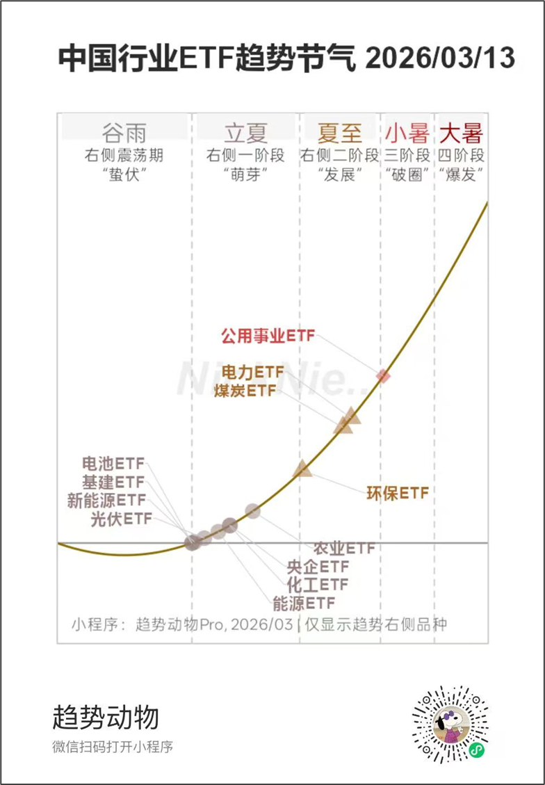
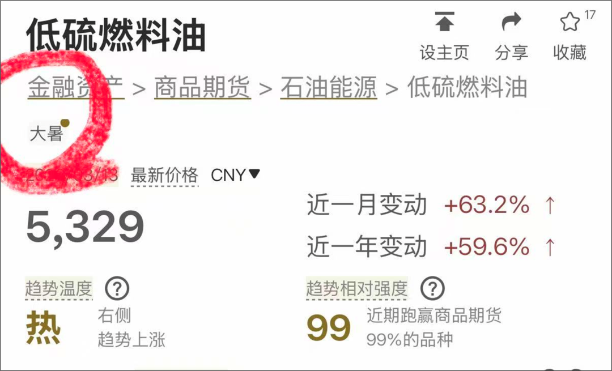
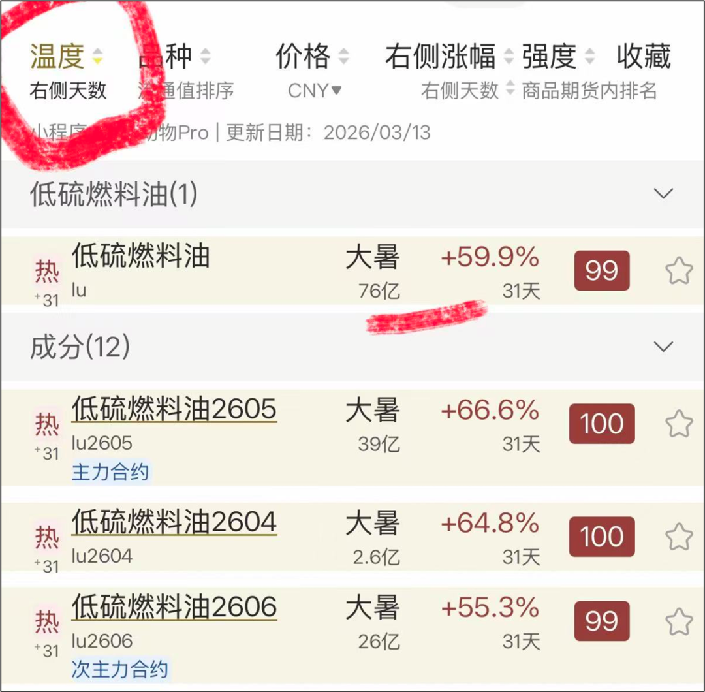
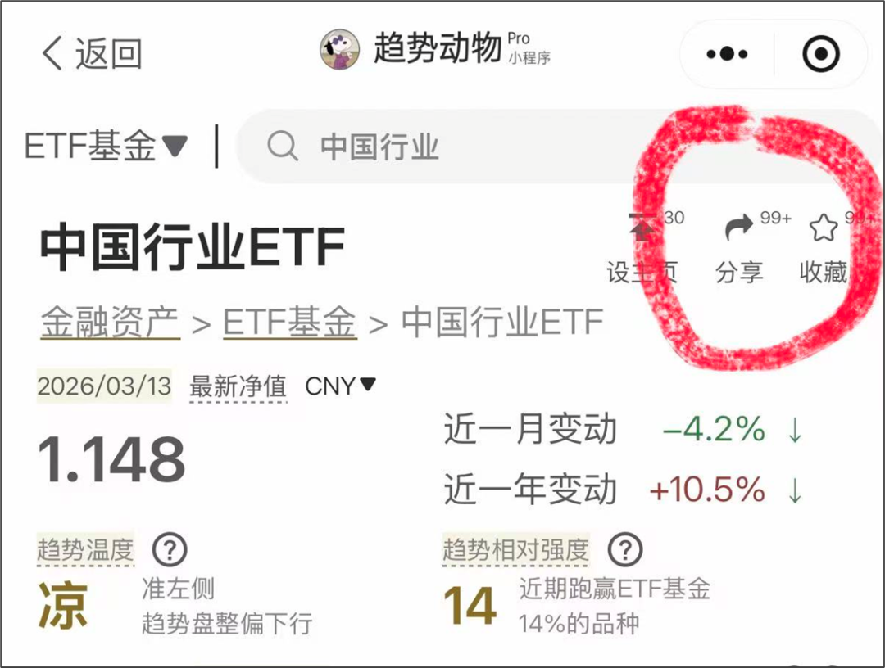
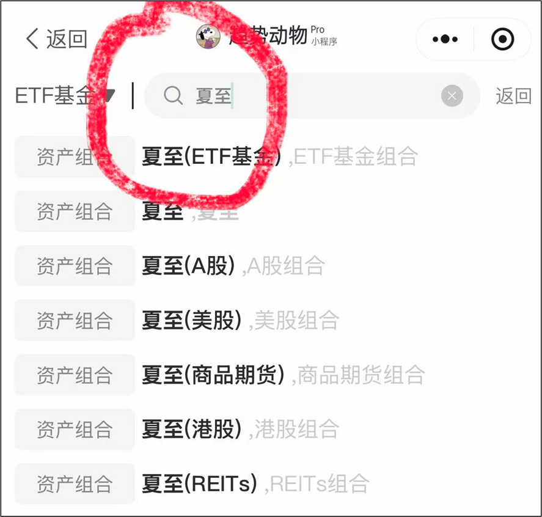

# 指标 | 趋势节气

> 来源：[趋势动物公众号](https://mp.weixin.qq.com/s?__biz=MzkyODQ5MTIzNw==&mid=2247492112&idx=1&sn=8142ddff85b1e1618dd5d7c356043347&chksm=c215519af562d88c16210d7fba5e1110c1598bb0a8ddc5add43ac8a99891b815359e5332069b#rd) ｜ 2026年3月13日 20:39

---

**这是一篇“趋势节气”的说明书。**

  

趋势节气，是对“趋势右侧”各个阶段更精细的划分。

  

如果说“趋势温度”描述的是——有没有进入右侧，

那么“趋势节气”描述的是——这个右侧走到了哪里。

  

它模仿二十四节气的表达，

把一段右侧趋势，拆成从萌芽、发展、破圈到爆发的几个阶段。

  

对应关系如下：

  

谷雨——右侧震荡、蛰伏

立夏——右侧一阶段、萌芽 

夏至——右侧二阶段、发展

小暑——右侧三阶段、破圈（加速）

大暑——右侧四阶段、爆发

立秋——右侧结束、结束

  

为什么有些品种没有“趋势节气”标签？

  

这里最重要的一点是——

趋势节气不是面向全部品种的，而是专门面向处于“趋势右侧”的品种。

  

也就是说，一个品种先要进入右侧，

才谈得上它处于立夏、夏至、小暑还是大暑。

  

什么是趋势右侧？

见这篇文章。[指标 | 趋势右侧](https://mp.weixin.qq.com/s?__biz=MzkyODQ5MTIzNw==&mid=2247491808&idx=1&sn=6f60fd264c323745b866cf1ac05ee78f&scene=21#wechat_redirect)

  

立夏、夏至、小暑、大暑、立秋代表什么？

  

趋势节气是对右侧阶段的再次拆分，

帮助我们判断：这是右侧初期，还是右侧后期。

  

立夏阶段，更像是趋势刚刚从土里冒头。

这时候行情可能刚启动，涨幅未必大，

市场关注度也未必高，但持仓逻辑相对更完整。

  

夏至阶段，趋势进一步发展，

开始变得更清晰，右侧的确定性通常比立夏更强一些。

  

到了小暑，往往意味着行情已经走出辨识度，

开始破圈，开始吸引更多资金和关注。

  

到了大暑，通常已经是右侧后段，

也是趋势最猛烈、最拥挤、最容易剧烈波动的阶段。

  

立秋，趋势结束。

  

所以，趋势节气是“趋势位置”的进一步指导。

它不是告诉你“能不能买”，

而是帮助你理解“现在买，买的是右侧前段还是右侧后段”。

  

  

买趋势节气越早的越好？

  

没有标准答案。

  

对于稳健型交易者，如果风险偏好偏低，

希望持仓周期更长，更适合参与早期节气。

比如立夏、夏至，或者至少尽量在小暑之前完成开仓。

  

因为越靠前，通常意味着趋势刚展开，

后续可持有空间更大，容错率也相对更高。

并不是立夏就一定安全，而是和小暑、大暑相比，它更像是右侧的前半程。

  

对于激进型交易者，

如果你的风格本来就是追龙头、追强势、追加速，

那么小暑甚至大暑，也可以参与。

参与这类节气，本质上是在接右侧后段的加速行情，

吃的是情绪、强度和惯性。

它的特点不是“不能做”，而是“只能短做”。

持仓周期一定要短，并且要时刻保持离场的预期和觉悟。

因为越到后段，趋势越强，但同时也越脆弱。

一旦转向，回撤往往很快。

  

这也是趋势节气想表达的第二层意思——

不是强就一定更好，而是不同阶段，

适合不同类型的交易者。

  

稳健的人，更适合早一点，追求安全。

激进的人，可以晚一点，追求效率，接受更短的周期和更高的波动。

  

如果你完全忽略节气，无论右侧早期、后期，全部执行交易。

依然是完全是可以的。

  

根据自己的性格和偏好，制定纪律。并严格执行。

[什么是“按趋势做”？](https://mp.weixin.qq.com/s?__biz=MzkyODQ5MTIzNw==&mid=2247487956&idx=1&sn=1ccdc168f1550959c933cc058cf7bd2e&scene=21#wechat_redirect)

  

进入右侧的品种一定会走完整的趋势节气吗？

  

不一定。趋势不可预测。

  

买入“立夏”，并不意味着行情一定会继续演进到“小暑”或“大暑”。

很多品种在立夏阶段就结束了，甚至刚进入右侧不久，就重新下跌，结束右侧。

  

同样，买入“小暑”，也不代表下一个阶段必然是大暑。

小暑之后，也可能直接结束。

趋势从来不是按节气顺序机械推进的。

做好交易纪律，接受一切可能的结果。

  

如何查询小程序的趋势节气？

  

1、右侧的品种，会在趋势详情页标注节气标签。

  

2、点击温度排序，能看到页面所有品种的节气和右侧涨幅。

  

3、点击分享（趋势图），右滑，会出现当前页面右侧品种的节气一览图。

  

4、直接搜索“夏至”、“立夏”等节气词组，可直达。

  

相关链接：[指标 | 趋势相对强度](https://mp.weixin.qq.com/s?__biz=MzkyODQ5MTIzNw==&mid=2247484206&idx=1&sn=c21e53ba53c3593493eafcbbfe711c1d&scene=21#wechat_redirect)[指标 | 趋势温度](https://mp.weixin.qq.com/s?__biz=MzkyODQ5MTIzNw==&mid=2247484004&idx=1&sn=3570fde6439546defab30a96a9985821&scene=21#wechat_redirect)  
详见趋势动物Pro

声明：指标仅供参考，请独立决策，自负盈亏。

  
趋势动物Nick2026年3月13日
