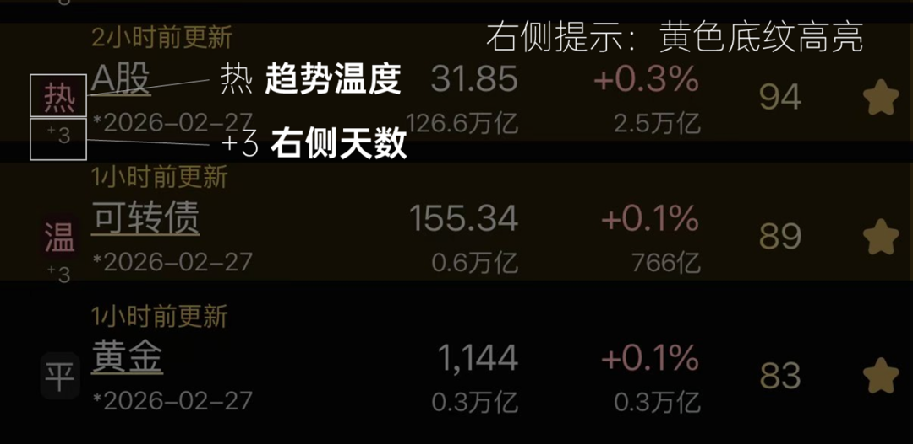

# 指标 | 趋势右侧

> 来源：[趋势动物公众号](https://mp.weixin.qq.com/s?__biz=MzkyODQ5MTIzNw==&mid=2247491808&idx=1&sn=6f60fd264c323745b866cf1ac05ee78f&chksm=c215536af562da7ccd65d1f929706085d06266719fae9f6f79dfe2802f7b2d87ab4d3f995ef0#rd) ｜ 2026年2月27日 18:46

---

**这是一篇关于“趋势右侧”定义的说明。**

**  
**

趋势小程序是 服务“顺势交易者”的工具。

最核心的理念是：右侧交易。

**[为什么要右侧交易？](https://mp.weixin.qq.com/s?__biz=MzkyODQ5MTIzNw==&mid=2247487254&idx=1&sn=bbbe161d59e003117dbb1f63caa151df&scene=21#wechat_redirect)**

**  
**

小程序里有一套关于“趋势右侧”指标体系。

本文做个说明：

  

所有品种的趋势温度分为七档：

沸、热、温、平、凉、寒、冻。

  

当一个品种的趋势第一次触发“热”的温度，

标志着正式进入“趋势右侧”，

也叫“温转热”。

  

此时右侧天数开始计数。

每当趋势行情更新，

只要品种在右侧持续，右侧天数+1天

其中1天为自然日口径，包含非交易日

[更新 | “右侧天数”指标公测上线](https://mp.weixin.qq.com/s?__biz=MzkyODQ5MTIzNw==&mid=2247486233&idx=1&sn=8af646b34e032b40ec5a859fa1c64ca7&scene=21#wechat_redirect)

  

何时右侧结束？

  

当处于右侧的品种，第一次趋势温度降到“平”以下的温度。

标志着该品种“右侧结束”，

也叫“温转平”。

  

此时右侧天数清零。

  
注：小程序里的温转热、温转平标签，实际上分别是进入右侧、结束右侧的信号。并非狭义概念的趋势温度“温转热”，比如：平转热、温转沸也可能被标注为“温转热”，因为此时右侧开始。  
在小程序中，对于所有处于“趋势右侧”的品种，显示为“底纹黄色高亮”，如图所示。  
图中所示：A股在当前截面，温度为热。进入右侧第三天，目前依然在趋势右侧没有结束（因此被高亮）。  
对于大部分时间、大部分品种，趋势处于无序震荡的“非右侧”状态。对于趋势交易者，应该把精力投入在有限的“趋势右侧”品种去。  
针对处于右侧的品种，“趋势节气”是对右侧状态的进一步的划分。将在未来的另一篇文章中介绍。  
可以关注并订阅“使用说明”文章合集，进行查看。  
相关链接：[指标 | 趋势相对强度](https://mp.weixin.qq.com/s?__biz=MzkyODQ5MTIzNw==&mid=2247484206&idx=1&sn=c21e53ba53c3593493eafcbbfe711c1d&scene=21#wechat_redirect)[指标 | 趋势温度](https://mp.weixin.qq.com/s?__biz=MzkyODQ5MTIzNw==&mid=2247484004&idx=1&sn=3570fde6439546defab30a96a9985821&scene=21#wechat_redirect)  
详见趋势动物Pro  
趋势动物Nick2026年2月27日
