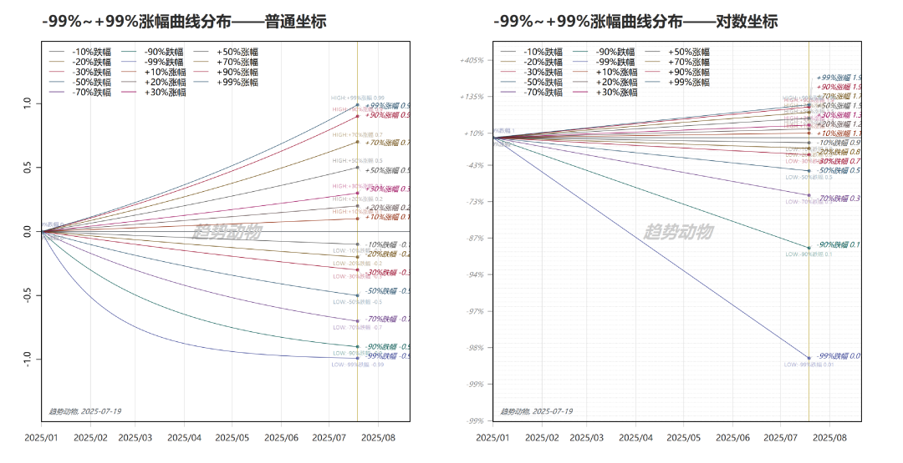
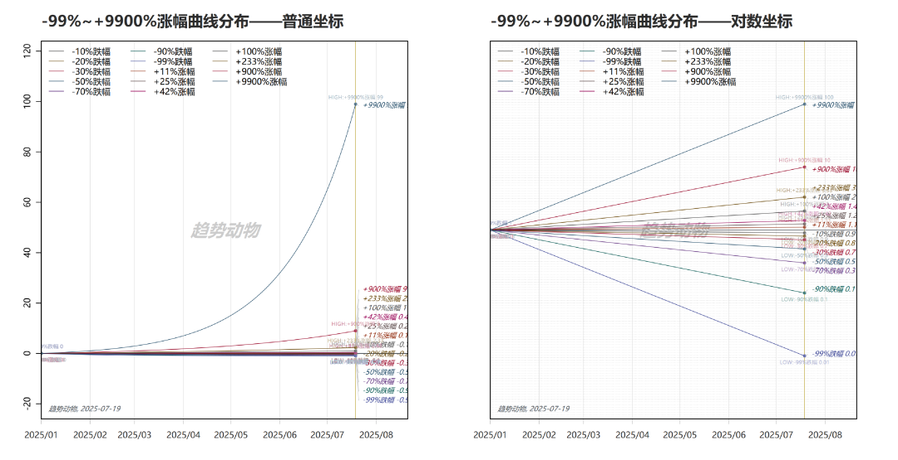

# 为什么小程序用对数坐标？（二）

> 来源：[趋势动物公众号](https://mp.weixin.qq.com/s?__biz=MzkyODQ5MTIzNw==&mid=2247486255&idx=1&sn=83952eba1d6b43c51df965b278e2bc6e&chksm=c216b8a5f56131b333992314f95c68e23a7589a8d53be00ca3e5b1e68b28f8fbc10613c373e8#rd) ｜ 2025年7月19日 16:21

---

接上文：[为什么小程序用对数坐标？](https://mp.weixin.qq.com/s?__biz=MzkyODQ5MTIzNw==&mid=2247486249&idx=1&sn=d022cae57f77b0e5ca623e765e2b943d&scene=21#wechat_redirect)  
前文聊了增速，这篇聊聊跌幅。结论依然同上篇：对数坐标更客观的反应价格「跌幅」  
  
存在一个关于涨跌幅的“直觉陷阱”：「涨跌幅」并不是对称的。  
当我们说-20%和+20%的时候，两者并不对称。  
举个例子，下图  
当把-99%跌幅~+99%涨幅曲线分别画在“普通坐标轴”（左）和“对数坐标轴”（右）时，会发现：🔹在“普通坐标”：-99~+99%的涨跌幅分布均匀、对称，🔹在“对数坐标”：-99~+99%的涨跌幅分布显著不对称，跌幅的整体深度远超直觉。  
  
分享一个细节：对数坐标上：“-90%跌幅”所在的位置，和“-99%跌幅”所在的位置，相距极远，超越了直觉。  
想象这样的一个过程：总投入100元，跌了90%，跌到10元。在10元的基础上，再跌90%，跌到1元。总跌幅99%。直觉上，-90%和-99%的跌幅差不了多少，但实际上差距巨大。因为-99%是由先亏90%，再亏90%完成的，相当于走了两倍的距离。对数坐标更客观的反应了这个情况。  
相信长期交易的朋友都很熟悉这样一组表述：  
🔹下跌-10%，需要上涨+11%，才能回本🔹下跌-20%，需要上涨+25%，才能回本🔹下跌-30%，需要上涨+42%，才能回本🔹下跌-50%，需要上涨+100%，才能回本🔹下跌-70%，需要上涨+233%，才能回本🔹下跌-90%，需要上涨+900%，才能回本🔹下跌-99%，需要上涨+9900%，才能回本。  
普通坐标下，这样的表述似乎超越了直觉，对数坐标下，前者“下跌跌幅”和后者的“上涨涨幅”直观等价。  
如图：左图普通坐标，超越直觉；右图对数坐标，直观合理资产趋势属于“极端斯坦”的世界，理应用对数坐标。上述表述其实就是对数世界在普通坐标表述形成的直觉陷阱：因为在日常语言的表述里：跌幅被限定在（-100%~0%）的狭窄区间，涨幅被限定在（0%~+无穷大）的广阔区间。天生不对等。  
正因如此：人们容易低估跌幅数字背后的实际回撤深度，也容易高估涨幅数字背后的实际上涨烈度。导致了我们倾向于“拿不住涨幅、愿意容忍跌幅”的交易心态，  
这一切归因来自“普通坐标”思维的数学表达如果用“对数思维”来重新表述，自然就不会觉得奇怪。  
🔹下跌-10%发生1次，需要+10%上涨1次，才能回本；下跌-10%一次的跌幅是 (1÷(1+10%))^(1)-1 = -9%上涨+10%一次的涨幅是 (1×(1+10%))^(1)-1 = +11%🔹下跌-10%发生2次，需要+10%上涨2次，才能回本；下跌-10%两次的跌幅是 (1÷(1+10%))^(2)-1 = -17%上涨+10%两次的涨幅是 (1×(1+10%))^(2)-1 = +21%🔹下跌-10%发生3次，需要+10%上涨3次，才能回本；下跌-10%三次的跌幅是 (1÷(1+10%))^(3)-1 = -24%上涨+10%三次的涨幅是 (1×(1+10%))^(3)-1 = +33%🔹下跌-10%发生4次，需要+10%上涨4次，才能回本；下跌-10%四次的跌幅是 (1÷(1+10%))^(4)-1 = -31%上涨+10%四次的涨幅是 (1×(1+10%))^(4)-1 = +46%🔹下跌-10%发生5次，需要+10%上涨5次，才能回本；下跌-10%五次的跌幅是 (1÷(1+10%))^(5)-1 = -37%上涨+10%五次的涨幅是 (1×(1+10%))^(5)-1 = +61%🔹下跌-10%发生6次，需要+10%上涨6次，才能回本；下跌-10%六次的跌幅是 (1÷(1+10%))^(6)-1 = -43%上涨+10%六次的涨幅是 (1×(1+10%))^(6)-1 = +77%🔹下跌-10%发生7次，需要+10%上涨7次，才能回本；下跌-10%七次的跌幅是 (1÷(1+10%))^(7)-1 = -48%上涨+10%七次的涨幅是 (1×(1+10%))^(7)-1 = +94%...  
小程序的趋势曲线图，全部采纳“对数坐标”。把“跌幅”和“涨幅”都直观转换到真实对数世界中，还原真实，有助于更好指导科学的交易决策。  
详见趋势动物pro  
Nick2025年7月19日
