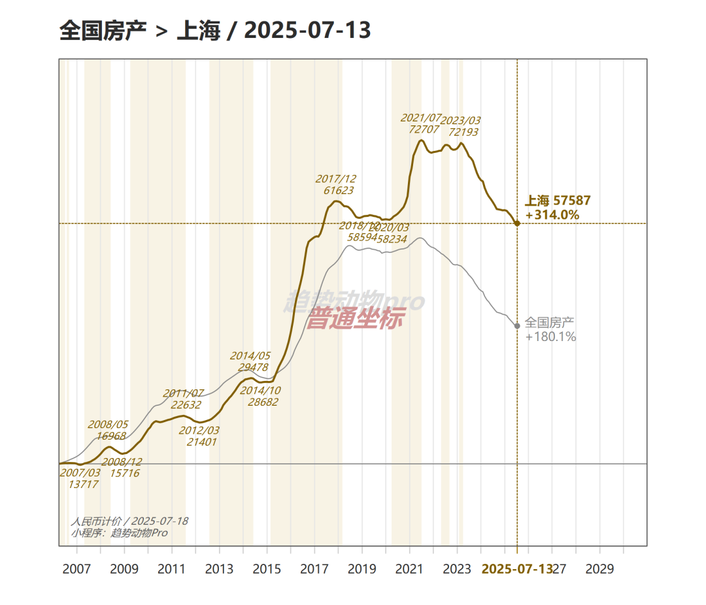
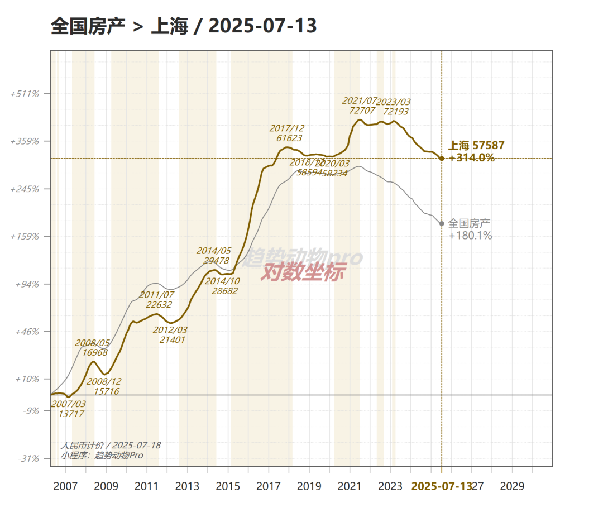
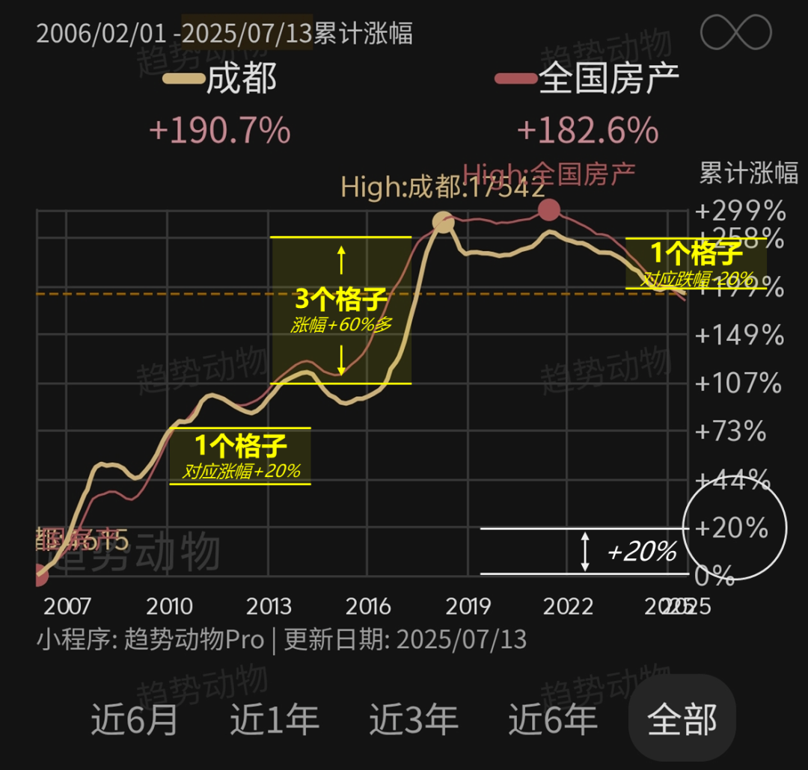
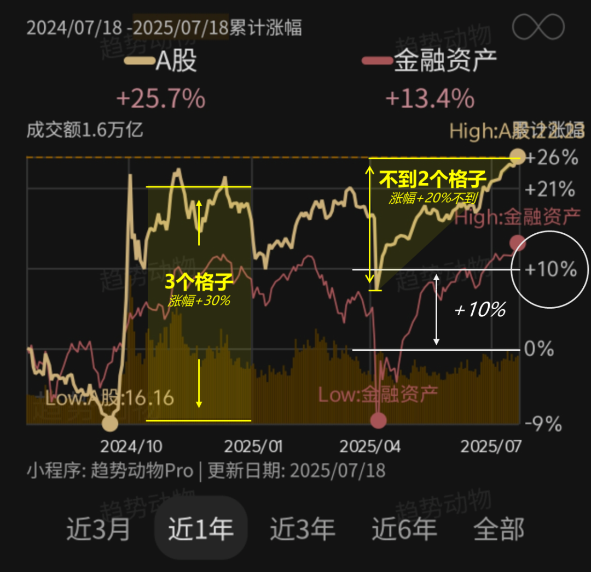
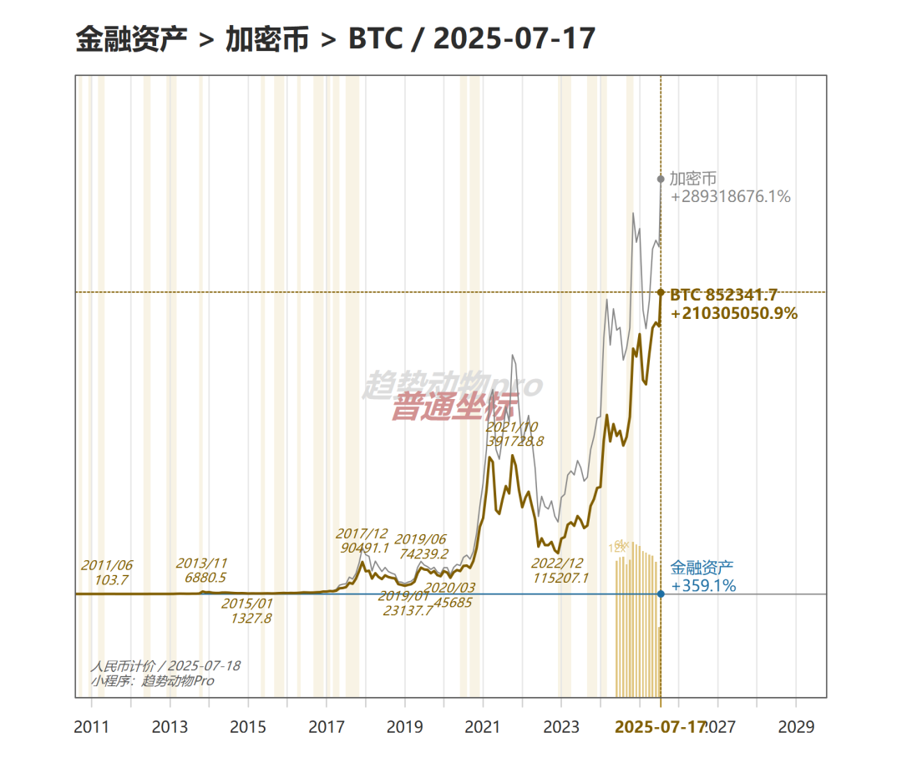
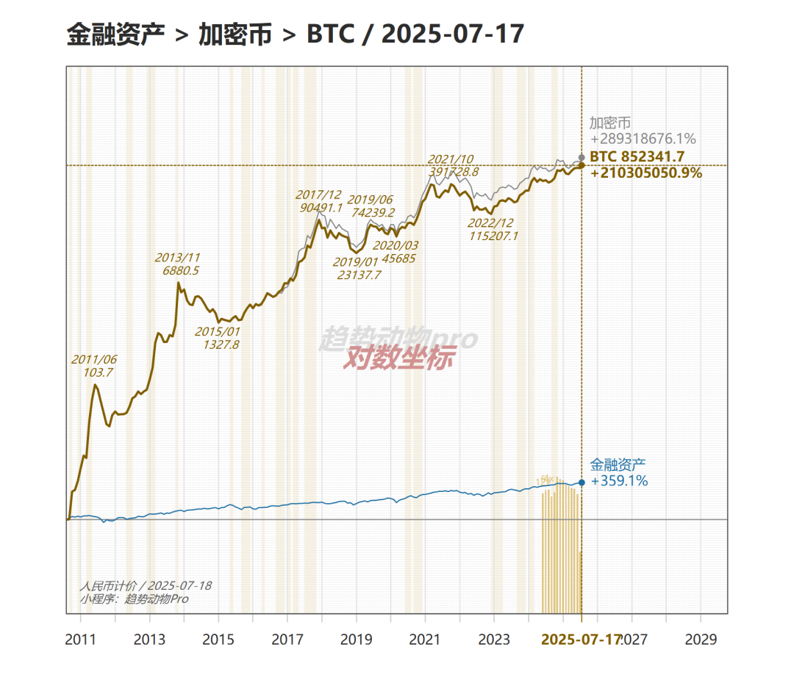

# 为什么小程序用对数坐标？

> 来源：[趋势动物公众号](https://mp.weixin.qq.com/s?__biz=MzkyODQ5MTIzNw==&mid=2247486249&idx=1&sn=d022cae57f77b0e5ca623e765e2b943d&chksm=c216b8a3f56131b53db173910d37f8a5d210610fc92dc5ac161f47f5b844ae37cfddc09978f9#rd) ｜ 2025年7月18日 18:31

---

小程序的所有品种的价格曲线图，用的是对数坐标。  
为什么用对数坐标？有几点好处。  
一、对数坐标更客观的反应价格「价格增速」  
  
举个例子。上海  
如果从「普通坐标」看，下图会得到直观结论：上海2019-2021年的房价涨幅很大，仅次于15-16年。因为：🔹2019~2021——房价从5.8万涨到了7.2万，涨了1.4万🔹2008~2011——房价从1.5万涨到了2.2万，只涨了7千似乎是前者涨幅更大。但实际上，2008~2011年的涨幅，显著大于2019~2021年的涨幅，因为：🔹2019~2021——房价从5.8万涨到了7.2万，涨幅+24%🔹2008~2011——房价从1.5万涨到了2.2万，涨幅+46%  
08~11年的涨幅是19~21年涨幅的两倍而「普通坐标」图给了错误的直觉暗示。  
也许有读者会反驳：如果同样买了一百平，19~21年涨了1.4万，净收益140万，而08~11年涨了7千，净收益只有70万。显然19~21年赚更多，不是吗？  
回答：要考虑投入资金量。  
「净收益 / 投入资金量」 才是 收益率公式。🔹2019年，投入580万，净收益140万🔹2008年，投入150万，净收益70万哪个收益更高？  
如果转换为对数坐标，看的很清楚。下图事实上，2019~2021年上海的涨幅并不大，不仅次于2015-2016，涨幅甚至弱于2012~2014和2008~2011。  
二、对数坐标直观丈量「收益率」  
对数坐标最妙的一点莫过于，可以直接通过丈量纵坐标间距，来计算收益率直接上手量，量多少是多少。直接、简洁、高效。  
小程序里，不仅采用对数坐标，并且标注了等距辅助横线，如果要统计两点之间的“涨幅”或“收益率”，直接数格子就行。  
举例1：成都-全部，下图  
  
首先看格子代表的单位，白字标注每两根“灰色”的横线之间的间隔涨跌幅为+20%  
然后就可以估算涨跌幅了，黄字标注🔹2010年附近的涨幅波段，一个格子对应20%涨幅🔹2016年~2018年最高点，3个半格子，接近4个格子，那就粗算是4*20% = 80%的收益率。🔹2021年局部高点到现在，跌掉了一个格子，粗算跌幅就是-20%  
举例2：A股-近1年，下图  
首先看格子代表的单位，白字标注每两根“灰色”的横线之间的间隔涨跌幅为+10%  
然后就可以估算涨跌幅了，黄字标注🔹2024年9月底的跨节行情，三个格子对应+30%的涨幅🔹2025年4月至今的反弹，不到两个格子，对应略低于+20%反弹幅度  
三、资产价格遵从“极端斯坦”的肥尾分布，用对数才符合真实世界  
这是小程序采用对数坐标轴的根本原因如果您是趋势交易者强烈建议忘记“价格”这个指标完全采用“累计涨幅”作为净值指标、在对数坐标里认识、理解资产的趋势宇宙。因为无论是交易目标、交易时机、还是交易结果，都应由“收益率”丈量和评判因此，对数坐标才是指导交易最理想的图表。  
四、最后附一张极端的案例大饼的例子，可能是理解对数坐标最好的案例  
「普通坐标」下，下图加密币价格似乎是最近才开始直线拉升。「对数坐标」才是真实世界，下图最快增速实际上是早期，随着大饼的破圈，近十年增速斜率是不断变缓的。  
详见趋势动物pro  
Nick2025年7月18日
