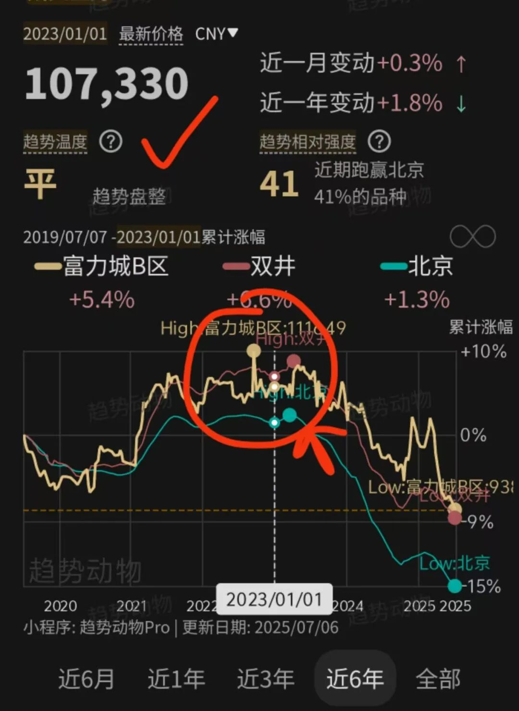
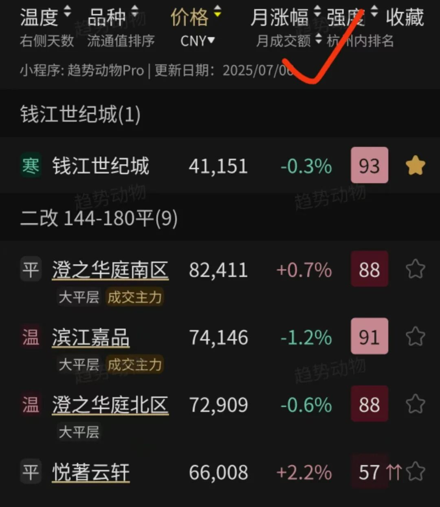
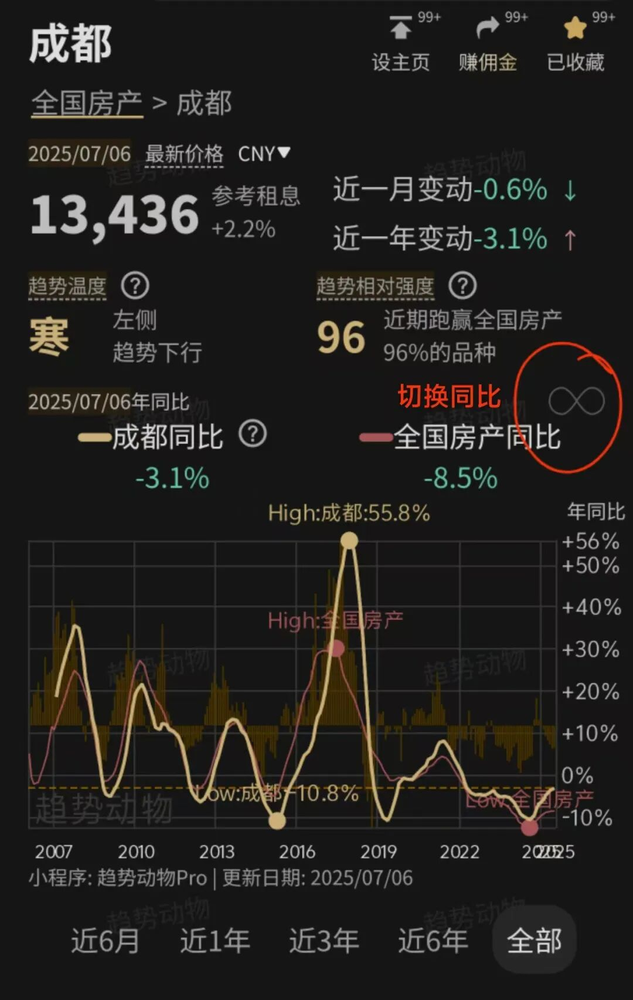
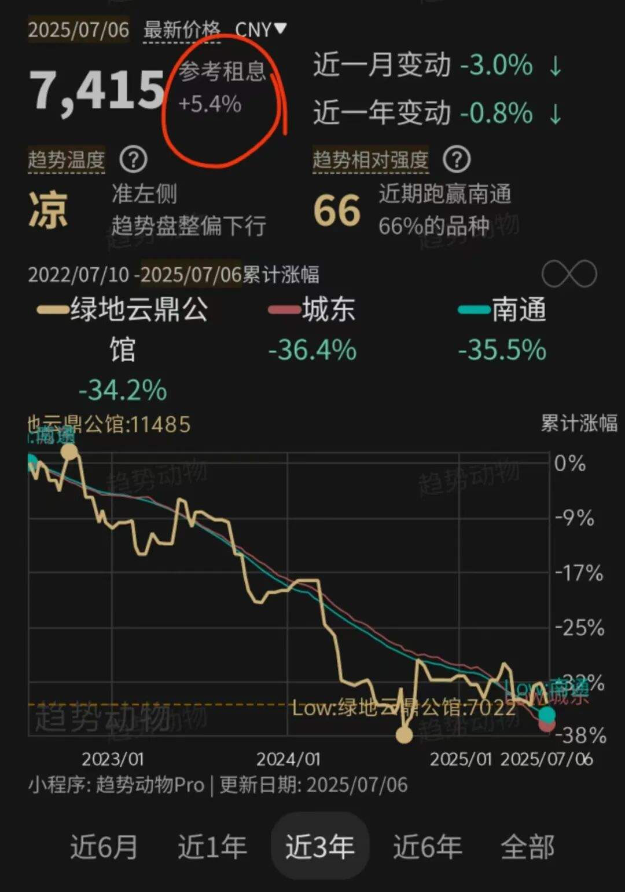
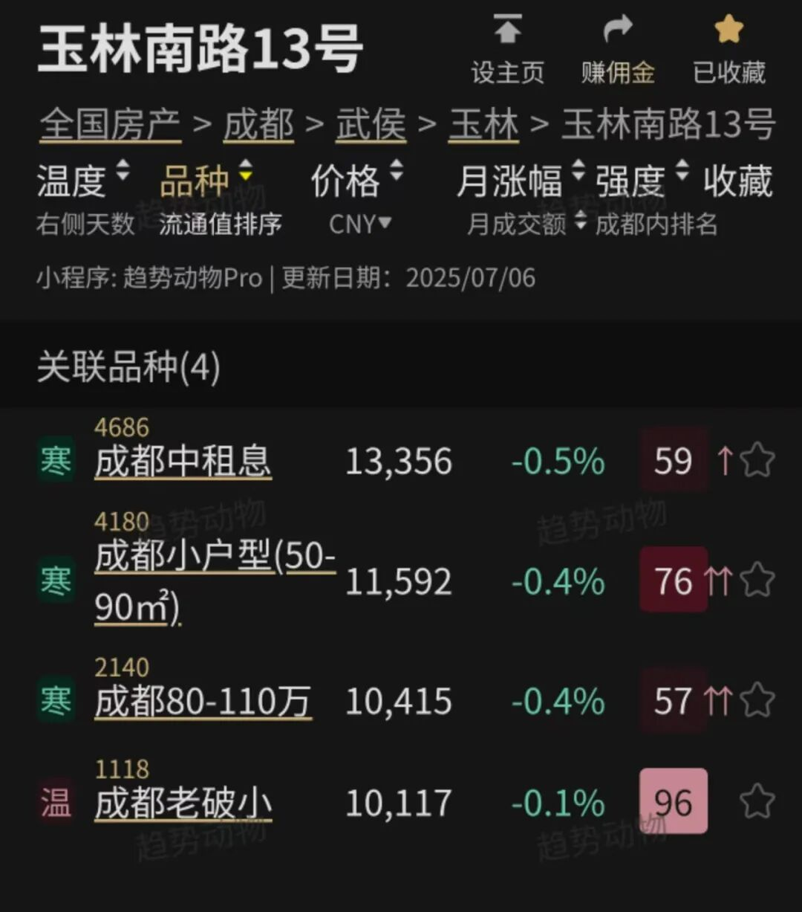
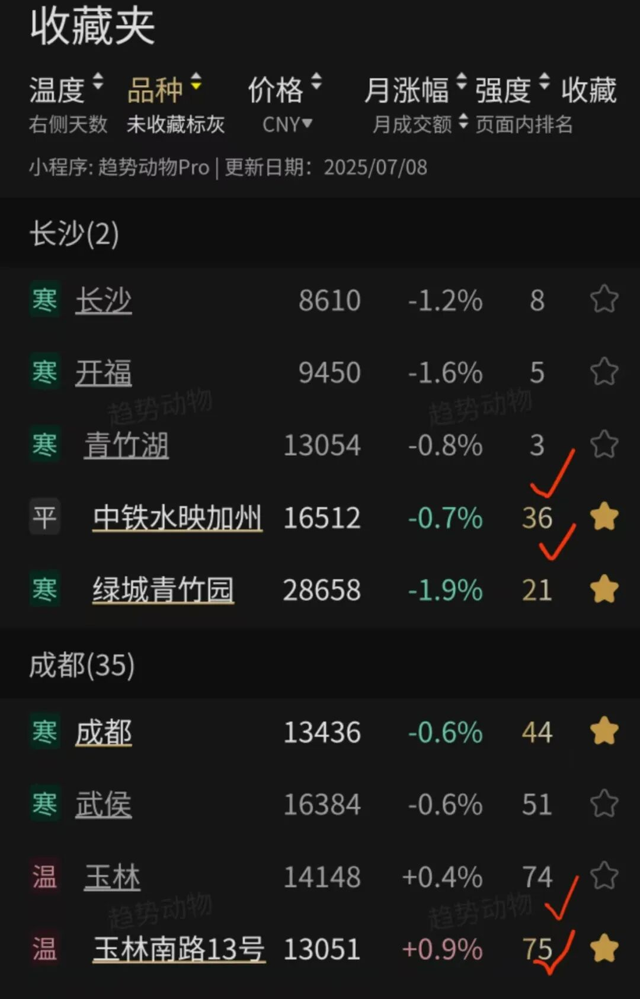
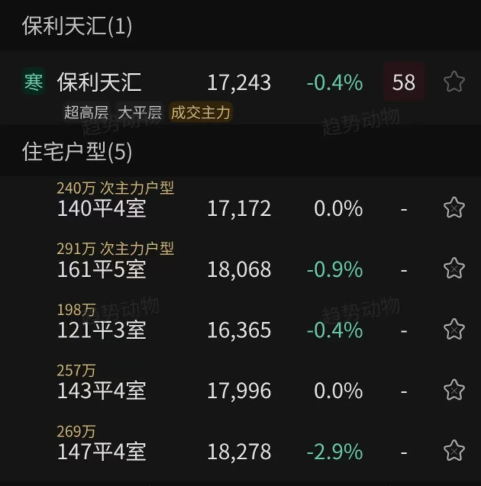

# 趋势小程序如何指导卖房？

> 来源：[趋势动物公众号](https://mp.weixin.qq.com/s?__biz=MzkyODQ5MTIzNw==&mid=2247486054&idx=1&sn=6804030fdb666820ef8df4d6041bde9f&chksm=c216b9ecf56130fad1bd305a75fdfd1c6a09c50e5dba13544646baa85efb7cde982af946b0d7#rd) ｜ 2025年7月9日 15:54

---

回答五个关键问题：

1、近期趋势如何？

2、是否应该卖？

3、优先卖哪套？

4、怎么定价？

5、成交周期多久？

  

“近期趋势如何？”

如何用小程序查看小区近期价格变动趋势？

小程序显示价格为边际挂牌价口径

捕捉成交、上架、撤牌、调价贡献趋势的边际变化。

小程序提供公正、及时、准确、低噪的行情趋势。

  

手指点击曲线的历史，可以看到历史边际挂价的变化。

举例。下图，富力城

最高单价，2022年10月，111649元；

最新单价，2025年7月，93841元；

手指点击处，2023年1月1日，107330元。

趋势表格展示城市、板块、小区的月涨幅（过去四周累计涨幅）

点击表头可以切换涨幅统计口径到周、月、年初至今。

每周一更新。

  

“是否应该卖？”

如何用小程序判断自己的房源是否应该卖？

推荐三个指标作为对照清单。

  

决定性指标——趋势温度

> 卖方反之同理。
> 
>   
> 
> 
> 当趋势是“凉”，则可以密切监测卖出机会；
> 
> 当趋势是“寒”，则代表趋势下跌已开启，应该尽快斩仓；
> 
> 当趋势是“冻”，则应该警惕下跌趋势是否进入尾声，可能随时反转。
> 
> Nick，公众号：趋势小程序说明书[指标 | 趋势温度](http://mp.weixin.qq.com/s?__biz=MzkyODQ5MTIzNw==&mid=2247484004&idx=1&sn=3570fde6439546defab30a96a9985821&chksm=c216b1eef56138f8cea5825b1580477593d8c708c2585721694e6df5df9a8f9f799302bd5d59#rd)

  

最佳卖点是凉转寒的初期。  

监测小区的趋势温度。

如小区的成交不充分，可以监测上级品种，也就是板块、风格、城市等品种的趋势温度。

  

对照你持有的小区或板块：

🔹趋势温度为热：不推荐卖，甚至推荐买进。

🔹趋势温度为平/温：不推荐卖。

🔹趋势温度为凉：不推荐卖，但需要密切监测，一旦变寒可卖。

🔹趋势温度为寒：凉转寒初期坚定卖出、寒后期结合辅助指标判断。

  

辅助指标1——周期：城市房价同比

同比是房价过去一年的累计涨跌幅，是衡量房价中期跌速的指标。

环比是房价过去一月的累计涨跌幅，是很亮房价近期跌速的指标。

  

房价同比是观察判断房地产短周期位置的最佳指标。

从周期的角度，当同比回升，跌速收窄，上行周期可能即将开始。

  

由于同环比理解门槛较，是小程序的隐藏功能。

点击“∞”符号切换到同比模式。

可以看所有城市2006年至今的同比——短周期历史。

  

  

如果近期同比小于0但在爬升，意味着趋势中期跌速在放缓，虽然价格绝对水平依然下跌，但暗示了周期已进入上行复苏阶段。

此时可能是价格下跌的后期。

反之如果同比在下行，意味着中期趋势跌速在放大，周期还将继续探底。

  

辅助指标2——租息(租金回报率)

  

小程序显示了小区的租金回报率指标，下图

当租金回报率足以覆盖近一年跌幅、且显著超过十年期国债收益率1.7%，则不建议裸卖。

  

> 档位一：高租息（4.5%以上）
> 
> 15%首付下可实现“以租养贷”，即月租金>月供
> 
>   
> 
> 
> 档位二：中高租息（3.0~4.5%）
> 
> 租息超过房贷利率，租金收入超过房贷的利息部分
> 
>   
> 
> 
> 档位三：中租息（1.7~3.0%）
> 
> 租息超过十年期国债收益率
> 
>   
> 
> 
> 档位四：低租息（1.7%以下）
> 
> 租息没有超过十年期国债收益率
> 
> 公众号：趋势小程序说明书[更新 | 租息标准更新](http://mp.weixin.qq.com/s?__biz=MzkyODQ5MTIzNw==&mid=2247485556&idx=1&sn=ea8c0868c2d3fca0d6cb3381faa2e2bf&chksm=c216bbfef56132e8125815d7fb280ff3963be4a2ad505dbae04f9c1ceec2f0770aa66480514d#rd)

  

举个例子，下图，南通的“绿地云鼎公馆”

虽然近一年跌-0.8%，但租金收益率达到了+5.4%水平，

实际上近一年的收益是正的。

如果裸卖，拿到的资金买R1理财，只有2.0%不到。

因此1、房屋的实际收益趋势为正，2、租金回报超过国债收益率

结论：对于持有这个小区的业主、不建议裸卖。

  

  

“优先卖哪套？”

持有多套，如何用小程序判断卖哪套？

  

根据“趋势相对强度”定去留。

在成交充分(年成交超过20套，小程序里标注了“成交主力”标签)的前提下，

优先选择卖“趋势相对强度”低的小区，保留“趋势相对强度”高的小区。

汰弱留强。

  

这里有点反常识的地方在于：

1、好卖、买家乐意出价的小区，反而不应该卖，应该下架；

难卖、价格快速下跌的小区，反而应该优先卖出，应主动降价到位。

2、趋势相对强度高的小区，也许和你的主观认知大相径庭。

比如出现老破小趋势强度高于次新小区的情况。

建议放下主观观点，以趋势为准。趋势决定持仓。

  

原因是：

在成交充分的前提下，趋势是资金交易博弈的痕迹。

通常近期保值、扛跌的小区，具备某种原因或素质，使得买卖双方认可其价值，才得以在趋势强度上跑赢。

一旦市场回暖，这类小区也容易跑赢。

  

相信市场有效性：留下趋势坚挺的好鸡蛋，丢掉趋势弱势的坏鸡蛋。

  

值得注意的是：

  

如果小区的成交不充分，比如趋势历史不够长、或一年成交数量很少，

会导致小程序的统计样本少，少数样本变化带来的曲线波动大、趋势噪音大、置信度降低。

  

可以采取以下三种变通方案：

1、选择小区所在板块的趋势相对强度作为判断依据

2、选择小区所在风格指数的趋势相对强度作为判断依据

3、选择小区相同素质的周边成交主力小区的趋势相对强度作为判断依据。

  

举个例子。下图

成都的玉林南路13号是老旧小区，一年成交只有不到5套。

成交不充分。小区的趋势波动噪音较大。

那么用小区所在板块、风格指数的趋势强度作为判断依据的替代。

如成都老破小(强度96)、成都小户型(强度76)、玉林(强度97)

  

  

跨城市持有多套，如何用小程序判断优先卖哪套？

对于跨城市的多个小区的趋势强度对比。

可以通过“收藏”到收藏夹后

根据收藏夹显示的趋势相对强度数值大小，进行对比

依然可以指导优先卖哪套的决策。

  

举个例子，下图

当把成都的“玉林南路13号”和长沙的“中铁水映加州”收藏后

收藏夹显示了页面内所有品种的趋势相对强度排序

根据趋势强度数值，可以得到结论：

如果你同时持有成都玉林小区（板块强度74、小区强度75）和长沙中铁小区（板块强度3、小区强度36），应该优先卖出长沙中铁。

  

  

“怎么定价？”

如何用小程序给自己的房子定价？

对于成交充分的小区来说，房源最合理的参考定价就是近期成交的上一套成交价。

咨询当地中介拿到楼栋楼层历史成交清单，是最精细的估计方法。

再对比自己房源的楼层、视野、装修进行浮动估计。

  

以下两种方案可以作为参考成交价的交叉验证：

方案一、根据小程序显示的边际挂牌价估计

  

小程序显示的价格是“边际挂牌价”口径。

可以根据以下公式，估计小区、户型的参考成交价。

  

参考成交价 = 边际挂牌价 × 议价折扣率

  

以下是平均折扣率水平参考：

2024年9月，折扣率89%(近期最低)

2025年3月，折扣率95%(近期最高)

2025年7月，折扣率92%(当前)

  

不同小区折扣率略有不同，但接近整体平均水平。

成交越充分、趋势温度越高，折扣率系数越高，反之越低。

  

举个例子。下图

“保利天汇”小区，发文日期显示的边际挂牌价为17243元

那么小区当前的参考成交价 = 17243×92% = 15864元

140平、161平的次主力户型的参考成交价也可用此方法参考。

  

  

方案二、根据历史成交价估计

  

参考成交价 = 历史成交价 × 最新边际挂牌价 / 历史边际挂牌价

  

可以理解为：以历史上已发生的成交价格定基，以小程序价格指数的波动反算最新的成交价格。

是一种净值化计算价格收益的思路。

  

举个例子，下图

如果已知2024年8月，保利天汇成交了一套330万的同素质、同户型房源。

小程序显示2024年8月边际挂牌价格18406元，而2025年7月现在的边际挂牌价17242元。

那么当前同素质、同户型房源的合理参考成交价可以这样计算：

参考成交价 = 330万 × 17242元 / 18406元 = 309万

  

“成交周期多久？”

应该预期多久卖出？

  

当你的底价已接近参考成交价后，你的房源就达到了理论上可成交的条件。

那么成交周期完全取决于小区的流通性水平。

  

举两个例子，

  

1、某小区近一年成交24套，约等于1个月成交2套。

那么你可以预期的成交周期 = 0.5-1个月。

未来1个月会成交两套房子，如果你的底价是参考成交价，那么两套房子是你的概率很大。

  

2、某小区近一年成交3套，约等于4个月成交1套。

那么你可以预期房源的成交周期 = 4-8个月。

  

虽然降价有利于缩短成交周期，但性价比极低。

建议以参考成交价作为保留底价，根据成交套数预期合理的成交周期即可。

  

文中观点仅供参考，独立决策，自负盈亏。

详见趋势小程序趋势动物pro

  
Nick2025年7月9日
