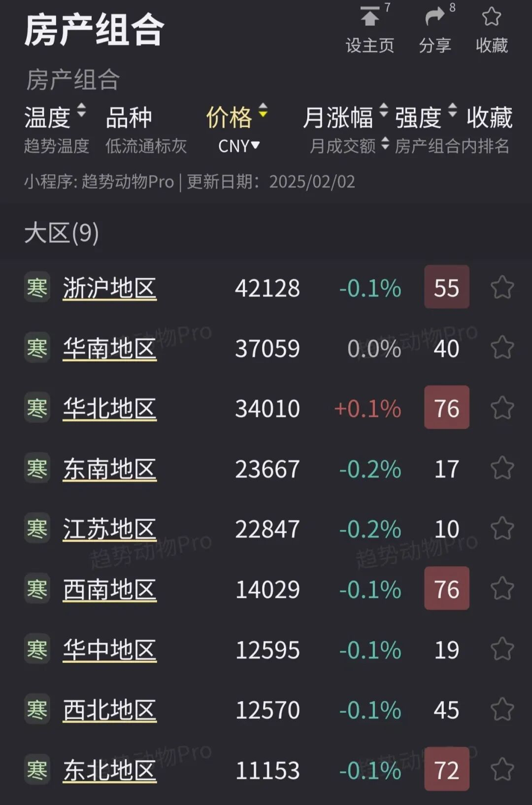
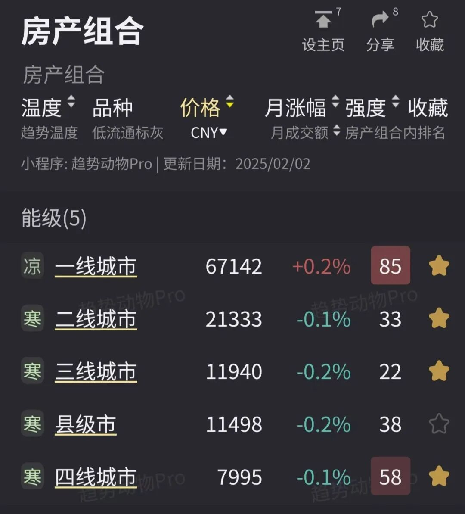
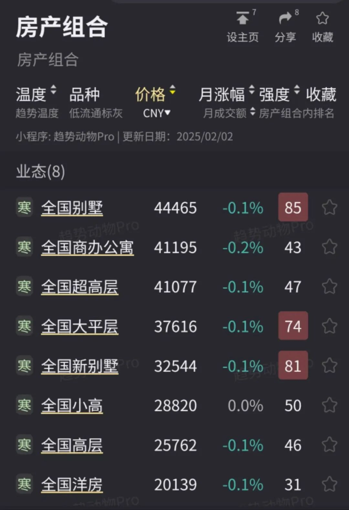
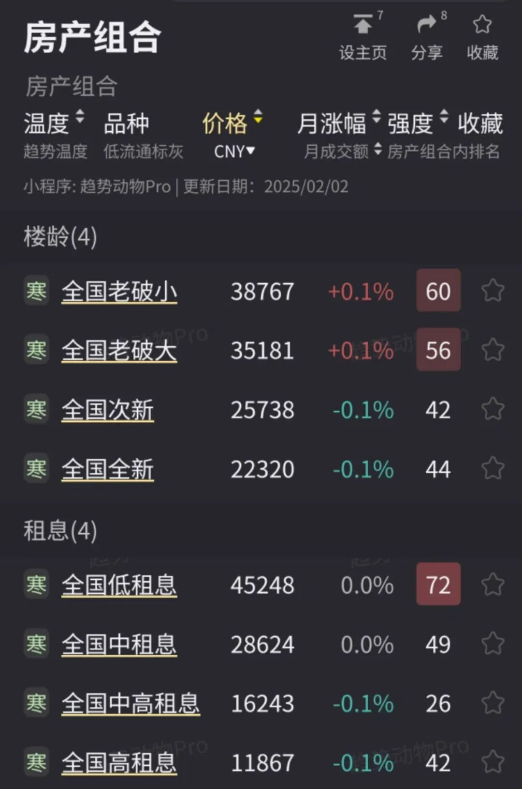
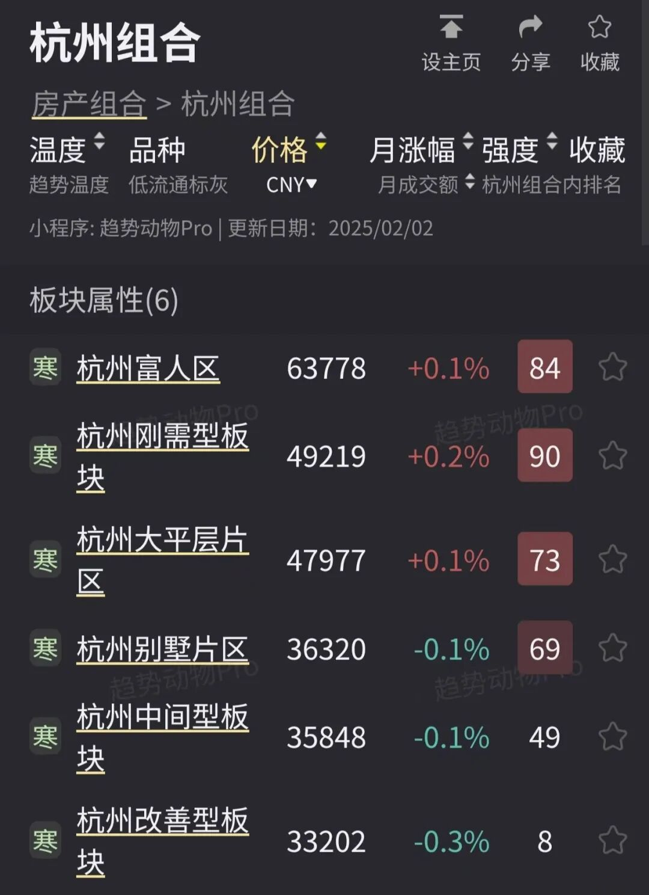
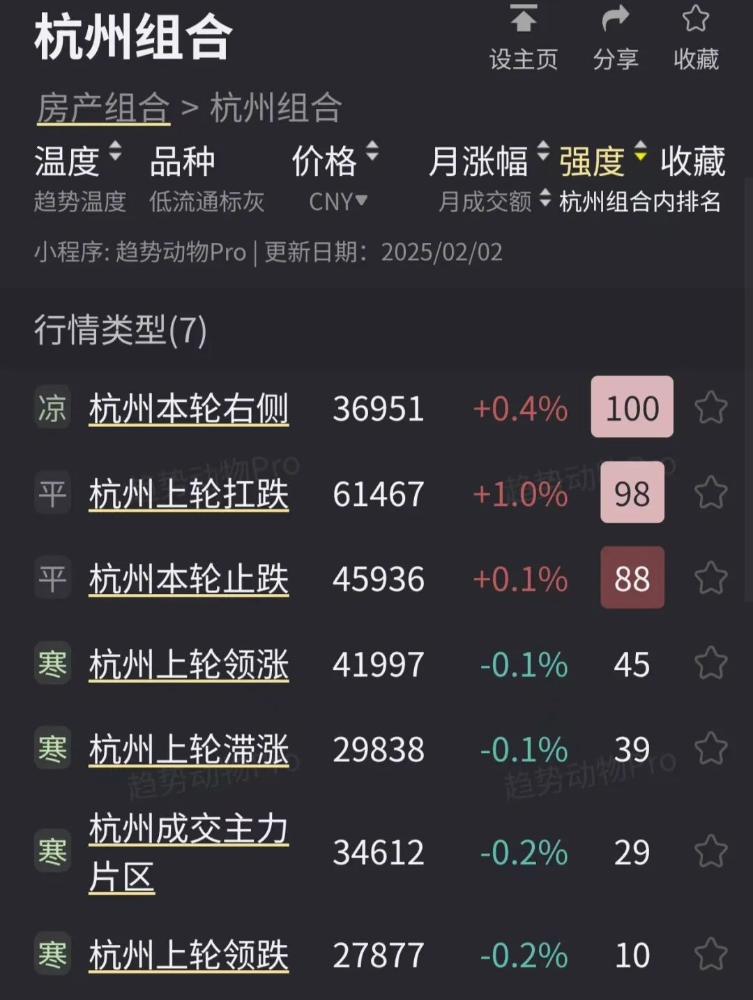
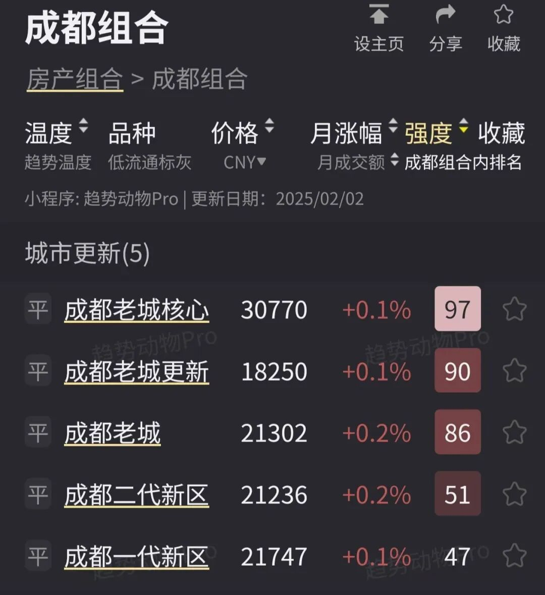

# 一系列楼市“风格指数”上线。

> 来源：[趋势动物公众号](https://mp.weixin.qq.com/s?__biz=MzkyODQ5MTIzNw==&mid=2247484952&idx=1&sn=6ea115a5cc4e30191c093ab628e8c7d2&chksm=c216b592f5613c84955419a56bf8368bc6789ea9af70f7d9dd1ae79c951bfe4436df227953d6#rd) ｜ 2025年2月13日 17:28

---

小程序更新一系列风格指数。

呈现在“房产组合”分类  

并穿透到全国、城市、板块、小区

  

九大区域

浙沪、华南、华北、东南、江苏、西南、华中、西北、东北

  

城市能级  

一线、二线、三线、四线、县级市

  
  
业态指数  

别墅-大平层-洋房-小高-高层-超高层

  
  
楼龄指数  

老破小-老破大-次新-全新

老破定义：2000年以前的住宅

老破小：90平以下

老破大：90平以上

次新：2015-2020年的商品住宅

全新：2020-2025年的商品住宅

  
  
租息指数  

低租息-中租息-中高租息-高租息

租息标准：[20240126 地资产：租金收益率研究（一）](https://mp.weixin.qq.com/s?__biz=MzIyMTYyMzg1OQ==&mid=2247493301&idx=1&sn=3814f6c990075a03ce1c08bdb7c13f0a&scene=21#wechat_redirect)

  
  
板块属性指数  

富人区、大平层片区、别墅片区、刚需型、中间型、改善型

富人区：支付能力位于城市头部，购入门槛在城市平均总价的两倍以上

刚需型板块：刚需小区为主的板块

改善型板块：改善小区为主的板块

  
  
行情类型指数  

上轮领涨、上轮滞涨、上轮领跌、上轮扛跌、本轮右侧、本轮止跌、成交主力片区

上轮领涨、上轮滞涨：2019-2021年涨幅领先、落后的板块

上轮领跌、上轮扛跌：2019-2024年跌幅领先、较小的板块

本轮右侧：最新截面趋势温度至少为热的板块

本轮止跌：最新截面趋势温度至少为平的板块

成交主力板块：交投活跃、成交额位于城市头部水平的板块

  
  
城市发展指数  

老城、老城更新、老城核心、一代新区、二代新区

老城、老城核心：老城区

老城更新：老城区，但近十年经历城市更新

第一代新区：近15年新建成的片区

第二代新区：近5年新建成的片区

  

更多风格指数

入口：页面左上角-选择“房产组合”

详见趋势小程序趋势动物Pro

  
趋势动物Nick2025年2月13日
