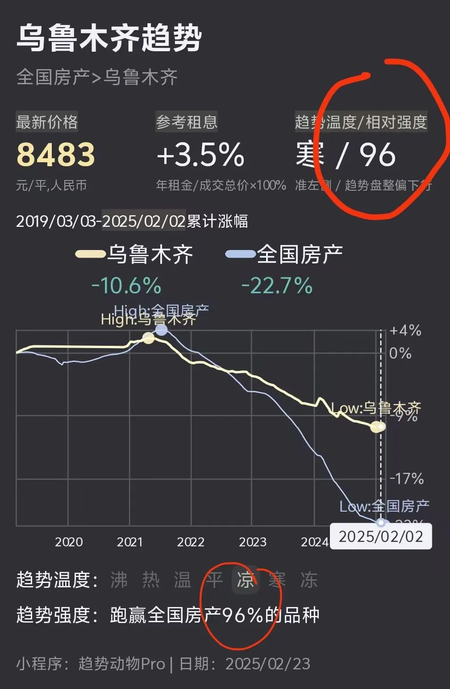
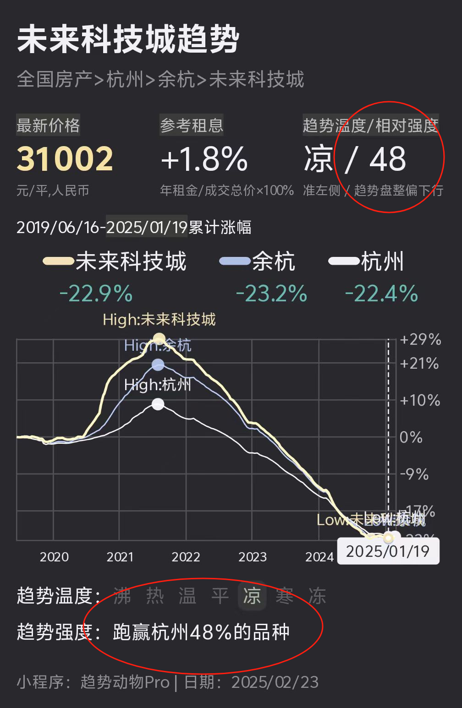
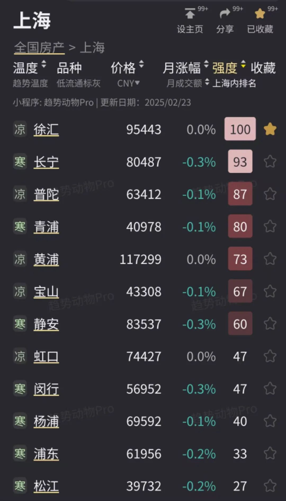

# 「趋势温度」是分数，「趋势相对强度」是排名

> 来源：[趋势动物公众号](https://mp.weixin.qq.com/s?__biz=MzkyODQ5MTIzNw==&mid=2247485003&idx=1&sn=c94d4c050e3147dd6e25299c1cf8b4f1&chksm=c216b5c1f5613cd7d55685da1a0c072a8e933c0bedea9dee8452be27474403c327135d1b9541#rd) ｜ 2025年2月26日 18:15

---

在趋势小程序里，「趋势温度」和「趋势相对强度」是一组重要的趋势指标但理解门槛又很高，怎么更好的理解？  
直接打个比喻：  
高考临近，全校有100个人每个月都模拟月考学生的「考试分数」就是「趋势温度」；学生的「年级排名」就是「趋势相对强度」。  
1、「趋势温度」 = 「考试分数」的趋势  
考试分数可以分为：>90优秀 >80良好 >60及格 <60不及格  
趋势温度可以分为：

“**沸** ”：趋势正快速拉升、波动放大。

“**热** ”：趋势处于上涨行情。

“**温** ”：趋势盘整，有即将启动上涨的迹象。

“**平** ”：趋势横盘

“**凉** ”：趋势盘整，有即将启动下跌的迹象。

“**寒** ”：趋势处于下跌行情。

“**冻** ”：趋势正快速下跌、波动放大。

  
2、「趋势相对强度」 = 「年级排名」  
比如，乌鲁木齐趋势寒、相对强度96说明乌市近期趋势虽然下跌，但跑赢了全国96%的城市又比如杭州未来科技城，趋势相对强度48说明未科近期跑赢了杭州48%的其他板块  
3、即使全校分数都不及格，依然能排名出个高低次序  
「考试分数」受试卷难度影响很大即使所有人分数不及格，排名依然有意义。  
「趋势温度」受宏观环境、货币周期影响很大上行周期几乎所有城市都涨、下行周期几乎所有城市都跌。但「趋势相对强度」依然有意义。  
比如2024的楼市虽然几乎所有城市的温度都是寒或凉但依然能排出个趋势相对强度高低毕竟有些城市跌的多、有些城市跌的少，有些放量、有些缩量。  
4、如果请你预测「高考状元是谁？」最靠谱的方法大概是从历史月考成绩排名靠前的人里选。  
类似的，预测未来几个月谁跌的少、谁涨得多靠谱的方法是按「趋势相对强度」选筹，趋势强度本身有惯性，会延伸到未来、甚至主导很长一段时间。  
随着月考成绩刷新，排名也随之刷新每个月的最新排名截面都是对未来一段时间最好的预言。  
5、高考只在乎排名，不在乎分数投资不仅在乎“涨得多”，更在乎“能涨”  
这点和高考问题不一样。对高考来说，即使试卷再难、所有人不及格，依然存在状元、985线、一本线。  
而对投资来说，如果时机不对，所有品种跌，即使选择品种跌的最少，也不符合投资目标。因为没有上涨。  
没有人会为跌的少而喝彩（其实应该这样做）因此投资不止需要关注「趋势相对强度」 ，还要关注「趋势温度」  
应该选择“试卷容易”的环境下，做投资决策。具体来说：在「趋势温度」转“温”、“热”时做买入决策在「趋势温度」转“凉”、“寒”时做卖出决策  
6、未来我买的城市能涨吗？问题等价于「未来我能押注某个学生能考985吗？」  
答：如果这个学生过去几次月考成绩能上985那么高考他大概就能上985如果反过来，概率就没那么大。  
如果主观看好他，为什么不等一等，等到他某次月考考上985，再押注呢？  
7、虽然我想买的城市相对强度很低、温度很冷，但我自住刚需，能买吗？问题等价于「我关注的学生成绩很差、排名很靠后，但我很喜欢他，可以押注他上985吗？」  
答：概率有点低，但长远看，或许也存在潜力理性上应该等等看，但既然喜欢、就随意。  
相反的问题：如果我发现一个城市相对强度很高，但我不觉得这个城市好，能买吗？问题等价于「我发现一个学生成绩很好、排名靠前，但我不认可他的学习方法，可以押注他上985吗？」  
答：可以押注试试，或者给个机会深入了解下，或许你的想法会有变化。  
8、年级排名次序不是一尘不变的，随着时间也会变化  
产生变化的原因很多：①骄傲或飘了、从而落后（共识瓦解）②老师的过分关注、同学的排挤（严厉监管、恶意竞争）③试卷考察的内容调整、学科调整（赛道变化、风格漂移）...  
但排名的变化很少在某次考试瞬间变化而是潜移默化、一点点的改变，通过一次次的月考成绩和排名逐步确认。通过持续追踪和观察，可以及时发现边际变化，并做出调整。趋势相对强度也如此。强弱次序可能发生变化，但不是一蹴而就的。  
9、趋势相对强度高，一定是领涨主线吗？问题等价于「模拟月考状元，一定会是高考状元吗？」  
答：不一定，但概率挺大，也是合理的假设。  
10、总结  
当用「趋势温度」和「趋势相对强度」的框架去看房产和资产，会变的简单把每周一更新的楼市趋势截面理解为一次模拟月考你的投资决策理解为高考  
你可以决定的是买卖时机和品种选筹。「趋势温度」（分数思维）指导「时机」「趋势强度」（排名思维）指导「选筹」放下主观的观点，多观察市场的真实趋势。当趋势和观点一致时，投资机会随之出现。  
11、更严肃一些的相关阅读：  
趋势温度：[指标 | 趋势温度](https://mp.weixin.qq.com/s?__biz=MzkyODQ5MTIzNw==&mid=2247484004&idx=1&sn=3570fde6439546defab30a96a9985821&scene=21#wechat_redirect)趋势相对强度：[指标 | 趋势相对强度](https://mp.weixin.qq.com/s?__biz=MzkyODQ5MTIzNw==&mid=2247484206&idx=1&sn=c21e53ba53c3593493eafcbbfe711c1d&scene=21#wechat_redirect)趋势交易：[20240801 为什么要右侧交易？](https://mp.weixin.qq.com/s?__biz=MzIyMTYyMzg1OQ==&mid=2247495147&idx=1&sn=432673f942322c173e1d6db2997e922d&scene=21#wechat_redirect)使用说明播客：[很荣幸，老钱又陪我唠嗑。](https://mp.weixin.qq.com/s?__biz=MzIyMTYyMzg1OQ==&mid=2247492601&idx=1&sn=9702b307dd12da61055e9341783f1f0d&scene=21#wechat_redirect)  
详见趋势小程序  
趋势动物Nick2025年2月26日
