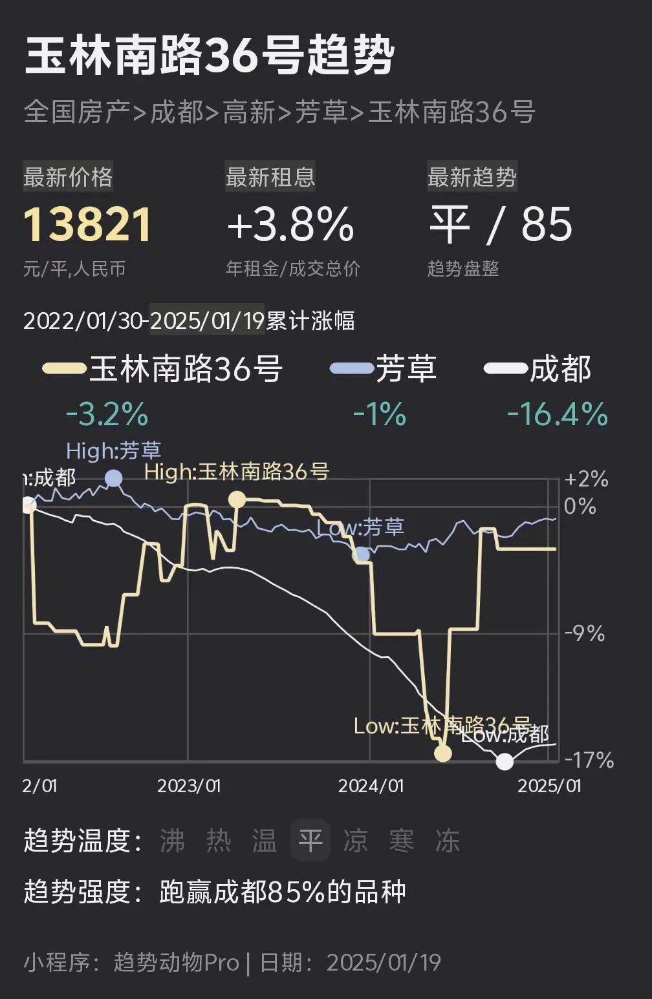
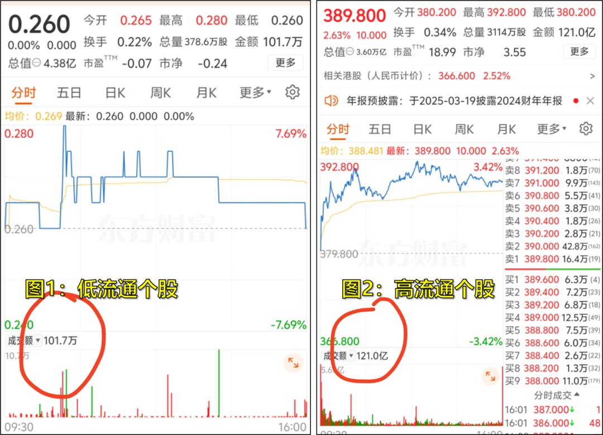
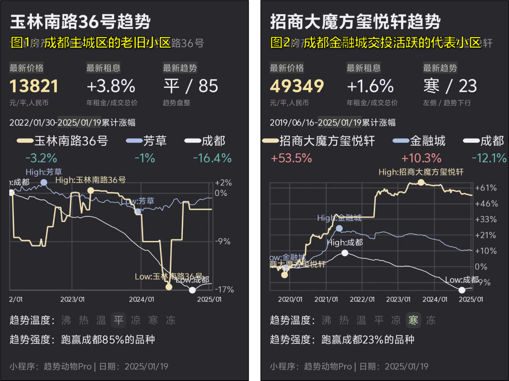
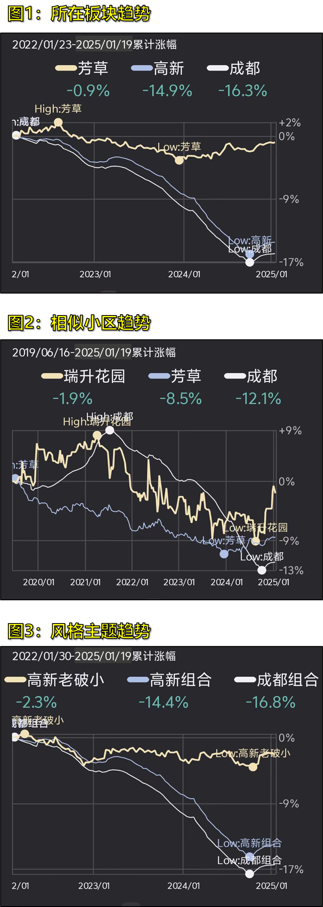

# 小区趋势像心电图，是不是不准？

> 来源：[趋势动物公众号](https://mp.weixin.qq.com/s?__biz=MzkyODQ5MTIzNw==&mid=2247484580&idx=1&sn=3199de60629b77a0ca61396eb12a6ade&chksm=c216b72ef5613e386f32e2cb52030cac7ee8d45b9f5c5a836e4457d5ccd157816b6b65d37497#rd) ｜ 2025年1月25日 14:51

---

在趋势小程序里，我的小区像心电图，趋势如下图：某个月下降-5%，某个月又上涨+10%，小程序是不是不准？  
  
一、先看港股的例子  
探索问题答案之前，先看港股的例子：同一交易日、两只港股的趋势，如下图图1：行情走势像心电图，分钟振幅高达+7%图2：行情走势流畅，波动性小，趋势稳定  
很显然，造成走势区别的最大区别是两只股票的交易额，前者交易额仅有100万，后者交易额高达100亿，相差1万倍  
现在问题来了——那只个股的趋势更真实？  
我的理解是——都真实。只是前者因为流通性不足，买卖挂单之间的价差大，且撮合的成功频次低，零星的成交会体现在成交价巨大的波动上所以看上去像心电图。  
但这恰就是真实走势，反应了成交、挂单的有效信息。但你会用哪只个股来观察趋势？后者。甚至用行业指数、大盘指数来观察趋势，因为——流通性越好、交易越充分，趋势走势的置信度越高。趋势的置信度是流通性。  
二、回到房产趋势说回房子。  
图1、成都30年+楼龄的老旧小区图2、成都金融城成交主力小区，交投活跃  
图1、小区的挂单、出价、成交少，趋势的波动大、频次低。图2、交投活跃、成交充分，趋势稳定，和大盘指数走势相关性高，甚至自身走势作为板块龙头信号。  
两者都代表了市场的真实走势。趋势小程序不会通过模拟、拟合的方式捏合不存在的价格，一切趋势的变化信息来自挂单、出价、成交，呈现原本真实的市场信息。这也与趋势交易里尊重市场有效性的理念相合。  
三、像“心电图”的小区，流通性一定差吗？  
不一定。有两类房，像“心电图”，但流通性反而很好。  
一类，是极度稀缺的价值龙头。这类标的流通性最好——成交小不是没人要，而是想要的人太多，卖家吊着价格或惜售这类房源降价必有成交——流动性极强的表现甚至不需挂到平台就能内部流通、私下成交掉——成交甚至不须被市场看到。多为有独特视野、或稀缺资源、顶级地段的房子。  
另一类，成交虽然多，但截面供应少、成交极快的小区最近越来越感觉到——很多黄金地段的老破小正在成为这类品种典型是成都主城老破小比起动不动10%议价空间的次新商品房，老破小通常成交极快、且议价空间很小，不到3%。因此看到的挂单很少，也没有大量调价，呈现出没有稳定的趋势。  
四、这类“心电图”小区的趋势应该如何观察？  
如果小区交投少，如何观察趋势，指导决策？有三种方案，可以很好解决：  
1、以小区所在的板块趋势做参考，下图1虽然小区成交少，但多个小区成的板块就成交充分了。  
2、以同板块下，相同素质的成交主力小区趋势做参考，下图2用同地段、同楼龄、同资源的多个相似小区趋势作参考。  
3、以小区对应的风格指数做参考，下图3虽然某个老旧小区成交走势像心电图，但几十个老旧小区的走势综合起来，还是能形成“大数据”有效看清趋势。  
  
详见趋势小程序  
趋势动物Nick2025年1月25日
