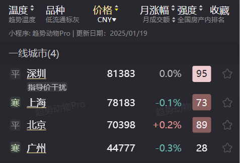
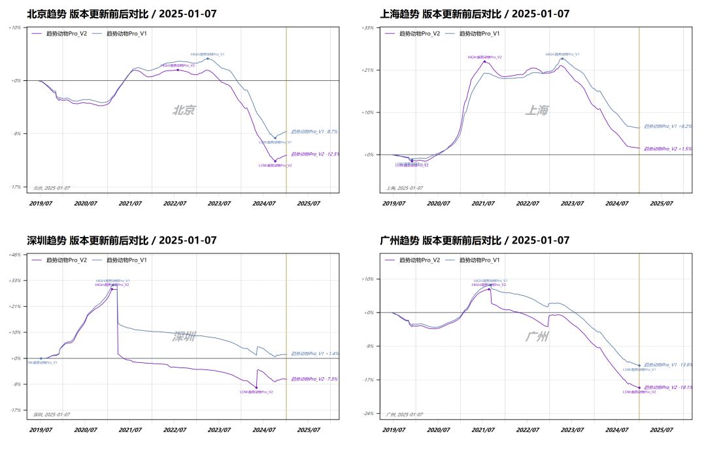

# 为什么新版本小程序里的价格指数变高了？

> 来源：[趋势动物公众号](https://mp.weixin.qq.com/s?__biz=MzkyODQ5MTIzNw==&mid=2247484564&idx=1&sn=ce042fd04b029aae9aa020c04c2a65b7&chksm=c216b71ef5613e08c3f366510f28f10b7ce217d785bd785551f8cf5b6d88f95997fbe65fca60#rd) ｜ 2025年1月22日 21:14

---

最近收到很多留言说新版本更新后价格指数变高了这里集中做个回复：  
一、什么价格指数变高了？从结果上看，大部分城市、行政区、板块价格指数提升了，但小区价格指数没有变化。  
例如：上海均价5.2万→7.8万、黄浦均价10.8万→14.3万、小区价格没有变化

**  
**

**二、为什么价格指数要调高？**

**  
**

是因为计算指数的算法做了一次升级。

简单理解，算法由楼市的“全A指数”升级为了“沪深300指数”

在底层品种价格不发生改变的前提下，

大幅增加了流通性好、成交量大小区对指数的贡献。

因此新的算法能更准确、敏感的计量市场趋势的变化。  
价格指数的提高，只是算法调整的自然结果。也有部分板块，因为低单价小区成交量更大，导致价格指数下降了。小程序会员可以通过城市-行政区-板块穿透到底层，看各个品种的成分组成和价格细项。  
值得说明的是，虽然价格指数绝对值有提升但整体趋势方向并没有大的变化，版本更新的趋势前后对比如下：  
  
新算法加持下，趋势的涨跌幅更准确的贴合实际、更敏感的捕捉边际变化，尤其是中小城市的趋势指数，有显著提升。  
三、新版本算法能更好的适应房产市场主线  
对比股票市场，房地产市场更像是一个“只有IPO，没有退市”的交易所土拍、新房不断涌入市场吸收资金，进入二手市场后却没有退市渠道。市场上可交易的品种只增不减，但交易的主线一直在变化带来的结果就是部分品种通过丢失流通性的方式变相退出市场。  
因此交易房产更应重视估值的流动性折价流通性低的小区，滑点和摩擦成本非常高。用成交活跃度加权的房产“沪深300”指数，比“全A指数”更能反映市场主线的趋势，小程序新版本的指数，是更加可靠的行情参考。  
从我的观察来看，市场交易主线发生了多次重大转变：  
2000年初，最早一批购房者买入塔楼、高层商品房2010年初，郊区新区开始流行，郊区欧式别墅、花园洋房受到追捧2015年，限墅令持续推进，大量政府、产业、学校搬迁到新区，配套大幅升级的新区成为主线2025年，城中村拆迁和旧城改造重新进入政府视野，迭代的“好房子”天资产、高租息的地资产或许将成为市场交易的新主线。  
详见趋势小程序  
趋势动物Nick2025年1月22日
