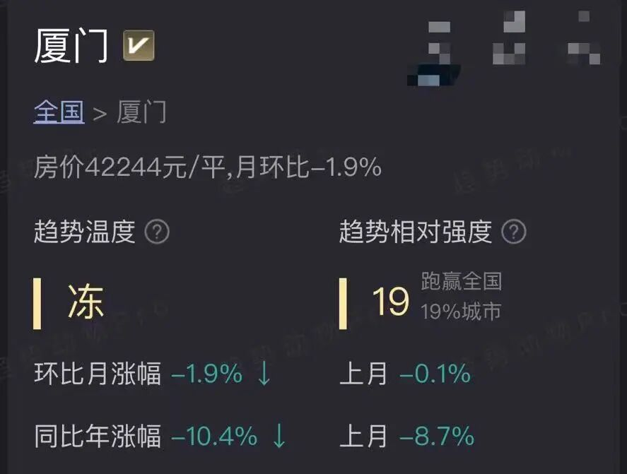
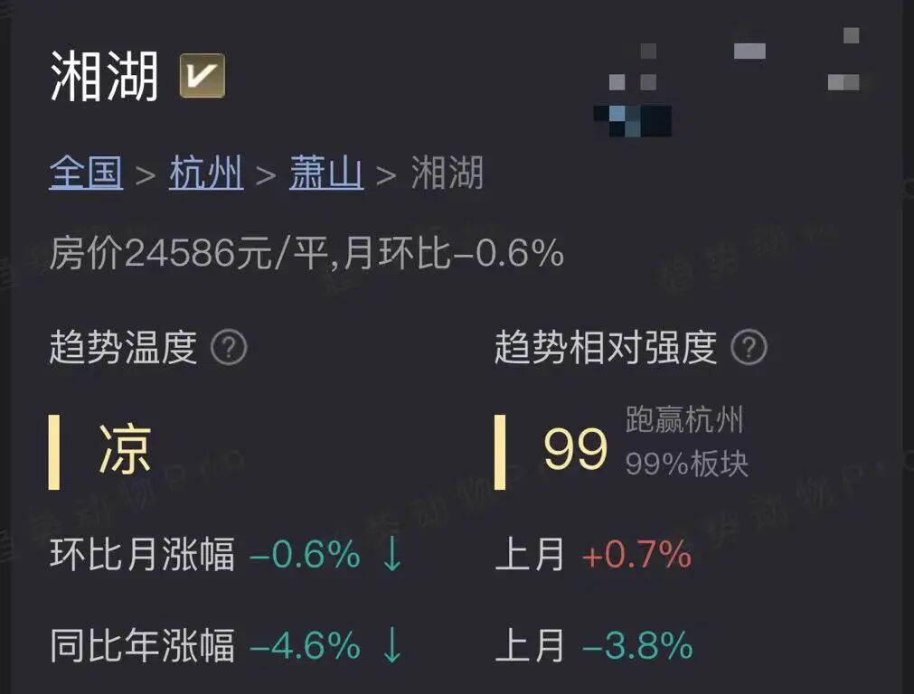
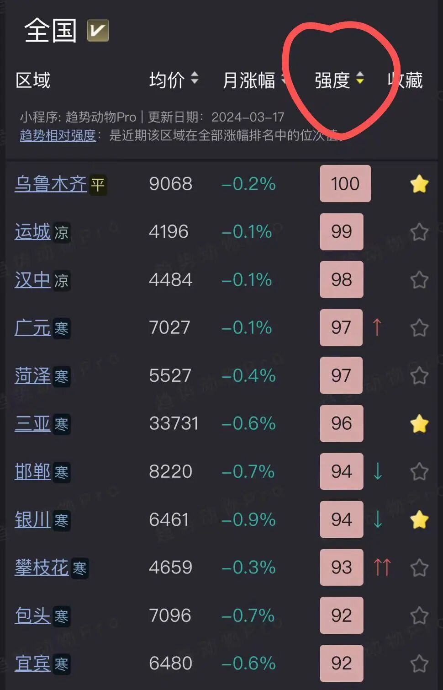
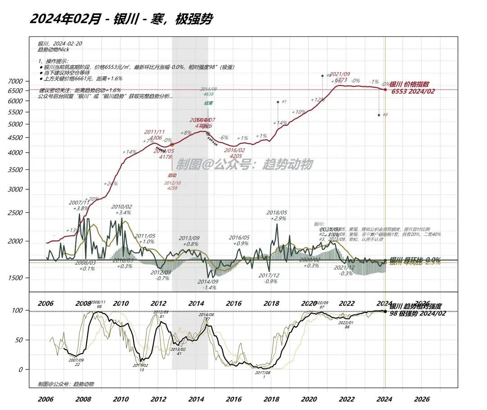

# 指标 | 趋势相对强度

> 来源：[趋势动物公众号](https://mp.weixin.qq.com/s?__biz=MzkyODQ5MTIzNw==&mid=2247484206&idx=1&sn=c21e53ba53c3593493eafcbbfe711c1d&chksm=c216b0a4f56139b20ad6d79f452b8011c14edcf4aabd9caa7b2d6412ed195d9981c0ba48de05#rd) ｜ 2024年3月24日 16:22

---

**趋势相对强度** ，是标的近期趋势在全国/城市的位次值。

是趋势跟踪策略中最重要的趋势信号之一。

  

90~100分：趋势排名领头、极强势  

70~90分：趋势排名靠前、强势

50~70分：趋势排名中上、偏强

30~50分：趋势排名中下、偏弱

10~30分：趋势排名靠后、弱势

0~10分：趋势排名倒数、极弱势  
  

这个指标灵感来自Willian O'Neil  

在楼市中有所改良。

  

**一、理念**

  

如果把趋势比作考场

**趋势温度类似成绩、 趋势相对强度类似排名**

  

趋势相对强度高不等于涨，趋势相对强度低不等于跌

趋势相对强度只是该品种近期趋势表现的位次值（排名）

  

**趋势相对强度指标，是用于发现领头羊品种的最佳指标。**  

其中的理念是：

在一轮完整的周期中，领头羊会在早期表现出极强的趋势相对强度，

并以强者恒强的姿态贯穿全周期。  

在房地产，一轮完整的周期长达3-4年。  

  

趋势相对强度高的品种，

通常表现为**量、价双好** 。

①量：相比过去，近期放量、或流通性强。  

②价：相对其他标的更坚挺、或表现领涨性。  

  
**二、指导交易  
**  
如果你是纯**买方** ：  
你需要密切关注趋势相对强度高的品种  
并加以归纳为风格、主题原因是小区级别可能有噪音异动、但归纳到风格主题则具备板块效应当周期启动（也就是趋势温度转暖）时  
对领头羊品种完成建仓。  
如果你是纯**卖方** ：  
你需要对手里所有持仓的品种进行归纳  
优先选择卖出/止损趋势相对强度由强转弱的品种  
但趋势相对强度更适用于**置换**决策**** ：  
风格轮动、业态轮动、城市轮动甚至大类资产轮动一直在进行  
我们需要持续监控篮子里的持仓  
以保持资产组合处于最佳进攻状态  
最好的方法就是**持续的留强汰弱** 留下趋势相对强势的品种、淘汰卖出趋势相对弱势的品种  
**对于置换决策，核心依据是机会成本。** 即使能预测到持仓中A品种未来能涨幅+10%，也不意味着持有它是最佳选择，因为有可能你未持有的领头羊品种B的上涨幅度是+100%。也就是持有A，你承担了90%本金的机会成本，也叫跑输。相反，如果预测到持仓A品种未来会跌-5%，也不意味着卖出它是最佳选择，因为有可能其他品种下跌普遍超过-10%，而-5%的跌幅已经是足够优秀。也就是持有A，你虽然亏损了-5%，但其实是跑赢。  
**三、几个例子** 以写作的此时为时间截面，举几个例子：  
**1、厦门，趋势温度“冻”，趋势相对强度19**  
意味着厦门此时趋势在快速下跌中接近历史最快跌速  
趋势排名在全国中只有19分  
可以得到结论：厦门大概率不会成为下一轮楼市上涨的领头城市  
如果您的投资视野是全国范围厦门不是值得关注的最佳投资选择。  
**2、杭州湘湖板块，趋势温度“凉”，趋势相对强度99**  

  
湘湖是杭州2016年开发的板块有文旅属性  
目前趋势还在下行趋势，但下跌并不快近期趋势跑赢了杭州99%的板块  
可以得到结论：虽然湘湖板块仍在下跌  
但相比于杭州大盘，这个板块表现出了极强的趋势如果您一定要在杭州进行投资  
湘湖板块是一个当下值得重点研究的板块踩盘先行、右侧交易。  
一旦杭州大盘跌幅缩窄或上涨湘湖有很大概率领涨、快涨。  
**3、第三个案例，留个悬念。以后补上。**  
**四、重要声明：**  
  
1、趋势相对强度指标特别适合作为周期启动初期的观察信号——也就是筑顶期、调整期、风格轮动期。  
当趋势温度转为热或沸后，按照趋势强度选筹，有追高的风险。  
2、接上条，趋势温度更适合指导择时，趋势相对强度更适合指导选筹。趋势温度指导节奏、相对强度指导方向。  
  
3、大盘处于普跌调整期，趋势相对强度高的品种，有[两种可能](http://mp.weixin.qq.com/s?__biz=MzkyODQ5MTIzNw==&mid=2247484035&idx=1&sn=df53534296fa008e62433db8e4cd0b82&chksm=c216b109f561381f55e6cf237ecc4a8e666e4144b81ffca458ded7490aa75a30b5e34c73b3f1&scene=21#wechat_redirect)，低波动导致的扛跌、或资金流入导致的扛跌。  
前者在牛市中很难成为领头羊，而后者是。因此趋势相对强度高是领头羊的必要不充分条件。领头羊趋势相对强度必高、但强度高不一定是领头羊。  
最稳妥的区分办法，仍是右侧交易，当领涨性被确认后，再建仓。  
4、这套指标、理念可以为趋势交易者提供重要参考。如果您是纯自住、价值投资、长期持有的交易风格，请谨慎参考。无论如何，请独立决策。据此交易，自负盈亏。  
5、相对强度高的品种，通常是冷门标的。通常趋势前沿、领先于舆论认知。  
事实>观点，依据趋势交易，而不是依据观点交易，需要认知上的信念、以及探索无人之境的勇气。  
6、你关注的品种池（城市池、股池）会影响品种趋势相对强度的大小。班级排名高的学生，放在年级里，排名有可能不高。  
扩大品种池、可以有效提升选筹能力和跨周期能力。  
广度大于深度，扩大视野，非常重要。这个话题后面有机会再展开。  
**五、查询趋势相对强度的两个方法：**  
  
1、趋势小程序可以查到：所有品种最新截面的趋势强度。

  
2、[趋势动物](http://mp.weixin.qq.com/s?__biz=MzIyMTYyMzg1OQ==&mid=2247493990&idx=1&sn=588ef65dc7e16f765a14fbf3a160b61e&chksm=e83b4a3adf4cc32cdafca47b7025e432aefeab6cff8c2c70656d05e8401b77e3e57a76a201cb&scene=21#wechat_redirect)公众号后台，回复城市名如“成都”，可以查到城市级别的趋势相对强度历史。

  
趋势动物Nick2024年3月24日  

指标系列文章，是趋势动物Pro的使用说明

上手小程序有一定的门槛，

但一旦理解内涵，研究和交易会变的简单，

为此录制了会议回放：后台菜单处自取。
