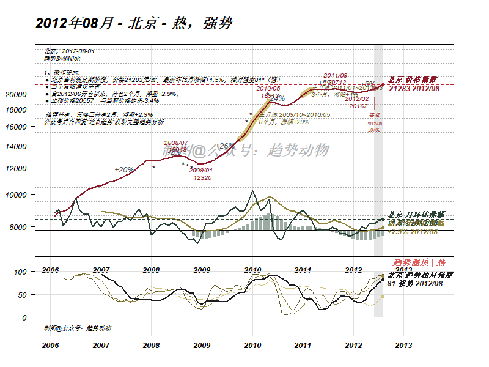

# 指标 | 趋势温度

> 来源：[趋势动物公众号](https://mp.weixin.qq.com/s?__biz=MzkyODQ5MTIzNw==&mid=2247484004&idx=1&sn=3570fde6439546defab30a96a9985821&chksm=c216b1eef56138f8cea5825b1580477593d8c708c2585721694e6df5df9a8f9f799302bd5d59#rd) ｜ 2023年11月30日 23:23

---

**趋势温度** ，是趋势的绝对体感。

是趋势跟踪策略中最重要的趋势信号之一。

  

“**沸** ”：趋势正快速拉升、波动放大。

“**热** ”：趋势处于上涨行情。

“**温** ”：趋势盘整，有即将启动上涨的迹象。

“**平** ”：趋势横盘

“**凉** ”：趋势盘整，有即将启动下跌的迹象。

“**寒** ”：趋势处于下跌行情。

“**冻** ”：趋势正快速下跌、波动放大。

  
如果你是**买方** ：当趋势是“**温** ”，则可以密切监测买入机会；当趋势是“**热** ”，则代表趋势启动，应该尽快建仓；当趋势是“**沸** ”，则应该警惕上升趋势是否进入尾声，可能随时反转。  
**卖方** 反之同理。  
当趋势是“**凉** ”，则可以密切监测卖出机会；当趋势是“**寒** ”，则代表趋势下跌已开启，应该尽快斩仓；  
当趋势是“**冻** ”，则应该警惕下跌趋势是否进入尾声，可能随时反转。  
几点**说明** ：  
  
1、对于上升趋势，“**温** ”是**预警** ，“**热** ”是**确认** ，“**沸** ”是**泡沫区**  
2、对于下跌趋势，“**凉** ”是**预警** ，“**寒** ”是**确认** ，“**冻** ”是**超跌区** 3、对于反转策略，在“**冻** ”处**左侧** 埋伏做多；对于趋势策略，在“**热** ”被确认的初期**右侧** 建多仓。做空反之同理。4、无论何种策略，尽量避免在“**沸** ”时**买入** ，“**冻** ”时**卖出** 。均对应了最拥挤的头寸方向。  
5、整个风格、板块、区域甚至城市的趋势温度，比单个小区的温度参考性更强。重视高级别的**板块效应** 。级别越低、成交量越稀疏、趋势指标**噪音** 越大。6、高beta期间，趋势温度率先转**“**热** ”**的城市、区域、风格，就是**领头羊** 。  
7、趋势温度的历史变化，以下是北京的**例子** ⬇️  
  

  

指标系列文章，是趋势选筹的使用说明

上手小程序有一定的门槛，

但一旦理解内涵，研究和交易会变的简单，

为此录制了会议回放：后台菜单处自取。
